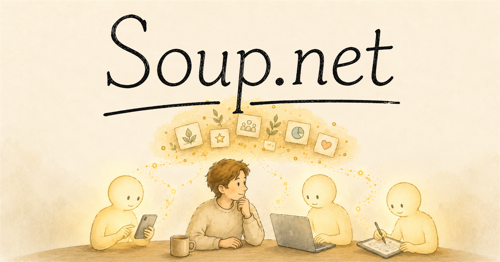
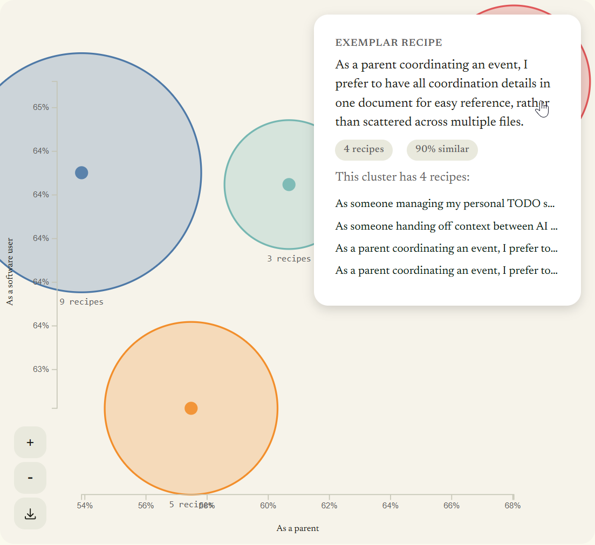

<p align="center">
  <a href="https://www.soup.net">
    
  </a>
</p>

<p align="center"><strong>Your taste and judgment, in every AI agent you use.</strong></p>

<p align="center">
  <a href="https://github.com/AndyForest/SoupNet/actions/workflows/ci.yml"></a>
  <a href="LICENSE"></a>
</p>

Soup.net is shared memory for AI agents. The agents you work with record your judgment calls as they happen, then bring them back in your next session, on a different tool, or to a collaborator's agent joining the project. The recipe book builds itself.

The unit of storage is a **recipe**: one judgment call in a structured, evidence-backed form — *"As a [role] working on [goal], I prefer [X] so that [reason]"*, plus verbatim supporting quotes. Agents use it through a **recipe check**: a semantic search whose only side effect is an append. Your agent searches with its current hypothesis about your taste, gets back your prior decisions with their evidence, and the hypothesis itself becomes a trace future agents can find. Nothing is ever overwritten, and every check makes the next one smarter — the same mechanism ants use to reinforce pheromone trails (stigmergy).

## Why

AI agents finish bigger and bigger pieces of work on their own, and you never run just one. Every new session is a fresh agent, every tool is another, and collaborators bring their own. Each one needs your answers, separately, from scratch. The scarce resource is you.

Most agent memory stores facts and conversation state, inside one vendor's ecosystem. Soup.net stores the judgment call itself, with the context and evidence that scope it, and it lives with you — portable across Claude Code, ChatGPT, Gemini, or the custom agent your team wrote in-house. Past decisions come back as **context, not directives**: your agent weighs them against the current task instead of replaying stale facts.

Because every check leaves a dated, append-only trace, you also get observability for free: one inspectable log of the judgment your agents exercised on your behalf. As agents run longer between check-ins, that record is what keeps you in the driver's seat.

Soup.net is developed with its own workflow. The AI agents that build it recipe-check their design decisions into the maintainer's corpus as they work — so the system's design history lives in the system, and the agents extending it retrieve the judgment calls that shaped the code they're changing.

The Recipe Map is how a human watches that corpus grow: recipes cluster by semantic similarity, projected onto any two concept axes you choose.

<p align="center">
  
</p>

## Field data

A field evaluation ran over the maintainer's real work in mid-2026 — two projects, coordinator agents spawning sub-agent fleets, every agent briefed to check at judgment moments and self-report what each check did for it. The honest scope: one developer, a 3-day feedback window over a 3-month corpus, all Claude-family agents. Observational, not a benchmark.

- 178 checks across 64 distinct agent sessions, in one joinable log.
- 68% of checks confirmed a prior decision, so the agent kept working instead of interrupting the human.
- ~4.5% of checks changed the agent's action. Rare by design — but that tail is where the value concentrates: the strongest case was an agent's measured-but-wrong "drop this index" conclusion being challenged by the human, re-tested, reversed, and permanently logged so no future agent re-derives it.
- 12 of 12 audited high-impact cases held up against the raw corpus; none was contradicted.
- Costs: ~1–3 KB of returned context per check, a 4–6 KB session briefing, 0.15–0.36 s warm check latency.

Known failure modes, from the same evaluation: the self-reporting never once said "no" (treat every percentage as an upper bound); a young corpus returns nothing for roughly 1 in 10 checks (that's seeding, not failure); and batched end-of-session checks mostly retrieve the agent's own fresh traces. Check at the judgment moment, not in a closing ceremony. And one honest gap: the plain-URL path is tested working with ChatGPT (web), Gemini, and Claude — but every *instrumented* field row so far comes from Claude-family agents in Claude Code, so cross-vendor effectiveness numbers don't exist yet. If you run it from another harness, you're generating the first real data.

## Try it

- **Hosted** — free, open to new signups: [soup.net](https://www.soup.net). The site generates a one-click briefing for whatever agent you use, from web-only chatbots to full MCP clients.

  The web-chatbot path is a first-class interface, not a fallback: agents without MCP participate through generated links — the recipe check is a URL the agent constructs or the human clicks. Tested working with ChatGPT (web), Gemini, and Claude, free tiers included.
- **Self-host** — MIT-licensed, deliberately boring stack (Postgres 17 + pgvector, Hono, React). No LLM runs on the server for the core check path: agents do the reasoning wherever they already run; the server does storage and vector search. (Optional premium features — off by default, opt-in per user — use one server-side LLM call; see `docs/planning/premium-llm-features.md`.) Embeddings default to Google's Gemini API (an [AI Studio key](https://aistudio.google.com/apikey) works; a deterministic stub provider covers dev and tests with zero API calls), but self-hosters can run them **fully locally with no key** — in-process on CPU, or against any local `/v1/embeddings` server ([Local / offline embeddings](#local--offline-embeddings) below). Gemini is then needed only for the optional premium features. Quick start below. Either way your corpus exports as a single JSON file.

Point an MCP-capable agent at the hosted service in one line:

```
claude mcp add --transport http soupnet https://mcp.soup.net/mcp --header "Authorization: Bearer YOUR_KEY"
```

## Learn more

- [`docs/benchmarks.md`](docs/benchmarks.md) — controlled benchmark results across PERMA, SWE-Lancer, and π-Bench (abstract + per-benchmark detail pages), the complement to the field data above
- [`docs/design-thinking.md`](docs/design-thinking.md) — product vision, user archetypes, recipe-check scenarios
- [`docs/architecture/overview.md`](docs/architecture/overview.md) — system topology, three agent surfaces, data model at a glance
- [`docs/planning/pivot-search-as-logging.md`](docs/planning/pivot-search-as-logging.md) — the search-as-logging pivot (decision history)
- [`docs/engineering-principles.md`](docs/engineering-principles.md) — 13 principles that govern every design choice
- [`docs/backlog.md`](docs/backlog.md) — current work queue; completed items in `docs/backlog-completed.md`
- [`docs/adr/`](docs/adr/) — architecture decisions with dates and status lines
- [`docs/testing-plan.md`](docs/testing-plan.md), [`docs/workflows/security.md`](docs/workflows/security.md) — how tests and audits work

Each document's top section states its purpose and how it differs from nearby docs. If you add a new doc, do the same — and link into this section.

---

## Quick start

```bash
cp .env.example .env
# Edit .env: set JWT_SECRET (openssl rand -hex 32), DEV_USERNAME, DEV_PASSWORD.
# GEMINI_API_KEY is optional locally — leave EMBEDDINGS_PROVIDER=stub for tests.

docker compose up --build -d    # postgres + backend (with in-process embedding worker) + mailpit
npm run dev:frontend            # Vite SPA on :5273 (separate terminal)
```

Open `http://localhost:5273` — log in, generate a recipe check link, and start checking recipes.

---

Mailpit Web UI for local dev: http://localhost:8625

---

## Local / offline embeddings

Semantic search needs an embedding provider, selected process-wide by `EMBEDDINGS_PROVIDER`. The default (`gemini`) calls Google; `stub` returns deterministic fake vectors for dev/tests. Two more providers let a self-hoster run real semantic search with **no external API and no key**:

- **`local`** — an in-process CPU model via `@huggingface/transformers` (default `bge-small-en-v1.5`). Set `EMBEDDINGS_PROVIDER=local` and go — the model (~23 MB) downloads once. Lowest friction; good for tire-kicking and CI.
- **`openai-compatible`** — points at any local OpenAI-style `/v1/embeddings` server, so you can serve a stronger model through tooling you already run:

  ```bash
  EMBEDDINGS_PROVIDER=openai-compatible
  EMBEDDINGS_BASE_URL=http://localhost:8080/v1   # llama.cpp: llama-server -m <model>.gguf --embedding --pooling mean
  EMBEDDINGS_MODEL=<the id the server reports>
  # EMBEDDINGS_API_KEY=...                        # optional bearer, if your server requires one
  ```

  LM Studio (`http://localhost:1234/v1`), Ollama (`ollama pull nomic-embed-text` → `http://localhost:11434/v1`), and Hugging Face TEI work identically — any `/v1/embeddings` endpoint. If Soup.net runs in its own container, `localhost` means the container: use `host.docker.internal` or the host IP.

**Two caveats.** One embedding provider per deployment — vectors from different models live in different semantic spaces and are never mixed, so switching provider or model means re-embedding the corpus (search fail-safes to empty results until you do). And a model's native dimension must be ≤ 3072 (or MRL-capable). Under the hood, sub-3072 vectors are zero-padded into the existing `halfvec(3072)` column, which is provably lossless for cosine — the design, the math, and the exit criterion are in **[ADR-0023](docs/adr/0023-local-embedding-providers.md)** and **[`docs/planning/local-embedding-provider.md`](docs/planning/local-embedding-provider.md)**.

---

## Repo layout

This is the orientation map for the whole repository. Subdirectories with their own README (or a stated purpose in their top doc) carry the detail; this map links to them.

```
apps/backend       Hono HTTP server (port 3101) — auth, REST API, /check recipe page,
                   remote MCP endpoint (/mcp), plus in-process pg-boss embedding consumers
                   (src/embedding-worker/). See ADR-0020, ADR-0021.
apps/frontend      Vite React SPA (port 5273) — dashboard, recipe map, admin pages
apps/mcp-server    Stdio MCP server (bundled as soupnet.mcpb for Claude Desktop)

packages/db        Drizzle schema + migrations — single claimnet schema, single source of truth
packages/domain    Business logic, ranking rules, shared agent-facing copy (no I/O)
packages/contracts Zod schemas + OpenAPI registry (mostly pre-pivot shapes; new routes inline-validate)
packages/client-sdk REST API client wrapper
packages/api-client Auto-generated React Query hooks (regenerated from contracts)
packages/config    Shared tsconfig, ESLint config

docs/              Top level: design-thinking.md, engineering-principles.md, testing-plan.md,
                   backlog.md + backlog-completed.md (the cross-session work queue)
docs/adr/          Architecture decision records — dated, with status lines
docs/architecture/ How the code works: overview, search algorithms, data model (generated)
docs/planning/     Validated proposals ready (or nearly ready) to implement
docs/rough-notes/  Dated working notes, meant to rot — see its README for the contract
                   and the fidelity ladder (rough-notes → planning → adopted docs/ADRs)
docs/workflows/    Repeatable processes (security audit cycle, etc.)
docs/connectors/   Connector-facing docs (claude.ai directory submission material)
docs/legal/        Privacy policy + ToS source material

scripts/           Dev/ops one-offs: test-ci-local.mjs (the canonical gate), cleanup,
                   data-model doc generation, QA harnesses
```

---

## MCP setup

The primary path is **remote MCP over Streamable HTTP** (stateless, ADR-0021). Point your agent at the backend's `/mcp` endpoint with an API key as a Bearer token — works the same whether you run locally (`http://localhost:3101/mcp`) or against the deployed instance (`https://mcp.soup.net/mcp`).

**1. Generate an API key** — Log in to the SPA, open **API keys**, create a daily or scoped key, copy the raw value.

**2. Add the server.** In Claude Code it's a one-liner:

```
claude mcp add --transport http soupnet http://localhost:3101/mcp --header "Authorization: Bearer YOUR_KEY"
```

Any HTTP-MCP client uses the same three facts, whatever its config schema calls them:

```jsonc
{
  "mcpServers": {
    "soupnet": {
      "type": "http",
      "url": "http://localhost:3101/mcp",
      "headers": { "Authorization": "Bearer YOUR_KEY" }
    }
  }
}
```

Per-client config blocks (Codex, VS Code, Google Antigravity, Claude Desktop via `mcp-remote` or the stdio server in `apps/mcp-server/`) live in the guide at `/docs/mcp-setup` — served by your own instance, or [hosted](https://mcp.soup.net/docs/mcp-setup) with your key pre-filled when reached from the dashboard. One living page instead of forked copies.

**3. Restart the client** (or run `/mcp` in Claude Code) to pick up the new server. Available tools: `check_recipe`, `get_briefing`, `list_my_recipe_books`, `update_recipe_book_description`.

The tool contract is read + append only. There is no update or delete surface, so a confused (or prompt-injected) agent can add traces but can never destroy or rewrite the record — worth knowing if you evaluate MCP servers on security posture.

---

## Development

**Prerequisites:** Node 24 LTS, npm ≥ 10, Docker

**Start everything via Docker:**

```bash
docker compose up --build -d    # postgres + backend + worker
npm run dev:frontend             # Vite dev server (separate terminal)
```

**Or run backend locally with hot reload:**

```bash
docker compose up -d postgres    # just the database
npm run build:packages           # build internal packages
source .env && npm run dev:backend   # Hono with tsx watch on :3101
npm run dev:frontend             # Vite on :5273
```

**Database migrations:**

```bash
cd packages/db
npx drizzle-kit generate         # generate migration from schema changes
# migrations auto-apply at backend startup
```

---

## Testing

```bash
npx vitest run                    # all tests (.env auto-loaded by vitest config)
npx vitest watch                  # watch mode
npm run test:ci                   # clean reproduction of CI (fresh DB on :5534, no Gemini)
```

Integration tests hit the running Docker backend, so keep `docker compose up -d` alive.

**Integration tests create test data** in the live database (users with `@test.local` emails, in their own recipe books). Test traces are recipe-book-scoped and don't appear in your personal search results. To clean up accumulated test data:

```bash
npx tsx scripts/cleanup-test-data.ts           # clean up
npx tsx scripts/cleanup-test-data.ts --status  # just show counts
```

See [`docs/testing-plan.md`](docs/testing-plan.md) for coverage expectations and test categories.

---

## Public vs hosted

This is the open-source codebase. The hosted version's deployment specifics — Terraform, operational runbooks, AWS topology — live in a separate private companion repo because they're specific to one operator's infrastructure choices and not generally useful.

**Test for what belongs in this repo:** would a self-hoster running this stack on their own infrastructure need this content? If yes, it's here. If it's specific to a particular hosted deployment, it isn't.

The application is deployment-agnostic — only Postgres 17 with `pgvector` and the env vars in `.env.example`. Container-platform-agnostic too: Docker Compose locally, anything else (Kubernetes, ECS, Fly, Hetzner) in production.

---

## Key rules

- No business logic in route handlers or React components — use services
- Never make direct DB edits — always use Drizzle migrations
- `import type { ... }` for type-only imports; `unknown` not `any`
- See [`docs/engineering-principles.md`](docs/engineering-principles.md)

---

## The human behind this

Much of Soup.net — code, docs, parts of this README — is written by AI agents. All of it is directed, reviewed, and answered for by one verifiable human: [Andy Forest](https://github.com/AndyForest), a systems architect and developer of 30 years. Recent work: AI Platform Architect at the Scratch Foundation; a decade running [Steamlabs](https://steamlabs.ca), a Canadian nonprofit that brought hands-on AI education to 850,000+ young learners; co-author of [*Make: AI Robots*](https://www.amazon.ca/Make-Robots-Amazing-Artificial-Intelligence/dp/1680457292) (O'Reilly, [translated into Japanese](https://www.amazon.co.jp/-/en/micro-bit%E3%81%A7%E3%81%AF%E3%81%98%E3%82%81%E3%82%8BAI%E5%B7%A5%E4%BD%9C-%E2%80%95%E8%A6%AA%E5%AD%90%E3%81%A7%E4%BD%9C%E3%82%8D%E3%81%86%EF%BC%81AI%E3%81%A7%E5%8B%95%E3%81%8F%E3%83%AD%E3%83%9C%E3%83%83%E3%83%88%E3%80%81%E3%82%B2%E3%83%BC%E3%83%A0%E3%80%81%E3%81%8A%E3%82%82%E3%81%A1%E3%82%83-Reade-Richard/dp/4814400993)); [LiteLLM](https://github.com/BerriAI/litellm) contributor.

Soup.net exists because he runs a lot of agents and wanted his judgment to survive between them. The accountability model this README describes — agents do the work, a human answers for it — is the one the repo itself is built with.

---

## License and trademarks

The code and documentation in this repository are licensed under the [MIT License](LICENSE).

The **Soup.net** name, logo, wordmark, and brand illustration assets identify the hosted service at [soup.net](https://www.soup.net) and are not covered by the MIT grant. Fork the code, self-host it, build on it freely — but present your own public instance under your own name and branding.
