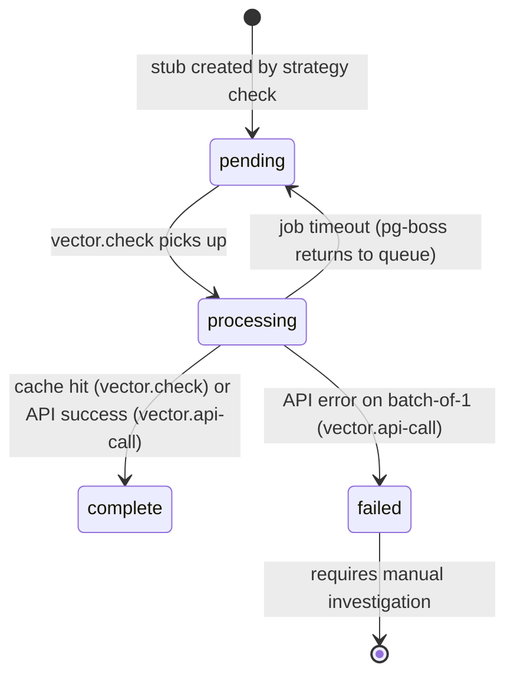

# ADR-0002: Single Postgres database with pgvector and pg-boss

**Date:** 2026-03-19
**Status:** Accepted
**Updated:** 2026-04-07 (worker architecture redesign)

---

## Context

ClaimNet needs:
- Durable storage for claims, validations, users, moderation records
- Vector similarity search for claim retrieval (semantic ranking)
- A background job queue for embeddings, ranking, fulfillment, moderation, email
- Ephemeral blob storage for full artifact payloads

We evaluated: separate vector DB (Pinecone/Weaviate), Redis queue, and Postgres-only.

## Decision

Use **one primary RDS PostgreSQL database** with:
- **pgvector** extension for embeddings and semantic search
- **pg-boss** for the job queue (Postgres-backed)
- **S3** for full artifact payloads (not Postgres)

No Redis, Kafka, Temporal, or OpenSearch in v1.

## Rationale

### Single DB

- RDS PostgreSQL supports pgvector natively
- Hybrid retrieval (FTS + pgvector) is sufficient for early scale
- One system to manage, back up, and monitor

### pgvector over a separate vector DB

- Avoids a second operational dependency at early scale
- Embeddings stored alongside metadata enables SQL joins in ranking queries
- Supports HNSW indexes for reasonable ANN performance
- Can be replaced with a dedicated vector DB later if needed

### pg-boss over Redis/Kafka/Temporal

- Postgres-backed: no additional infrastructure
- Supports exactly-once delivery semantics
- Jobs enqueued within existing DB transactions (write + enqueue atomically)
- Retries, dead letters, cron scheduling, polling workers
- Right level of sophistication for v1

### S3 for artifact payloads

- Full payloads are ephemeral and not needed in Postgres
- S3 lifecycle policies handle expiry automatically
- Presigned URLs for upload and download avoid proxying large blobs through the backend

## Consequences

- Custom Drizzle schema in `packages/db/src/schema.ts` defines embedding, ranking, and cache tables
- Vector columns require pgvector SQL migration (`CREATE EXTENSION IF NOT EXISTS vector`)
- Embedding vectors stored as text in Drizzle schema, cast to `vector(N)` type in raw migrations
- pg-boss consumers run in-process inside the backend (`apps/backend/src/embedding-worker/`) against the same DB connection; see ADR-0020 for the collapse rationale.

---

## Worker Architecture: Hierarchical Fan-Out (2026-04-07)

### Problem with the previous design

The original worker was a fragile chain: sweep → enqueue batch → API call → write vectors. Each step triggered the next, and if anything failed, everything downstream stopped. The sweep enqueued one job per `embedding_chunk_strategies` row, meaning each job only processed 2 vectors (one per task type). The 100-item Gemini batch API was never utilized. Backfills stalled silently.

### Design principles

1. **Each job is responsible for one end result.** Not a step in a chain — a complete deliverable. If it fails, the result is simply not done yet, and the next sweep rediscovers it.

2. **Fan-out, not chain.** Higher-level jobs fan out into smaller, independent sub-jobs. No job waits for another to complete before starting. The DB is the coordination mechanism (stigmergy for workers).

3. **Idempotent discovery.** Every sweep re-examines DB state. No reliance on a job having been enqueued correctly. If the worker crashes, restarts, or misses a cycle, the next sweep finds the gap.

4. **Small blast radius.** A single failing vector doesn't block 100 others. Binary-split retry isolates the poison pill in O(log n) attempts.

5. **No long-running jobs.** Each sub-job processes a bounded batch (≤64 items). Work is always chunked small enough to complete within pg-boss's timeout window.

### Four-tier job hierarchy

```
Strategy Sweep (cron: every 1 minute)
│
├─ For each strategy_id that has pending/stale work:
│  └─ Enqueue "strategy.check" (singletonKey prevents duplicates)
│
Strategy Check (per strategy_id)
│
├─ 1. Find traces missing chunk_text for this strategy
│  └─ Build text from trace + evidence, insert embedding_chunks + pending stubs
│
├─ 2. Find all embedding_vectors with status='pending' for this strategy  
│  └─ Enqueue "vector.check" jobs (≤64 vectors per job)
│
Vector Check (per batch of ≤64 vectors)
│
├─ 1. Check vector_cache for each chunk_hash
├─ 2. Cache hits → write vector immediately, mark complete
├─ 3. Cache misses → collect into a list
└─ 4. Enqueue one "vector.api-call" job with only the cache misses
│
Vector API Call (per batch of cache misses, ≤64)
│
├─ 1. Call Gemini batchEmbedContents API
├─ 2. On success → write vectors + populate cache, mark complete
└─ 3. On failure → binary-split retry (see below)
```

**Why Vector Check is separate from Vector API Call:** Cache lookups are <5ms each. Separating them means the API call jobs contain ONLY genuine cache misses — no wasted API capacity on already-cached vectors. This is especially important during backfills where many strategies share the same trace text (e.g., `exp_trace_minimal` = `full_document`) and hit the cache frequently.

### Tier 1: Strategy Sweep

**Schedule:** Every 1 minute via `boss.schedule()`.

**Responsibility:** Discover which embedding strategies have pending work and fan out one `strategy.check` job per strategy.

**Logic:**

```sql
-- Find strategies with pending or missing vectors
SELECT DISTINCT ecs.strategy_id
FROM claimnet.embedding_chunk_strategies ecs
JOIN claimnet.embedding_chunks ec ON ec.chunk_strategy_id = ecs.id
LEFT JOIN claimnet.embedding_vectors ev ON ev.embedding_chunk_id = ec.id
WHERE ecs.status = 'complete'
  AND (ev.id IS NULL OR ev.status = 'pending')

UNION

-- Find strategies that need chunk_text backfill (traces exist but chunks don't)
SELECT DISTINCT s.strategy_id
FROM (VALUES ('full_document'), ('full_recipe_context'),
             ('exp_trace_minimal'), ('exp_trace_instructed'),
             ('exp_trace_evidence_headed'), ('exp_trace_evidence_weighted'),
             ('exp_full_headed'), ('exp_full_weighted')) AS s(strategy_id)
WHERE EXISTS (
  SELECT 1 FROM claimnet.traces t
  WHERE NOT EXISTS (
    SELECT 1 FROM claimnet.embedding_sources es
    JOIN claimnet.embedding_chunk_strategies ecs ON ecs.embedding_source_id = es.id
    WHERE es.source_id = t.id AND es.source_type = 'trace'
      AND ecs.strategy_id = s.strategy_id
  )
)
```

**Enqueue guard:** Uses pg-boss `singletonKey: strategy_id` so that a strategy check job isn't duplicated if one is already queued or in progress.

**Does NOT:**
- Do any heavy processing
- Load source texts or evidence
- Call any external APIs

### Tier 2: Strategy Check

**Responsibility:** For a single `strategy_id`, ensure all traces have chunk_text built and pending vector stubs created. Then fan out vector batch jobs.

**Logic:**

1. **Find traces missing chunks for this strategy:**

```sql
SELECT t.id, t.claim_text, t.group_id
FROM claimnet.traces t
WHERE NOT EXISTS (
  SELECT 1 FROM claimnet.embedding_sources es
  JOIN claimnet.embedding_chunk_strategies ecs ON ecs.embedding_source_id = es.id
  WHERE es.source_id = t.id AND es.source_type = 'trace'
    AND ecs.strategy_id = $strategy_id
)
LIMIT 200  -- bounded per job
```

2. **For each missing trace:** Load evidence, build the strategy's `chunk_text`, insert `embedding_sources` → `embedding_chunk_strategies` → `embedding_chunks` → `embedding_vectors` (pending stubs).

3. **Find pending vectors for this strategy:**

```sql
SELECT ev.id AS vector_id, ec.chunk_text, ec.chunk_hash
FROM claimnet.embedding_vectors ev
JOIN claimnet.embedding_chunks ec ON ec.id = ev.embedding_chunk_id
JOIN claimnet.embedding_chunk_strategies ecs ON ecs.id = ec.chunk_strategy_id
WHERE ecs.strategy_id = $strategy_id
  AND ev.status = 'pending'
LIMIT 640  -- 10 batches of 64
```

4. **Enqueue vector check jobs** in groups of ≤64, passing vector IDs, chunk texts, and chunk hashes directly in the job data.

**Staleness detection:** A chunk is stale if `embedding_chunks.updated_at < embedding_chunk_strategies.updated_at`. Stale chunks are deleted (along with their vectors) and recreated. This is the single place where staleness is defined — future signals (model version changes, strategy parameter updates) add conditions here.

**Bounded work:** Processes at most 200 traces per invocation. If more remain, the next sweep cycle enqueues another strategy.check job.

### Tier 3: Vector Check

**Responsibility:** For a batch of ≤64 pending vectors, resolve as many as possible from the vector cache. Remaining cache misses are forwarded to a Vector API Call job.

**Logic:**

1. **Mark batch as processing** (prevents other workers from grabbing the same vectors).

2. **For each vector in the batch**, query `vector_cache` by `chunk_hash + task_type + model_id`:
   - **Cache hit** → write the cached vector to `embedding_vectors`, mark `complete`.
   - **Cache miss** → add to the "needs API" list.

3. **If cache misses remain**, enqueue one `vector.api-call` job with only the misses (≤64 items). This ensures API call batches contain zero already-cached vectors.

4. **If all were cache hits**, job is done — no API call needed.

**Why this is a separate tier:** Cache lookups are <5ms each. During backfills, many strategies share the same underlying text (e.g., `exp_trace_minimal` has the same text as `full_document`), so cache hit rates can be very high. Separating cache resolution from API calls means API batches are dense with genuine work — no wasted API capacity on cache-hittable vectors.

### Tier 4: Vector API Call

**Responsibility:** For a batch of confirmed cache misses (≤64 vectors), call the Gemini embedding API, write results, and populate the cache.

**Logic:**

1. **Call Gemini `batchEmbedContents`** (≤64 texts per call, within Gemini's 100-item limit).

2. **On success:** Write vectors to `embedding_vectors` (mark `complete`) AND `vector_cache` (for future cache hits by other strategies).

3. **On failure:** Binary-split retry (see below).

### Binary-split retry for API failures

When a Gemini batch API call fails, the entire batch is lost. This could be due to:
- **Transient errors** (rate limits, network): retry the same batch
- **Poison pill** (one input has invalid content): need to isolate it

**Strategy using pg-boss's built-in retry:**

```
Attempt 1 (batch of 64): API fails
  → pg-boss retries with retryDelay
Attempt 2 (batch of 64): API fails again
  → Handler detects retrycount >= 1
  → Splits batch in half: enqueue two new jobs of 32
  → Marks current job as complete (children take over)
  
Child job (batch of 32): API succeeds
  → 32 vectors written + cached. Done.
  
Other child (batch of 32): API fails
  → Same retry logic: split to 2 × 16
  → Eventually isolates the 1 poison pill
  → Poison pill job (batch of 1): mark vector as 'failed' with error
```

**Guard against infinite retry of the same failing vector:** The strategy sweep and vector check both ignore vectors with `status = 'failed'`. Failed vectors require manual investigation or a targeted fix. The error message stored on the vector row identifies the problem.

**pg-boss configuration per vector.api-call job:**
- `retryLimit: 2` — one automatic retry before splitting
- `retryDelay: 5` — 5 seconds between retries (Gemini rate limits)
- `retryBackoff: true` — exponential backoff
- `expireInMinutes: 10` — timeout after 10 minutes

### State diagram for `embedding_vectors.status`



### How this replaces the current code

| Current | New | Notes |
|---|---|---|
| `embedding-sweep.ts` (5min cron, finds pending, enqueues per-strategy) | **Strategy Sweep** (1min cron, discovers strategies with work, fans out strategy.check) | Discovery only, no heavy logic |
| `backfill-experimental-strategies.ts` (startup, creates all stubs) | **Strategy Check** handles backfill naturally — sweep discovers missing strategies, check creates stubs | No separate backfill needed |
| `vectoring.ts` (batch mode + legacy mode) | **Vector Check** (cache resolution) + **Vector API Call** (Gemini batch + binary-split retry) | Cache separated from API for efficient batching |
| `chunking.ts` (separate job for chunking) | Merged into **Strategy Check** — chunking is part of ensuring texts exist | One fewer job type |
| `scripts/backfill-experimental-strategies.ts` | Unnecessary — sweep + strategy.check handle it | Can be kept for manual one-shot runs |

### Queue names

```typescript
const QUEUES = {
  STRATEGY_SWEEP: "embedding.strategy-sweep",      // cron: */1 * * * *
  STRATEGY_CHECK: "embedding.strategy-check",      // per strategy_id
  VECTOR_CHECK: "embedding.vector-check",           // per batch of ≤64 (cache resolution)
  VECTOR_API_CALL: "embedding.vector-api-call",     // per batch of cache misses (Gemini API)
} as const;
```

### Recipe check fast path

When a recipe is checked via `/check` or MCP, the backend calls `submitAndSearch()` which needs vectors for immediate search. This is a **synchronous fast path** that bypasses the worker hierarchy:

1. Build all strategy texts (trace-only, trace+evidence, experimental variants)
2. For each: compute content hash → check `vector_cache`
3. Cache hit → use immediately (no API call, <5ms)
4. Cache miss → call Gemini API synchronously, write to cache + `embedding_vectors`

This ensures the checked recipe is searchable immediately on all strategies. The worker hierarchy handles backfills of existing traces and retries of failures — it never needs to process freshly-checked recipes because the fast path already did.

The fast path and the worker hierarchy share the same `vector_cache` — a vector generated by the fast path benefits future worker cache lookups, and vice versa.

### Monitoring

Each tier logs structured output with timing:
- `[strategy-sweep] Found 3 strategies with pending work`
- `[strategy-check] strategy=exp_trace_minimal: 45 traces need chunks, 200 pending vectors → 4 vector-check jobs`
- `[vector-check] batch=64: 50 cache hits → 14 forwarded to vector.api-call`
- `[vector-api-call] batch=14: 14 vectors generated, 14 cached`

The DB is the source of truth for progress:
```sql
-- Overall progress
SELECT ecs.strategy_id, ev.status, COUNT(*)
FROM claimnet.embedding_chunk_strategies ecs
JOIN claimnet.embedding_chunks ec ON ec.chunk_strategy_id = ecs.id
JOIN claimnet.embedding_vectors ev ON ev.embedding_chunk_id = ec.id
GROUP BY ecs.strategy_id, ev.status
ORDER BY ecs.strategy_id, ev.status;
```

### Adding a new embedding strategy

1. Add the strategy ID to the strategy list in the Strategy Sweep
2. Add the text-building logic in Strategy Check (same pattern as `buildExperimentalStrategies`)
3. Deploy. The sweep discovers traces without the strategy, check creates the texts, batch generates the vectors. No migration, no backfill script, no manual steps.
