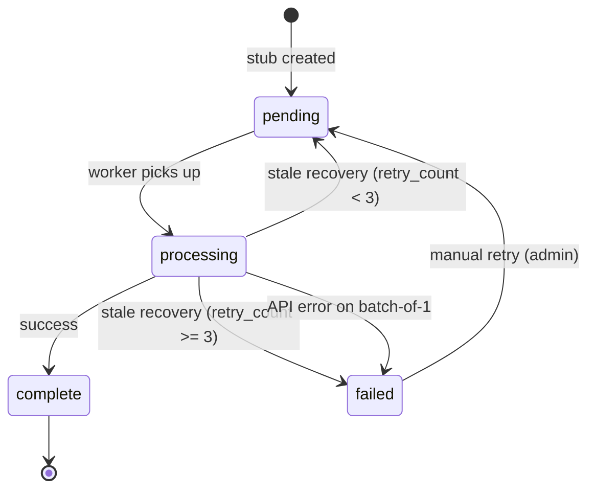

# Admin Dashboards

> **Purpose:** Specification for the system admin dashboards. Documents the structure, retry semantics, and prioritized feature list for queue and worker visibility.
>
> **Audience:** Engineers building or extending admin tooling. Andy as the sole system admin during early operations.
>
> **Related docs:**
> - [engineering-principles.md §12](../engineering-principles.md) — **Admin pages are data-model-driven, not curated reports.** Read this first; it shapes every decision below.
> - [adr/0002-postgres-pgvector-pg-boss.md](../adr/0002-postgres-pgvector-pg-boss.md) — worker architecture being monitored
> - [search-algorithms.md](search-algorithms.md) — embedding pipeline being monitored
>
> **Rule of thumb:** If it's about building or operating the system, put it here. If it's about how the system algorithmically works, put it in search-algorithms.md.

All routes must be protected by auth to only the system admins.

## Design philosophy: data-model-driven

Admin pages mirror the underlying data model. Top-level shows table row counts; per-table shows aggregates AND raw rows (filterable, paginated); per-row shows every column. The admin gets the same vantage point as a `psql` session, with the convenience of a UI on top.

**Why this matters here:** When investigating "why is this vector stuck?" or "why isn't this job running?", the admin needs to see the actual database state — not a curated executive summary that hides the columns the developer thought weren't important. Real investigation needs unanticipated questions answered, which requires raw data access.

See [engineering-principles.md §12](../engineering-principles.md) for the full principle and what it rules out.

# Worker Queue

Admin observability and control of worker queues

---

## Worker Queue Two-page split

Admin observability for worker queues splits into two distinct concerns:

1. **Generic queue dashboard** (`/admin/queues`) — pg-boss state. Independent of what the workers actually do. Useful for any application using pg-boss. Could be extracted to a shared library someday.

2. **Application worker dashboards** (`/admin/workers/*`) — domain-specific views of what the workers produce. Currently: embedding pipeline. Future: ranking recompute, moderation scan, email send, etc.

The split lets us answer different questions on different pages:
- "Are the queues healthy?" → `/admin/queues`
- "Are recipe checks fully embedded?" → `/admin/workers/embeddings`

A landing page at `/admin/workers` lists all worker types with a brief health summary, linking into per-worker pages.

### Routes

```
/admin                          → landing (cards for sections)
/admin/queues                   → generic pg-boss dashboard
/admin/workers                  → list of all worker types with summary
/admin/workers/embeddings       → embedding pipeline deep-dive
/admin/workers/<future>         → future worker types
```

All routes require `users.role = 'system'`.

---

## Retry semantics

### The problem

The previous architecture had two failure modes:

1. **Stuck in `processing`** — a worker grabbed the vector, set status to `processing`, then crashed mid-batch. The vector was orphaned. pg-boss retried the job, but the new job's SQL only found `pending` vectors, missing the stuck ones.

2. **Failed permanently** — binary-split retry isolated a poison pill (e.g., empty text, oversized input). Marked as `failed`. No way to retry without manual intervention.

### Solution: `retry_count` column

Add `retry_count integer NOT NULL DEFAULT 0` to `embedding_vectors`.

**Auto-recovery (stale processing):**
1. Strategy sweep finds vectors in `processing` state with `updated_at < now() - interval '10 minutes'`.
2. If `retry_count < AUTO_RETRY_LIMIT` (3): increment `retry_count`, reset to `pending`, clear error. The strategy sweep will pick it up on the next cycle.
3. If `retry_count >= AUTO_RETRY_LIMIT`: mark as `failed` with error `"Auto-retry limit exceeded"`. Requires manual investigation.

**Manual retry (admin panel):**
- Admin clicks "Retry" on a failed vector.
- Increment `retry_count`, reset to `pending`, clear error.
- The strategy sweep picks it up on the next cycle.
- Manual retries are NOT capped — the admin is intentionally retrying. But the count keeps incrementing so we can see how many times we've tried.

**Why retry_count instead of separate "retried_at" timestamps:**
- One column instead of multiple
- Atomic increment via UPDATE
- Easy to query: `WHERE retry_count >= 3` finds chronic failures
- Visible in the dashboard for diagnostics

### State diagram (updated)



---

## Page specifications

### `/admin/queues` — Generic pg-boss dashboard

**Tier 1 — Always visible:**

| Section | Data | Refresh |
|---|---|---|
| Health summary | Total queues, total jobs by state across all queues | 10s |
| Backlog age per queue | Oldest pending job timestamp + age in human-readable form | 10s |
| Queue list | Per-queue: created/retry/active/completed/failed counts | 10s |
| Cron schedules | `pgboss.schedule` rows: queue name, cron expression, next run, last run | 10s |

**Tier 2 — On click:**

| Action | Result |
|---|---|
| Click a queue name | Drill into queue detail (job list, recent failures) |
| Click a schedule | See history of runs for that schedule |

**Tier 3 — Operational (later):**

| Action | Result |
|---|---|
| Pause/resume queue | Stops workers from picking up new jobs (uses pg-boss control APIs) |
| Purge queue | Delete all jobs in a queue (with confirmation) |

### `/admin/workers/embeddings` — Embedding pipeline

**Tier 1 — Coverage and pipeline state:**

| Section | Data | Refresh |
|---|---|---|
| Strategy coverage | Per-strategy: traces covered, % complete, vector statuses | 10s |
| Pending vectors by strategy | Count + oldest pending timestamp per strategy | 10s |
| Stuck processing | Vectors in `processing` for >5min, with retry_count | 10s |
| Recent failures | Last 20 failed vectors with error message and retry_count | 10s |

**Tier 2 — Diagnostic:**

| Section | Data |
|---|---|
| Error grouping | Cluster failed vectors by error message — see if all failures share a cause |
| Cache hit rate | % of vectors resolved from `vector_cache` vs needing API call (last 1000 jobs) |
| Per-trace coverage gaps | Which traces are missing which strategies (drill-in from coverage table) |

**Tier 3 — Operations:**

| Action | Result |
|---|---|
| "Retry" button on failed vector | Increment retry_count, reset to pending |
| "Retry all failed" for a strategy | Bulk reset all failed vectors for one strategy |
| "Force re-embed" for a trace | Delete + recreate all vectors for one trace (when text changes) |

---

## Prioritization

### Now (this session)

1. **`retry_count` migration** — adds the column to `embedding_vectors`.
2. **Stale recovery in strategy sweep** — auto-resets stuck `processing` vectors with retry guard.
3. **Split admin pages** — `/admin/queues` (generic) and `/admin/workers/embeddings` (specific).
4. **Manual retry button** — for failed vectors.
5. **Error grouping** — cluster failures by error message.
6. **Backlog age** — oldest pending job per queue.
7. **Cron schedule visibility** — list `pgboss.schedule` with next run times.

### Soon (next iteration)

8. **Click-through job detail** — see payload, history, error for a specific job.
9. **Worker health** — detect if no workers are processing a queue (active jobs older than expected).
10. **Cache hit rate** — observability into vector_cache effectiveness.
11. **Per-trace coverage gaps** — drill-in to find specific traces missing strategies.

### Later

12. **Bulk operations** — pause queues, purge, retry all failed (per strategy).
13. **Throughput charts** — requires time-series data; needs design for storage.
14. **Force re-embed for a trace** — useful when content changes; requires UI flow.

### Skip for MVP

15. **Anomaly detection / alerting** — premature; Discord alerts via existing bot when needed.
16. **Workers connected heartbeat** — pg-boss doesn't expose this cleanly; would need custom heartbeat table.
17. **Job archive browser** — `psql` is fine for now.

---

## Open questions

1. **Should `vector_check` jobs that find a stuck `processing` vector reset it, or wait for the strategy sweep?** Recommendation: only the strategy sweep resets, to keep the recovery logic in one place and avoid race conditions.

2. **Should manual retries reset `retry_count` to 0?** Recommendation: no. Keep incrementing so we can see chronic failures. Admin can decide to investigate vectors with `retry_count > 5` even if they're currently `pending`.

3. **What's the right `AUTO_RETRY_LIMIT`?** Starting at 3. Tunable constant. Consider raising if transient failures are common.

4. **Should `/admin/workers` show health from queues separately, or should the embeddings page query its own metrics?** Both — the workers landing page shows a brief health summary per worker type (queue depth, last successful run), and each worker's detail page has the deep dive.

