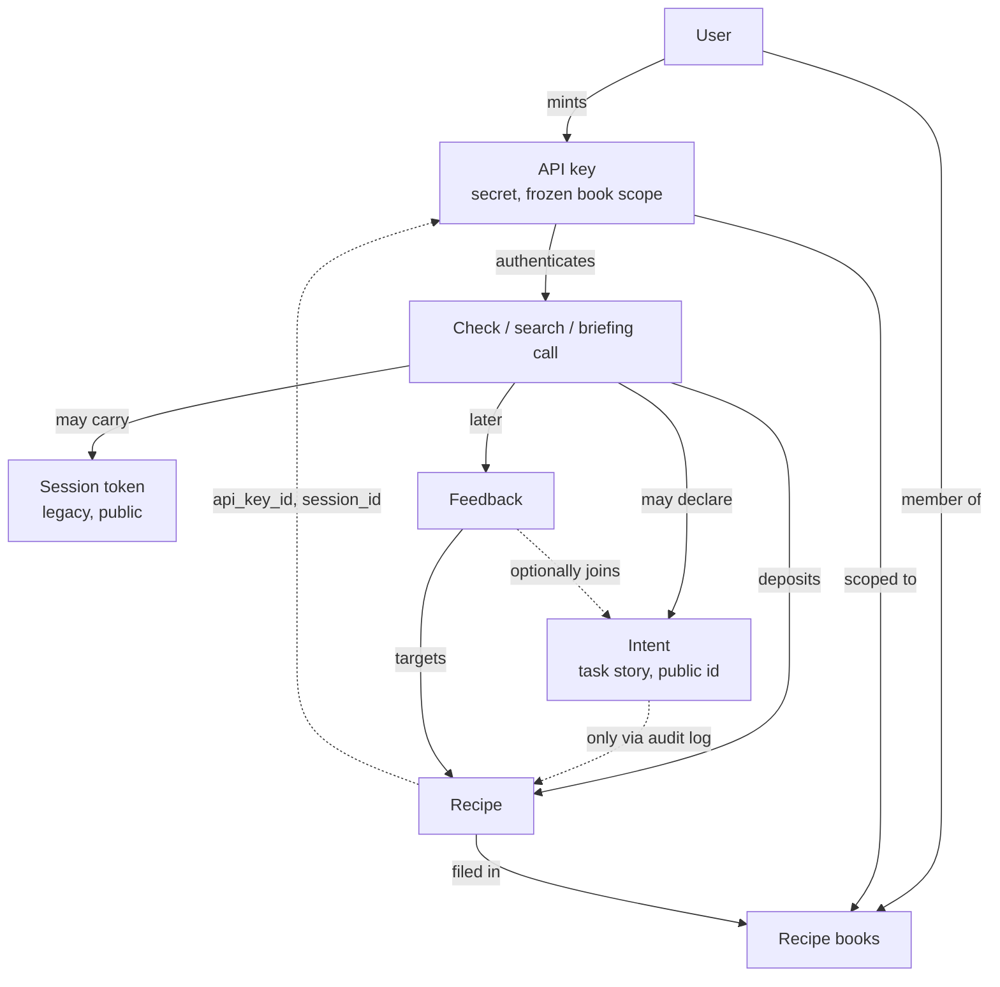

# Agent context seams

> **Purpose:** One place that says what each agent-facing identity and context concept is, who creates it, how long it lives, whether it is a secret, and what joins to it. Written 2026-09-19 to inform three open designs: derived API keys for sub-agents, repo/branch/PR context on recipes, and organization accounts. Sections marked **Proposed** describe designs under discussion in `docs/planning/`, not shipped behavior.
>
> **Sources:** schema files in `packages/db/src/schema/` and the code map in [../planning/org-accounts-research/access-control-map.md](../planning/org-accounts-research/access-control-map.md). File citations drift; the schema files are authoritative.

## The concepts today

| Concept | Identifies | Minted by | Lifetime | Secret? | Stored as | What joins to it |
|---|---|---|---|---|---|---|
| **User** | The human whose taste and judgment is being recorded | Registration | Until deletion | n/a | `users` row | Everything |
| **Recipe book** (`groups`) | An audience: who can read and write a body of recipes | A human, via the dashboard; or an agent for ephemeral workspaces | Durable, or until expiry for ephemeral books | No | `groups` + `group_members` | `traces.group_id`, key scope arrays |
| **API key** | A credential: this user, these books, until this time | A human (daily, scoped) or the OAuth token endpoint | Daily: to expiry next day. Scoped: chosen expiry. OAuth: 1 hour access, rotating refresh | **Yes.** Hashed at rest, shown once | `api_keys` row; scope frozen in `read_group_ids` / `write_group_ids` | `traces.api_key_id`, link tables' `api_key_id`, `intents.api_key_id`, `ephemeral_books.created_by_key_id` |
| **Agent id** | A label an agent gives itself so its calls form a lineage | The agent, free text | None; it is just a string | No | `intents.agent_id`, `check_feedback.agent_id`, `audit_log.metadata.agentId` | Nothing enforces it; capture only |
| **Session token** (legacy, deprecation-marked) | One agent context's fill state: which recipes it has been shown | Server mints on first check; client may also supply any well-shaped token | Rows age out of a 7-day window | **No.** Plaintext, echoed, carried in URLs | `traces.session_id`, `session_shown`, `check_feedback.session_id`, audit metadata | Known-set stub rendering only, never ranking |
| **Intent** | A declared task: the story of what the agent is trying to do | Any call that sends intent text; always a new row, never deduplicated | Indefinite for now (retention undecided); delivery ledger uses a 7-day window | **No.** Plaintext primary key, echoed in prose, carried in URLs. Protected by ownership check only | `intents`, `intent_shown`, `check_feedback.intent_id`, audit metadata | Stub rendering, feedback join, (planned) book selection |
| **Recipe** (`traces`) | One judgment, with evidence | A recipe check | Durable; humans may re-file or delete | No | `traces` + evidence/reference link tables | `group_id`, `user_id`, `api_key_id`, `session_id`; idempotent per (key, book, text hash) |
| **Search id** | One read-only search | Server, per search | Life of the audit row | No | The `check.searched` audit row's id | `check_feedback.search_audit_id` |
| **Feedback** | What a prior check or search did for the agent | The agent, after the fact | Durable | No | `check_feedback` | Targets a recipe id or a search id; optionally carries intent, session, agent id |

Two rules hold across all of these and are worth keeping:

1. **Identifiers and secrets are different kinds of thing.** Only API keys are secrets, and only they are hashed. Everything else is echoed, logged, and joined on freely. The audit log, which outlives account deletion by design, records session tokens and intent ids in its metadata, so neither can ever be given secret weight.
2. **Context shapes rendering, never ranking.** Sessions and intents decide what gets shown in full versus as an id-stub. Ranking stays a pure function of the query and the corpus.

## How they relate

The dotted line from intent to recipe is the weak seam. A recipe records which key and which legacy session deposited it, but not which intent. "Show me the recipes deposited while working on this task" can't be answered without reading audit metadata.

## Gaps these designs have to close

1. **No scoped-down credential for a sub-agent.** An orchestrator shares its whole key or a human mints a scoped key by hand.
2. **No first-class link from a recipe to the task it came from.** See the dotted line above.
3. **No place for work context** such as repo, branch, PR, or commit. It can only appear inside recipe or evidence text today.
4. **Two overlapping context tokens.** Session and intent both do stub rendering. Session is deprecation-marked but still advertised in tool schemas and echoed in every response.
5. **A key always belongs to a human and can always deposit.** `default_write_group_id` is NOT NULL, so there is no read-only credential, and no principal that isn't a person.
6. **No organization layer.** A recipe book's audience is its member list; nothing says "everyone at this company".

## Proposed: where new concepts would sit

| Concept | Identifies | Minted by | Secret? | Notes |
|---|---|---|---|---|
| **Derived API key** (decided 2026-09-19, [derived-agent-keys.md](../planning/derived-agent-keys.md)) | One sub-agent's narrowed credential | An orchestrating agent, from its own key; scope and expiry can only shrink | Yes, like any API key | An ordinary `api_keys` row with a nullable `parent_key_id`, valid only while the parent is. No new concept: intents, checks, searches, and feedback behave exactly as with any key, and many intents per key already works because `intents.api_key_id` records the minting key. Closes gap 1. Gap 4 closes on its own path, by finishing the legacy session deprecation |
| **Recipe → intent link** | Which task a recipe came from | Server, at deposit | No | An `intent_id` column on `traces`. Closes gap 2 |
| **References on intents** (operator lean 2026-09-19) | What a body of work relates to: a PR, a branch, a ticket, a design doc, an ADR, anything with an address | Declared by the agent with the intent | No | Reuses the reference concept recipes already have for evidence, applied to intents, in place of fixed repo and branch fields. Quoted search already matches reference citations, so retrieval by PR or ticket URL follows once gap 2 is closed. Open: recipes inherit their intent's references at deposit, or join through the intent at query time. Closes gap 3 |
| **Verification state on a recipe** | Whether a recipe attributed to someone has been confirmed by them or by their own agent | Appended by the person or their agent | No | For backfill on behalf: unverified recipes are visible only to the attributed person. An appended verification row, not an update, keeps agent surfaces append-only |
| **Capabilities on a key** | What a credential may do: check, search, read, feedback, mint | Set at mint; only narrows | n/a | Replaces the implicit "every key can deposit". Closes gap 5 for derived keys and autonomous agents alike |
| **Service principal** | An autonomous agent owned by an organization rather than a person | An org admin | Its keys are | Starts with no deposit capability. Closes the rest of gap 5 |
| **Organization membership** | That a managed account belongs to a company | Domain auto-join, invitation, or the site operator | No | Org-wide books as materialized memberships with provenance. Closes gap 6 |

## Questions this view raises

1. With derived keys, each sub-agent has its own key row. Should context-fill tracking key off the credential (server-side, across all its intents), leaving the per-intent delivery ledger as it is, or is per-intent tracking enough?
2. Related: should the server treat the key itself as the implicit context for calls that declare no intent? That would give every agent context-fill tracking with nothing to carry, and would answer the parked question about auto-minting anonymous intents.
3. Should feedback rows gain their lineage automatically from the credential (the key id, and through a derived key its parent), removing three optional lineage fields agents have to remember to pass?
