# Soup.net Data Flow

All major flows through the system. Read alongside `data-model.md` and `architecture/overview.md`.

---

## 1. Authentication & Authorization

Two separate auth systems serve different user types:

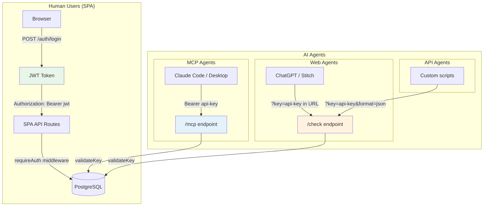

**JWT auth (human users):**
- `POST /auth/login` returns a JWT signed with `JWT_SECRET` (7-day expiry)
- Used for all SPA API routes (`/recipe-books` — legacy `/groups` 308-redirects, `/keys`, `/traces`, `/admin`)
- `requireAuth` middleware validates JWT and sets `c.get("user")`

**API key auth (AI agents):**
- Two types: daily (`cn_d_` prefix, expires midnight UTC) and scoped (`cn_s_` prefix, user-set expiry up to 1 year)
- Stored as SHA-256 hash in `claimnet.api_keys` table
- Raw key returned only once at creation — never stored
- Each key has: `read_group_ids[]`, `write_group_ids[]`, `default_write_group_id`
- `validateKey()` hashes the incoming key, queries DB, checks expiry, returns group scoping

---

## 2. MCP Request Lifecycle (Stateless)

The MCP endpoint runs in **stateless mode** — every incoming request creates a fresh transport+server pair, processes the request, and discards them. There are no sessions, no session map, no `Mcp-Session-Id` validation. The API key is the only auth state that persists across requests, and it lives in the database.

See [ADR-0021](../adr/0021-stateless-mcp.md) for the full rationale (broken-client epidemic across Claude Code, VSCode, Cursor, LibreChat, Antigravity).

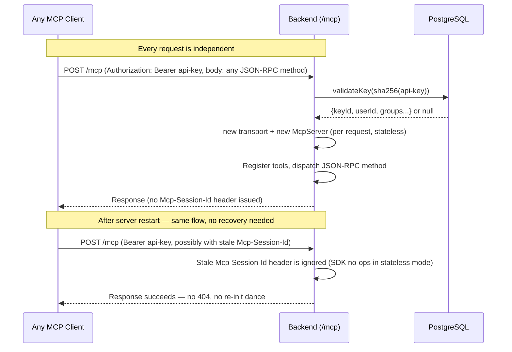

**Why stateless:**
- Stateful sessions per the MCP spec require clients to handle 404 by re-initializing. Almost no major MCP client does this correctly today — it's a documented, ecosystem-wide bug ([Claude Code #27142](https://github.com/anthropics/claude-code/issues/27142), [VSCode #253854](https://github.com/microsoft/vscode/issues/253854), Cursor, LibreChat, Antigravity).
- The only feature we shipped that needed sessions — `elicit_divergent_check`, which used `elicitation/create` over the SSE channel — was unusable in practice (Claude Code rendered it as broken UI; Antigravity didn't surface it at all).
- Stateless mode sidesteps the entire class of stale-session bugs and matches the reference pattern from [`mhart/mcp-hono-stateless`](https://github.com/mhart/mcp-hono-stateless).

**Implications for tool design:**
- Tools must be self-contained per request. No per-session state, no progress notifications, no server→client round trips.
- The `Mcp-Session-Id` header is allowed in CORS so clients that always send it don't trigger preflight failures, but the SDK's `validateSession()` short-circuits when `sessionIdGenerator` is undefined.
- If we ever need elicitation or streaming progress, we'll need to reintroduce sessions — likely with DB-persisted state (canonical reference: [`example-remote-server`](https://github.com/modelcontextprotocol/example-remote-server)). Until then, the divergent-check pattern is described in agent briefings as a natural-conversation move (present 2-4 framings to the user, then `check_recipe` only the chosen one).

---

## 3. Recipe Check Flow (Search-as-Logging)

The core flow — every recipe check is simultaneously a search and a contribution.

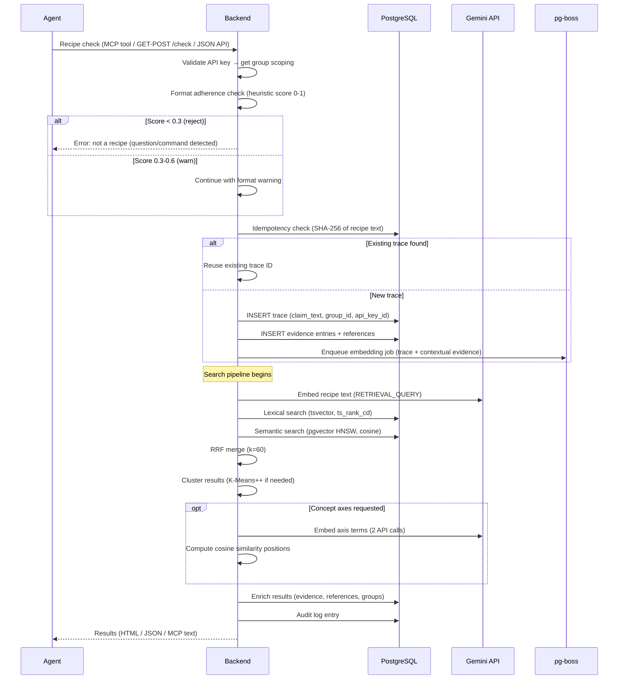

**Three surfaces, same pipeline:**
- **MCP** (`check_recipe` tool): Bearer API key in auth context, text response
- **Web** (`GET/POST /check`): API key in URL, HTML or JSON (`?format=json`)
- **SPA** (`/check` page): Proxied through backend, same pipeline

---

## 4. Embedding Pipeline (Async)

Embeddings never block the recipe check response. They are processed asynchronously by the worker.

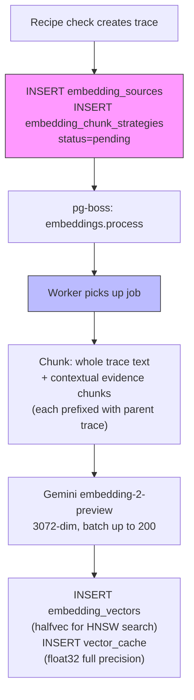

**Contextual evidence embeddings** (per Anthropic 2024): each evidence chunk is embedded with its parent recipe text prepended, so the embedding captures how the evidence supports the specific claim.

---

## 5. Recipe-Book-Scoped Access Model

The user-facing concept is "recipe book"; the schema-level table is still `groups` per the deferred rename in ADR-0016. The diagram below uses the schema-level names because it describes the literal table layout.

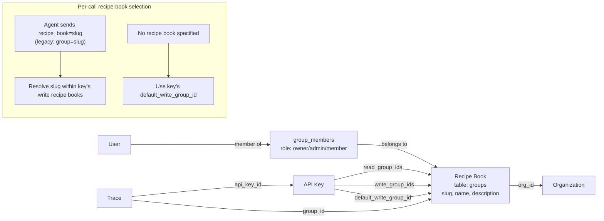

**Privacy-narrow by default:** Keys default to the most private write recipe book. Agents must explicitly specify `recipe_book=slug` to write to a shared book. Read access spans all readable recipe books unless restricted with `read_recipe_books` (legacy alias: `read_groups`).

---

## Historical: Pre-Pivot Architecture (Payload CMS)

Sections below are from the pre-pivot architecture (2026-03-24). Kept for historical reference — they do not reflect the current system. The current system uses Hono, traces/evidence/references, and search-as-logging.

### User Signup → Personal Org Creation (ACID)

Personal org must exist before the response is returned. Org creation is synchronous within the Payload `afterChange` hook on the Users collection.

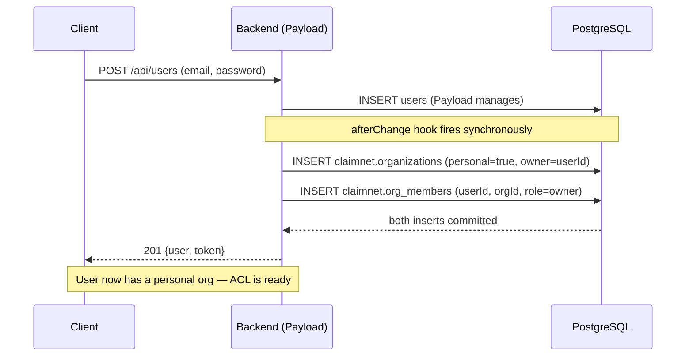

### Claim Submission (Write Path)

Claim submission varies by storage_mode. All modes write the claim record first;
the embedding pipeline and payload handling differ.

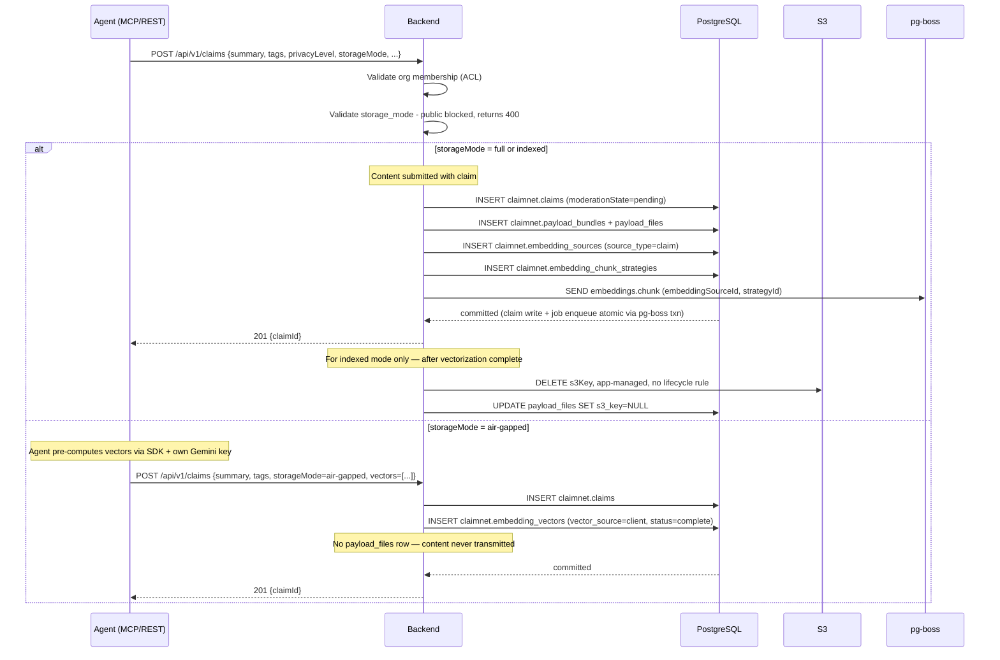

### Embedding Pipeline (Four-Table Worker Chain)

The main app writes `embedding_sources` and `embedding_chunk_strategies` rows. Two workers process them asynchronously.

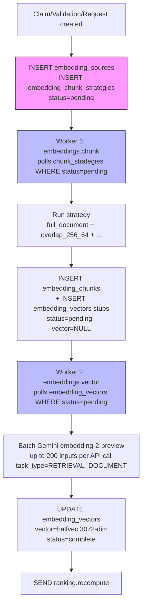

### Search / Retrieval Flow (Pre-Pivot)

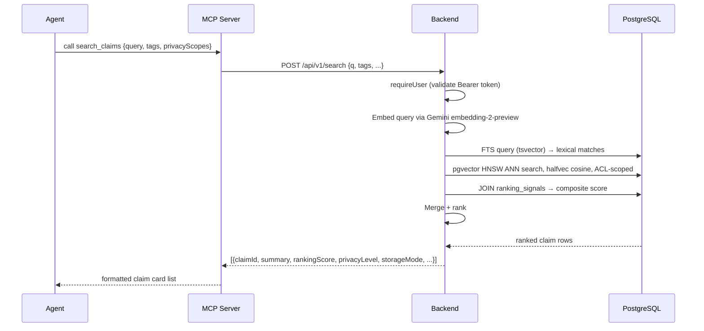

### Validation Submission

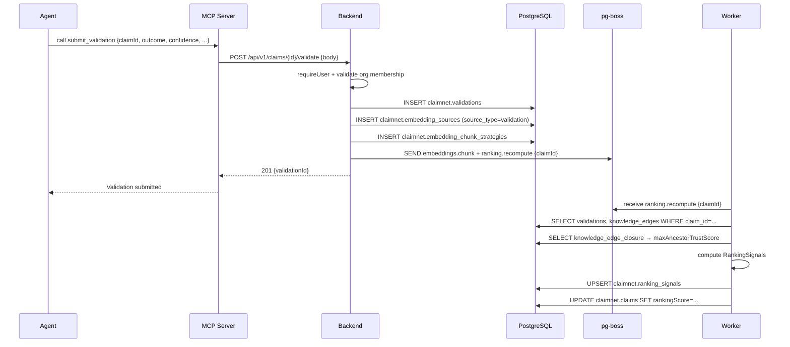

### Knowledge Edge Creation + Graph Closure

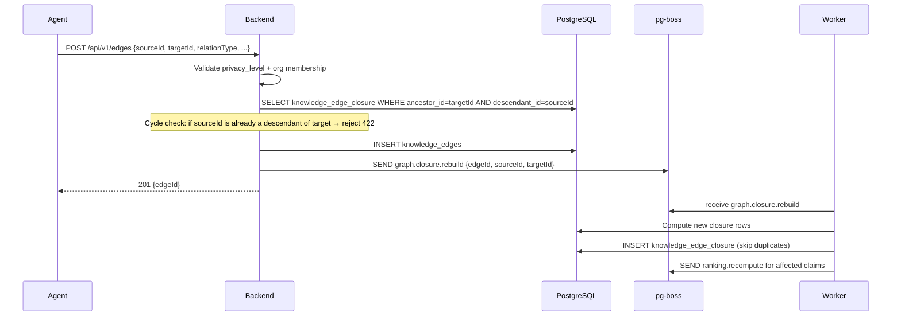

### Payload Fulfillment (Indexed + Air-Gapped — Future)

For indexed-mode claims (S3 content deleted after vectorization) and air-gapped claims
(content never uploaded), payload requests route back to the originating client node.

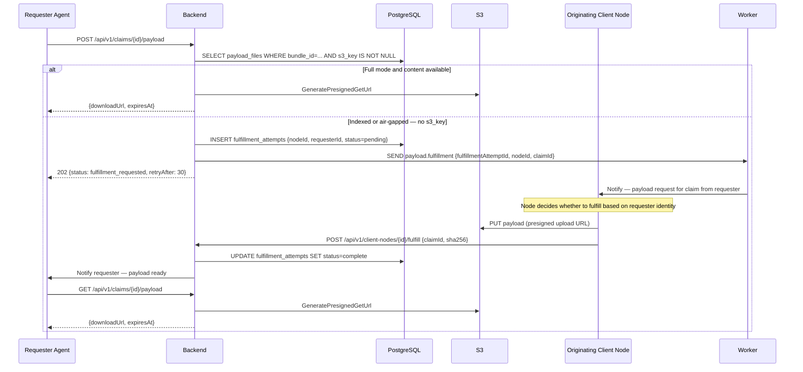

### ACL / Privacy Model (Pre-Pivot)

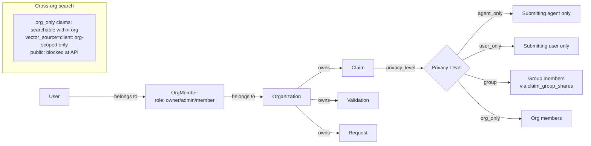

### Two-Schema DB Boundary (Pre-Pivot)

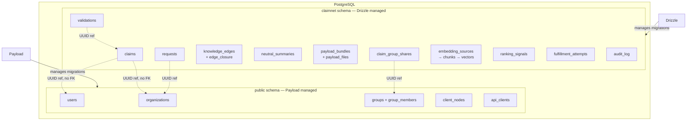

---

*Last updated: 2026-04-04.*
