# ClaimNet Data Model — Generated Reference

> **Auto-generated** from Drizzle migration snapshot `0029_snapshot.json`.
> Do not edit by hand. Regenerate with: `npx tsx scripts/generate-data-model-docs.ts`
>
> Generated: 2026-07-06
> Tables: 27 | Schema: `claimnet`

For design rationale, conventions, and context, see [data-model.md](data-model.md).

## Tables

**Identity & Access:** [`users`](#claimnetusers) · [`organizations`](#claimnetorganizations) · [`groups`](#claimnetgroups) · [`group_members`](#claimnetgroup_members)
**Core Content:** [`traces`](#claimnettraces) · [`evidence`](#claimnetevidence) · [`references`](#claimnetreferences)
**Linking:** [`trace_evidence`](#claimnettrace_evidence) · [`trace_references`](#claimnettrace_references) · [`evidence_references`](#claimnetevidence_references)
**Auth & Admin:** [`api_keys`](#claimnetapi_keys) · [`invitations`](#claimnetinvitations) · [`system_settings`](#claimnetsystem_settings) · [`audit_log`](#claimnetaudit_log)
**Embedding Pipeline:** [`embedding_sources`](#claimnetembedding_sources) · [`embedding_chunk_strategies`](#claimnetembedding_chunk_strategies) · [`embedding_chunks`](#claimnetembedding_chunks) · [`embedding_vectors`](#claimnetembedding_vectors)
**Caching:** [`reference_source_cache`](#claimnetreference_source_cache) · [`vector_cache`](#claimnetvector_cache)

---

## Entity-Relationship Diagram

Solid lines = FK constraints. Dotted lines = UUID references (no FK, service-layer enforced).

```mermaid
erDiagram

    api_keys {
        uuid id PK
        text key
        text key_prefix
        uuid user_id
        uuid[] read_group_ids
        uuid[] write_group_ids
        uuid default_write_group_id
        text label
        text key_type
        text refresh_token_hash
        timestamptz refresh_token_expires_at
        text oauth_client_id
        timestamptz consumed_at
        timestamptz expires_at
        timestamptz last_used_at
        timestamptz created_at
    }

    audit_log {
        uuid id PK
        uuid actor_user_id
        uuid actor_node_id
        uuid api_key_id
        text action
        text target_type
        uuid target_id
        jsonb metadata
        timestamptz occurred_at
    }

    check_feedback {
        uuid id PK
        uuid trace_id FK
        uuid api_key_id
        text agent_id
        text kind
        text impact
        text disposition
        text story_fulfilled
        text story
        text note
        real top_similarity
        text model
        text harness
        text harness_version
        uuid[] related_trace_ids
        timestamptz created_at
    }

    check_feedback_stars {
        uuid id PK
        uuid feedback_id FK
        uuid user_id FK
        timestamptz created_at
    }

    email_log {
        uuid id PK
        text to_email
        text kind
        text subject
        text status
        text error
        timestamptz created_at
    }

    embedding_chunk_strategies {
        uuid id PK
        uuid embedding_source_id FK
        text strategy_id
        text status
        text error
        timestamptz created_at
        timestamptz updated_at
    }

    embedding_chunks {
        uuid id PK
        uuid embedding_source_id FK
        uuid chunk_strategy_id FK
        text chunk_text
        varchar chunk_hash
        text chunk_path
        jsonb metadata
        timestamptz created_at
    }

    embedding_sources {
        uuid id PK
        text source_type
        uuid source_id
        uuid group_id
        text source_text
        text artifact_category
        timestamptz created_at
    }

    embedding_vectors {
        uuid id PK
        uuid embedding_chunk_id FK
        text model_id
        text task_type
        text vector_source
        text status
        text error
        integer retry_count
        halfvec vector
        timestamptz created_at
        timestamptz updated_at
    }

    evidence {
        uuid id PK
        text content
        timestamptz created_at
        timestamptz updated_at
    }

    evidence_references {
        uuid id PK
        uuid evidence_id FK
        uuid reference_id FK
        timestamptz created_at
    }

    group_members {
        uuid id PK
        uuid group_id FK
        uuid user_id FK
        text role
        boolean daily_read
        boolean daily_write
        timestamptz joined_at
    }

    groups {
        uuid id PK
        text name
        text slug
        uuid organization_id FK
        text description
        timestamptz created_at
        timestamptz updated_at
    }

    invitations {
        uuid id PK
        uuid inviter_id FK
        uuid group_id FK
        text email
        text token
        boolean bypass_cap
        timestamptz expires_at
        timestamptz accepted_at
        timestamptz declined_at
        timestamptz created_at
    }

    oauth_authorization_codes {
        uuid id PK
        text code_hash
        text client_id
        uuid user_id
        text redirect_uri
        text code_challenge
        text code_challenge_method
        uuid[] scope_read_group_ids
        uuid[] scope_write_group_ids
        uuid scope_default_write_group_id
        timestamptz consumed_at
        timestamptz expires_at
        timestamptz created_at
    }

    oauth_clients {
        uuid id PK
        text client_id
        text client_secret_hash
        text client_name
        text[] redirect_uris
        timestamptz created_at
        timestamptz last_used_at
    }

    organizations {
        uuid id PK
        text name
        text slug
        uuid owner_id FK
        boolean is_personal
        timestamptz created_at
        timestamptz updated_at
    }

    reference_source_cache {
        uuid id PK
        uuid reference_id FK
        text url
        text content_type
        text cached_content
        text s3_key
        text fetch_strategy
        timestamptz fetched_at
        timestamptz created_at
    }

    references {
        uuid id PK
        text quote
        text source
        text file_url
        text file_mime_type
        varchar file_hash
        text original_filename
        jsonb region_meta
        timestamptz created_at
    }

    system_settings {
        uuid id PK
        text key
        text value
        timestamptz updated_at
    }

    trace_evidence {
        uuid id PK
        uuid trace_id FK
        uuid evidence_id FK
        text stance
        uuid api_key_id
        timestamptz created_at
    }

    trace_reactions {
        uuid id PK
        uuid trace_id FK
        uuid user_id FK
        text reaction
        timestamptz created_at
        timestamptz updated_at
    }

    trace_references {
        uuid id PK
        uuid trace_id FK
        uuid reference_id FK
        uuid api_key_id
        timestamptz created_at
    }

    traces {
        uuid id PK
        uuid user_id
        uuid group_id
        uuid api_key_id
        text claim_text
        text claim_text_hash
        real format_adherence_score
        timestamptz decided_at
        timestamptz created_at
        timestamptz updated_at
    }

    uploads {
        uuid id PK
        uuid api_key_id
        text content_hash
        text mime_type
        integer size_bytes
        text original_filename
        timestamptz created_at
    }

    users {
        uuid id PK
        text email
        text password_hash
        text display_name
        text provider
        text external_id
        text role
        timestamptz email_verified_at
        text email_verification_token
        timestamptz email_verification_token_created_at
        text password_reset_token_hash
        timestamptz password_reset_token_created_at
        timestamptz tos_accepted_at
        timestamptz last_login_at
        timestamptz suspended_at
        text suspended_reason
        timestamptz waitlisted_at
        text signup_reason
        timestamptz premium_at
        jsonb preferences
        timestamptz created_at
        timestamptz updated_at
    }

    vector_cache {
        uuid id PK
        text content_hash
        text model_id
        text task_type
        vector vector
        timestamptz created_at
    }

    check_feedback }o--|| traces : "trace_id"
    check_feedback_stars }o--|| check_feedback : "feedback_id"
    check_feedback_stars }o--|| users : "user_id"
    embedding_chunk_strategies }o--|| embedding_sources : "embedding_source_id"
    embedding_chunks }o--|| embedding_sources : "embedding_source_id"
    embedding_chunks }o--|| embedding_chunk_strategies : "chunk_strategy_id"
    embedding_vectors }o--|| embedding_chunks : "embedding_chunk_id"
    evidence_references }o--|| evidence : "evidence_id"
    evidence_references }o--|| references : "reference_id"
    group_members }o--|| groups : "group_id"
    group_members }o--|| users : "user_id"
    groups }o--|| organizations : "organization_id"
    invitations }o--|| users : "inviter_id"
    invitations }o--|| groups : "group_id"
    organizations }o--|| users : "owner_id"
    reference_source_cache }o--|| references : "reference_id"
    trace_evidence }o--|| traces : "trace_id"
    trace_evidence }o--|| evidence : "evidence_id"
    trace_reactions }o--|| traces : "trace_id"
    trace_reactions }o--|| users : "user_id"
    trace_references }o--|| traces : "trace_id"
    trace_references }o--|| references : "reference_id"
    traces }o..|| users : "user_id"
    traces }o..|| groups : "group_id"
    traces }o..|| api_keys : "api_key_id"
    api_keys }o..|| users : "user_id"
    invitations }o..|| users : "inviter_id"
    invitations }o..|| groups : "group_id"
    audit_log }o..|| users : "actor_user_id"
    embedding_sources }o..|| groups : "group_id"
    trace_evidence }o..|| api_keys : "api_key_id"
    trace_references }o..|| api_keys : "api_key_id"
```

### Objects defined in migration SQL (not in Drizzle snapshot)

These are created by raw SQL in migration files and are not captured in the snapshot JSON:

- **`traces.tsv`** — `tsvector` generated column: `to_tsvector('english', claim_text)`. GIN-indexed (`traces_tsv_idx`).
- **`embedding_vectors_hnsw_idx`** — HNSW index on `embedding_vectors.vector` using `halfvec_cosine_ops` (m=16, ef_construction=64).

---

## Identity & Access

### `claimnet.users`

| Column | Type | Nullable | Default | PK |
|---|---|---|---|---|
| `id` | `uuid` | NO | `gen_random_uuid()` | PK |
| `email` | `text` | NO |  |  |
| `password_hash` | `text` | NO |  |  |
| `display_name` | `text` | YES |  |  |
| `provider` | `text` | NO | `'local'` |  |
| `external_id` | `text` | YES |  |  |
| `role` | `text` | NO | `'tenant'` |  |
| `email_verified_at` | `timestamptz` | YES |  |  |
| `email_verification_token` | `text` | YES |  |  |
| `email_verification_token_created_at` | `timestamptz` | YES |  |  |
| `password_reset_token_hash` | `text` | YES |  |  |
| `password_reset_token_created_at` | `timestamptz` | YES |  |  |
| `tos_accepted_at` | `timestamptz` | YES |  |  |
| `last_login_at` | `timestamptz` | YES |  |  |
| `suspended_at` | `timestamptz` | YES |  |  |
| `suspended_reason` | `text` | YES |  |  |
| `waitlisted_at` | `timestamptz` | YES |  |  |
| `signup_reason` | `text` | YES |  |  |
| `premium_at` | `timestamptz` | YES |  |  |
| `preferences` | `jsonb` | NO | `'{}'::jsonb` |  |
| `created_at` | `timestamptz` | NO | `now()` |  |
| `updated_at` | `timestamptz` | NO | `now()` |  |

**Unique constraints:**
- `users_email_unique`: `(email)`

**Indexes:**
- `users_provider_external_id_idx`: `(provider, external_id)`

---

### `claimnet.organizations`

| Column | Type | Nullable | Default | PK |
|---|---|---|---|---|
| `id` | `uuid` | NO | `gen_random_uuid()` | PK |
| `name` | `text` | NO |  |  |
| `slug` | `text` | NO |  |  |
| `owner_id` | `uuid` | NO |  |  |
| `is_personal` | `boolean` | NO |  |  |
| `created_at` | `timestamptz` | NO | `now()` |  |
| `updated_at` | `timestamptz` | NO | `now()` |  |

**Foreign keys:**
- `owner_id` → `users.id`

**Unique constraints:**
- `organizations_slug_unique`: `(slug)`

**Indexes:**
- `organizations_owner_id_idx`: `(owner_id)`

---

### `claimnet.groups`

| Column | Type | Nullable | Default | PK |
|---|---|---|---|---|
| `id` | `uuid` | NO | `gen_random_uuid()` | PK |
| `name` | `text` | NO |  |  |
| `slug` | `text` | NO |  |  |
| `organization_id` | `uuid` | NO |  |  |
| `description` | `text` | YES |  |  |
| `created_at` | `timestamptz` | NO | `now()` |  |
| `updated_at` | `timestamptz` | NO | `now()` |  |

**Foreign keys:**
- `organization_id` → `organizations.id`

**Unique constraints:**
- `groups_org_slug_unique`: `(organization_id, slug)`

**Indexes:**
- `groups_organization_id_idx`: `(organization_id)`

---

### `claimnet.group_members`

| Column | Type | Nullable | Default | PK |
|---|---|---|---|---|
| `id` | `uuid` | NO | `gen_random_uuid()` | PK |
| `group_id` | `uuid` | NO |  |  |
| `user_id` | `uuid` | NO |  |  |
| `role` | `text` | NO | `'member'` |  |
| `daily_read` | `boolean` | NO |  |  |
| `daily_write` | `boolean` | NO |  |  |
| `joined_at` | `timestamptz` | NO | `now()` |  |

**Foreign keys:**
- `group_id` → `groups.id`
- `user_id` → `users.id`

**Unique constraints:**
- `group_members_group_user_unique`: `(group_id, user_id)`

**Indexes:**
- `group_members_group_id_idx`: `(group_id)`
- `group_members_user_id_idx`: `(user_id)`

---

## Core Content

### `claimnet.traces`

| Column | Type | Nullable | Default | PK |
|---|---|---|---|---|
| `id` | `uuid` | NO | `gen_random_uuid()` | PK |
| `user_id` | `uuid` | NO |  |  |
| `group_id` | `uuid` | NO |  |  |
| `api_key_id` | `uuid` | YES |  |  |
| `claim_text` | `text` | NO |  |  |
| `claim_text_hash` | `text` | YES |  |  |
| `format_adherence_score` | `real` | YES |  |  |
| `decided_at` | `timestamptz` | YES |  |  |
| `created_at` | `timestamptz` | NO | `now()` |  |
| `updated_at` | `timestamptz` | NO | `now()` |  |

**Unique constraints:**
- `traces_api_key_group_claim_unique`: `(api_key_id, group_id, claim_text_hash)`

**Indexes:**
- `traces_user_id_idx`: `(user_id)`
- `traces_group_id_idx`: `(group_id)`
- `traces_api_key_id_idx`: `(api_key_id)`
- `traces_created_at_idx`: `(created_at)`

---

### `claimnet.evidence`

| Column | Type | Nullable | Default | PK |
|---|---|---|---|---|
| `id` | `uuid` | NO | `gen_random_uuid()` | PK |
| `content` | `text` | NO |  |  |
| `created_at` | `timestamptz` | NO | `now()` |  |
| `updated_at` | `timestamptz` | NO | `now()` |  |

---

### `claimnet.references`

| Column | Type | Nullable | Default | PK |
|---|---|---|---|---|
| `id` | `uuid` | NO | `gen_random_uuid()` | PK |
| `quote` | `text` | NO |  |  |
| `source` | `text` | NO |  |  |
| `file_url` | `text` | YES |  |  |
| `file_mime_type` | `text` | YES |  |  |
| `file_hash` | `varchar(64)` | YES |  |  |
| `original_filename` | `text` | YES |  |  |
| `region_meta` | `jsonb` | YES |  |  |
| `created_at` | `timestamptz` | NO | `now()` |  |

---

## Linking

### `claimnet.trace_evidence`

| Column | Type | Nullable | Default | PK |
|---|---|---|---|---|
| `id` | `uuid` | NO | `gen_random_uuid()` | PK |
| `trace_id` | `uuid` | NO |  |  |
| `evidence_id` | `uuid` | NO |  |  |
| `stance` | `text` | NO |  |  |
| `api_key_id` | `uuid` | NO |  |  |
| `created_at` | `timestamptz` | NO | `now()` |  |

**Foreign keys:**
- `trace_id` → `traces.id`
- `evidence_id` → `evidence.id`

**Indexes:**
- `trace_evidence_trace_id_idx`: `(trace_id)`
- `trace_evidence_evidence_id_idx`: `(evidence_id)`

---

### `claimnet.trace_references`

| Column | Type | Nullable | Default | PK |
|---|---|---|---|---|
| `id` | `uuid` | NO | `gen_random_uuid()` | PK |
| `trace_id` | `uuid` | NO |  |  |
| `reference_id` | `uuid` | NO |  |  |
| `api_key_id` | `uuid` | NO |  |  |
| `created_at` | `timestamptz` | NO | `now()` |  |

**Foreign keys:**
- `trace_id` → `traces.id`
- `reference_id` → `references.id`

**Indexes:**
- `trace_references_trace_id_idx`: `(trace_id)`
- `trace_references_reference_id_idx`: `(reference_id)`

---

### `claimnet.evidence_references`

| Column | Type | Nullable | Default | PK |
|---|---|---|---|---|
| `id` | `uuid` | NO | `gen_random_uuid()` | PK |
| `evidence_id` | `uuid` | NO |  |  |
| `reference_id` | `uuid` | NO |  |  |
| `created_at` | `timestamptz` | NO | `now()` |  |

**Foreign keys:**
- `evidence_id` → `evidence.id`
- `reference_id` → `references.id`

**Indexes:**
- `evidence_references_evidence_id_idx`: `(evidence_id)`
- `evidence_references_reference_id_idx`: `(reference_id)`

---

## Auth & Admin

### `claimnet.api_keys`

| Column | Type | Nullable | Default | PK |
|---|---|---|---|---|
| `id` | `uuid` | NO | `gen_random_uuid()` | PK |
| `key` | `text` | NO |  |  |
| `key_prefix` | `text` | NO |  |  |
| `user_id` | `uuid` | NO |  |  |
| `read_group_ids` | `uuid[]` | NO |  |  |
| `write_group_ids` | `uuid[]` | NO |  |  |
| `default_write_group_id` | `uuid` | NO |  |  |
| `label` | `text` | YES |  |  |
| `key_type` | `text` | NO |  |  |
| `refresh_token_hash` | `text` | YES |  |  |
| `refresh_token_expires_at` | `timestamptz` | YES |  |  |
| `oauth_client_id` | `text` | YES |  |  |
| `consumed_at` | `timestamptz` | YES |  |  |
| `expires_at` | `timestamptz` | NO |  |  |
| `last_used_at` | `timestamptz` | YES |  |  |
| `created_at` | `timestamptz` | NO | `now()` |  |

**Unique constraints:**
- `api_keys_key_unique`: `(key)`

**Indexes:**
- `api_keys_user_id_idx`: `(user_id)`
- `api_keys_expires_at_idx`: `(expires_at)`
- `api_keys_refresh_token_hash_idx`: `(refresh_token_hash)`

---

### `claimnet.invitations`

| Column | Type | Nullable | Default | PK |
|---|---|---|---|---|
| `id` | `uuid` | NO | `gen_random_uuid()` | PK |
| `inviter_id` | `uuid` | NO |  |  |
| `group_id` | `uuid` | YES |  |  |
| `email` | `text` | NO |  |  |
| `token` | `text` | NO |  |  |
| `bypass_cap` | `boolean` | NO |  |  |
| `expires_at` | `timestamptz` | NO |  |  |
| `accepted_at` | `timestamptz` | YES |  |  |
| `declined_at` | `timestamptz` | YES |  |  |
| `created_at` | `timestamptz` | NO | `now()` |  |

**Foreign keys:**
- `inviter_id` → `users.id`
- `group_id` → `groups.id`

**Unique constraints:**
- `invitations_token_unique`: `(token)`

**Indexes:**
- `invitations_email_idx`: `(email)`
- `invitations_group_id_idx`: `(group_id)`

---

### `claimnet.system_settings`

| Column | Type | Nullable | Default | PK |
|---|---|---|---|---|
| `id` | `uuid` | NO | `gen_random_uuid()` | PK |
| `key` | `text` | NO |  |  |
| `value` | `text` | NO |  |  |
| `updated_at` | `timestamptz` | NO | `now()` |  |

**Unique constraints:**
- `system_settings_key_unique`: `(key)`

---

### `claimnet.audit_log`

| Column | Type | Nullable | Default | PK |
|---|---|---|---|---|
| `id` | `uuid` | NO | `gen_random_uuid()` | PK |
| `actor_user_id` | `uuid` | YES |  |  |
| `actor_node_id` | `uuid` | YES |  |  |
| `api_key_id` | `uuid` | YES |  |  |
| `action` | `text` | NO |  |  |
| `target_type` | `text` | YES |  |  |
| `target_id` | `uuid` | YES |  |  |
| `metadata` | `jsonb` | YES |  |  |
| `occurred_at` | `timestamptz` | NO | `now()` |  |

**Indexes:**
- `audit_log_actor_user_id_idx`: `(actor_user_id)`
- `audit_log_target_id_idx`: `(target_id)`
- `audit_log_occurred_at_idx`: `(occurred_at)`
- `audit_log_api_key_id_occurred_at_idx`: `(api_key_id, occurred_at)`

---

## Embedding Pipeline

### `claimnet.embedding_sources`

| Column | Type | Nullable | Default | PK |
|---|---|---|---|---|
| `id` | `uuid` | NO | `gen_random_uuid()` | PK |
| `source_type` | `text` | NO |  |  |
| `source_id` | `uuid` | NO |  |  |
| `group_id` | `uuid` | NO |  |  |
| `source_text` | `text` | YES |  |  |
| `artifact_category` | `text` | NO |  |  |
| `created_at` | `timestamptz` | NO | `now()` |  |

**Indexes:**
- `embedding_sources_source_idx`: `(source_type, source_id)`
- `embedding_sources_group_idx`: `(group_id)`

---

### `claimnet.embedding_chunk_strategies`

| Column | Type | Nullable | Default | PK |
|---|---|---|---|---|
| `id` | `uuid` | NO | `gen_random_uuid()` | PK |
| `embedding_source_id` | `uuid` | NO |  |  |
| `strategy_id` | `text` | NO |  |  |
| `status` | `text` | NO | `'pending'` |  |
| `error` | `text` | YES |  |  |
| `created_at` | `timestamptz` | NO | `now()` |  |
| `updated_at` | `timestamptz` | NO | `now()` |  |

**Foreign keys:**
- `embedding_source_id` → `embedding_sources.id`

**Unique constraints:**
- `embedding_chunk_strategies_source_strategy_unique`: `(embedding_source_id, strategy_id)`

**Indexes:**
- `embedding_chunk_strategies_source_idx`: `(embedding_source_id)`
- `embedding_chunk_strategies_status_idx`: `(status)`

---

### `claimnet.embedding_chunks`

| Column | Type | Nullable | Default | PK |
|---|---|---|---|---|
| `id` | `uuid` | NO | `gen_random_uuid()` | PK |
| `embedding_source_id` | `uuid` | NO |  |  |
| `chunk_strategy_id` | `uuid` | NO |  |  |
| `chunk_text` | `text` | NO |  |  |
| `chunk_hash` | `varchar(64)` | NO |  |  |
| `chunk_path` | `text` | YES |  |  |
| `metadata` | `jsonb` | YES |  |  |
| `created_at` | `timestamptz` | NO | `now()` |  |

**Foreign keys:**
- `embedding_source_id` → `embedding_sources.id`
- `chunk_strategy_id` → `embedding_chunk_strategies.id`

**Indexes:**
- `embedding_chunks_source_idx`: `(embedding_source_id)`
- `embedding_chunks_strategy_idx`: `(chunk_strategy_id)`
- `embedding_chunks_hash_idx`: `(chunk_hash)`

---

### `claimnet.embedding_vectors`

| Column | Type | Nullable | Default | PK |
|---|---|---|---|---|
| `id` | `uuid` | NO | `gen_random_uuid()` | PK |
| `embedding_chunk_id` | `uuid` | NO |  |  |
| `model_id` | `text` | NO |  |  |
| `task_type` | `text` | NO |  |  |
| `vector_source` | `text` | NO | `'server'` |  |
| `status` | `text` | NO | `'pending'` |  |
| `error` | `text` | YES |  |  |
| `retry_count` | `integer` | NO |  |  |
| `vector` | `halfvec(3072)` | YES |  |  |
| `created_at` | `timestamptz` | NO | `now()` |  |
| `updated_at` | `timestamptz` | NO | `now()` |  |

**Foreign keys:**
- `embedding_chunk_id` → `embedding_chunks.id`

**Unique constraints:**
- `embedding_vectors_chunk_model_task_unique`: `(embedding_chunk_id, model_id, task_type)`

**Indexes:**
- `embedding_vectors_status_idx`: `(status)`
- `embedding_vectors_chunk_idx`: `(embedding_chunk_id)`
- `embedding_vectors_source_idx`: `(vector_source)`

---

## Caching

### `claimnet.reference_source_cache`

| Column | Type | Nullable | Default | PK |
|---|---|---|---|---|
| `id` | `uuid` | NO | `gen_random_uuid()` | PK |
| `reference_id` | `uuid` | NO |  |  |
| `url` | `text` | NO |  |  |
| `content_type` | `text` | NO |  |  |
| `cached_content` | `text` | YES |  |  |
| `s3_key` | `text` | YES |  |  |
| `fetch_strategy` | `text` | NO |  |  |
| `fetched_at` | `timestamptz` | NO |  |  |
| `created_at` | `timestamptz` | NO | `now()` |  |

**Foreign keys:**
- `reference_id` → `references.id`

---

### `claimnet.vector_cache`

| Column | Type | Nullable | Default | PK |
|---|---|---|---|---|
| `id` | `uuid` | NO | `gen_random_uuid()` | PK |
| `content_hash` | `text` | NO |  |  |
| `model_id` | `text` | NO |  |  |
| `task_type` | `text` | NO |  |  |
| `vector` | `vector(3072)` | NO |  |  |
| `created_at` | `timestamptz` | NO | `now()` |  |

**Unique constraints:**
- `vector_cache_hash_model_task_unique`: `(content_hash, model_id, task_type)`

**Indexes:**
- `vector_cache_content_hash_idx`: `(content_hash)`

---
