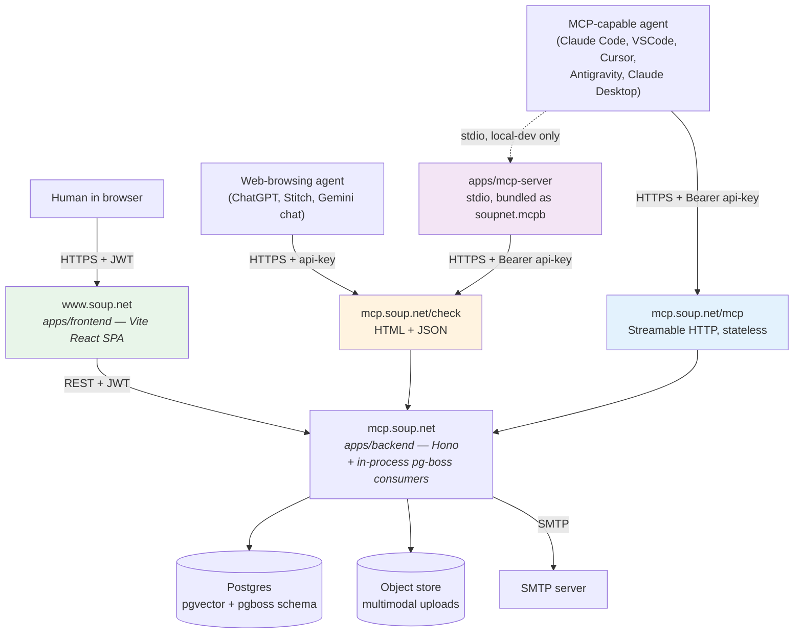
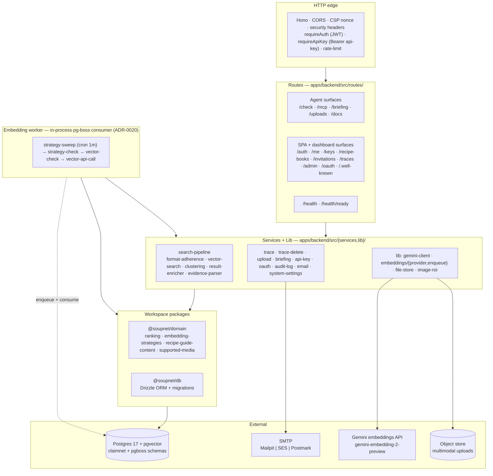
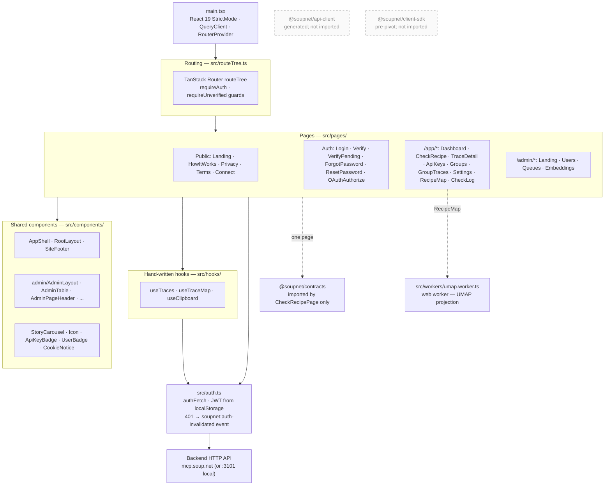
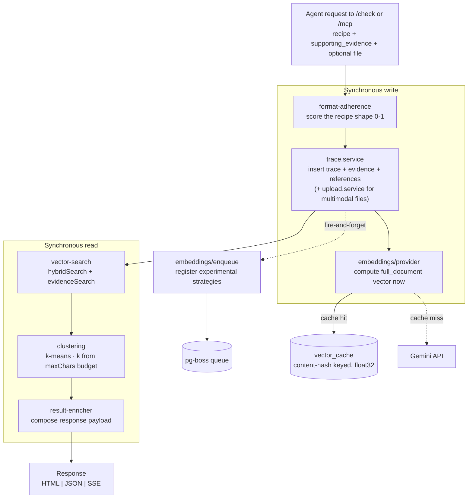
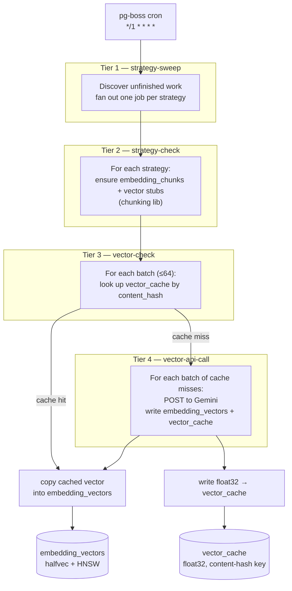
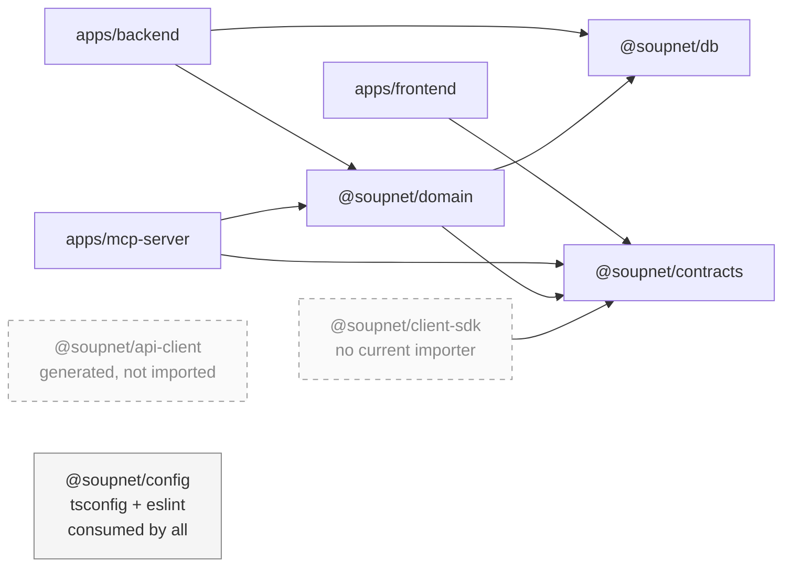

# Soup.net Architecture Overview

**Purpose:** the one scrollable page that orients you — who talks to what, how the data is shaped, what the three agent surfaces are. For details, follow the links. This doc summarizes; it is not the second source of truth.

- Request sequences, auth flow, embedding pipeline → `docs/architecture/data-flow.md`
- Table shapes, FK conventions → `docs/architecture/data-model.md` + generated reference
- Ranking / search / strategies → `docs/architecture/search-algorithms.md`, `search-strategies.md`, `vector-store.md`
- Decisions (with dates) → `docs/adr/`
- Product vision + agent archetypes → `docs/design-thinking.md`

## Topology

Two hostnames for the deployed system. Humans come in through `www.soup.net` (the SPA). AI agents come in through `mcp.soup.net` (the backend's public API, including `/check` and `/mcp`). Local dev collapses both onto `localhost`.

- **SPA** (port 5273 locally, `www.soup.net` in the hosted version) — human dashboard, recipe map, admin pages. JWT auth only.
- **Backend API** (port 3101 locally, `mcp.soup.net` in the hosted version) — Hono HTTP server, Drizzle ORM, in-process pg-boss consumers (ADR-0020). Agents and the SPA both terminate here.
- **Stdio MCP server** (`apps/mcp-server`) — kept for local dev and Claude Desktop via `.mcpb`. Clients that can't speak HTTP MCP use this to bridge stdio → the same backend. The hosted deployment does not run it.

Self-hosting requires Postgres 17 with `pgvector`, an SMTP server (or local Mailpit for dev), and an object store for multimodal uploads. Specific infrastructure choices are up to the operator.

## The three agent surfaces — one pipeline

| Surface | Auth | Transport | Use case |
|---|---|---|---|
| `/check` HTML / JSON | API key in URL or `Authorization` header | Plain HTTPS | Any browsing agent — zero setup. Human-readable HTML + structured JSON via `format=json` or `Accept: application/json`. |
| Remote MCP `/mcp` | Bearer API key | Streamable HTTP, **stateless** (ADR-0021) | Claude Code, VSCode, Cursor, Antigravity — the primary MCP path. Streaming responses arrive as `text/event-stream`; no session lifecycle. |
| Stdio MCP (`apps/mcp-server`) | API key via env | stdio JSON-RPC | Claude Desktop via `.mcpb`; local-dev agents that don't speak HTTP MCP. Proxies to `/check`. |

All three go through the same `submitAndSearch` service — parity is load-bearing (`feedback_dual_surface` memory). A change to one must land in the other two. See `data-flow.md` §2 for the MCP request lifecycle and §3 for the recipe check pipeline.

## Backend components

What's inside the Hono process. Routes are grouped by audience (agent surfaces vs. SPA surfaces), not alphabetically — the routing surface is the agent contract first and a dashboard backend second. The embedding worker runs in the same process as the HTTP server (ADR-0020), gated by `EMBEDDING_WORKER_ENABLED`; the same image runs HTTP-only or worker-only by flipping the flag.

Worth knowing for navigation:

- **No LLM on the server** (design rule §6). Gemini is the only third-party AI call, and it's only for embeddings.
- **No business logic in routes** (design rule §1) — routes parse, authenticate, delegate to `services/`, and return. The dense node in this diagram is `search-pipeline`, which is also the most-tested file in the backend.
- **`@soupnet/contracts` is reached transitively** through `@soupnet/domain`, not imported directly by backend code. Newer routes (`/check`, `/traces`, `/uploads`, `/auth`) validate inline rather than via the contracts package — pre-pivot legacy is being consolidated; see `backlog.md`.

## Frontend components

The SPA is a TanStack Router app with hand-written hooks that talk to the backend through one `authFetch` wrapper. There is no generated API client wired in today, despite the existence of `packages/api-client`; see the workspace package map below.

Worth knowing for navigation:

- **Auth is global state via `localStorage`**, not React context. `authFetch` reads the token directly; `requireAuth` route guards read a cached `email_verified` flag so guards stay sync (no fetch on every navigation). A 401 fires a window event that `AppShell` listens for to bounce to `/auth/login`.
- **The UMAP web worker** isolates the recipe-map projection off the main thread — embedding clustering can chew CPU for several seconds on first render. `useTraceMap` posts to the worker; the worker doesn't talk to the network.
- **One page imports `@soupnet/contracts`** (CheckRecipePage). Everywhere else, `Trace` and friends are declared locally in the hook file — pragmatic, but creates drift potential if a route response shape changes.

## Subsystem: recipe-check pipeline

Drill-down for the `/check` and `/mcp` hot path. The write side resolves the `full_document` and `full_recipe_context` SEMANTIC_SIMILARITY vectors in parallel before the transaction (so the trace is searchable on the next request) and reuses the trace vector as the search query vector — the read side makes zero embedding calls of its own. Experimental embedding strategies are backfilled by the worker's strategy sweep. The read side is pure semantic search + optional clustering.

Worth knowing:

- **Multimodal uploads are sync-only** (ADR-0019) — the async job shape doesn't carry file bytes, and diverging the two paths would corrupt the content-hashed vector cache.
- **The full-precision `vector_cache`** lives alongside the halfvec-quantized `embedding_vectors` so re-embedding the same content (same hash) skips the Gemini call entirely. The cache survives HNSW quantization; halfvec is for search, float32 is for cache portability.
- See `data-flow.md` §3 for the request-sequence view of the same pipeline.

## Subsystem: embedding worker

The 4-tier pg-boss pipeline (ADR-0002). Each tier reduces fan-out: a single sweep job spawns ~one job per strategy, which spawns batches of ≤64 chunks, which spawns one Gemini API call per batch of cache misses.

Worth knowing:

- **Idempotency is per-tier**, not end-to-end. A re-run of `strategy-check` will not re-chunk; a re-run of `vector-api-call` will skip rows already marked complete. That's how the worker survives restarts and how the same job can be safely retried.
- **`embedding.*` queues are the current names**; `embeddings.*` (no namespace) are legacy and still drained for in-flight pre-refactor jobs (`apps/backend/src/embedding-worker/queues.ts:22`). Removing the legacy handlers requires confirming an empty `embeddings.*` backlog.
- The same `EMBEDDING_WORKER_ENABLED=false` flag that disables the worker for HTTP-only nodes leaves the HTTP path's sync embedding write (Tier 0-equivalent) intact — primary writes never depend on the worker being up.

## Workspace package map

Who depends on whom across the npm workspaces. Two packages are currently orphaned by the source code despite still being listed as dependencies — flagged here so a self-hoster reading the architecture doesn't wire diagrams to ghosts.

Role of each package:

- **`@soupnet/db`** — Drizzle ORM schema + migrations for the `claimnet` Postgres schema. Single source of truth for tables; `$inferSelect` / `$inferInsert` produce TS row types. Consumed by `apps/backend` and `@soupnet/domain`.
- **`@soupnet/domain`** — business logic and shared agent-facing copy. `ranking.ts`, `embedding-strategies.ts`, `supported-media.ts`, `user-preferences.ts`, plus `recipe-guide-content.ts` (the briefing text agents see when they call `get_briefing`). No I/O; pure functions and constants. Consumed by `apps/backend` and `apps/mcp-server`.
- **`@soupnet/contracts`** — Zod schemas for the public API + the `zod-to-openapi` registry. Mostly legacy pre-pivot shapes (claims, validations, graph, nodes). The generator that emits `packages/api-client/openapi.json` reads this. Consumed directly by `apps/mcp-server` and (one page) by `apps/frontend`; consumed transitively by `apps/backend` through `@soupnet/domain`.
- **`@soupnet/config`** — shared `tsconfig.base.json` and ESLint config. Pulled in via `extends` by every workspace's local config; no runtime presence.
- **`@soupnet/api-client`** *(currently orphaned)* — Orval-generated React Query hooks + TS types from the committed `openapi.json` snapshot. Pipeline exists end-to-end; no source file in `apps/frontend` actually imports it. See `docs/architecture/type-safety.md` for the type-derivation chain and the gap.
- **`@soupnet/client-sdk`** *(currently orphaned)* — pre-pivot REST client. References endpoints (`/api/claims`, `/api/requests`, `/api/validations`) that the post-pivot Hono backend doesn't serve. Listed as a dependency by `apps/frontend` and `apps/mcp-server` but imported by neither. Candidate for deletion — tracked in `backlog.md`.

## Core data model

The three-entity model is inspired by two sources:

- **[Toulmin argumentation](https://en.wikipedia.org/wiki/Toulmin_model)** — the structural shape: a claim is supported by warrants, which are backed by data. Maps directly onto our tables.
- **[Design Thinking](https://en.wikipedia.org/wiki/Design_thinking) user stories** — the *text format* of the claim itself: "As a [role] working on [goal], I [prefer/chose] so that [reason]." Context (role + goal) is required so taste doesn't drift into assertion. See `packages/domain/src/recipe-guide-content.ts` for the agent-facing briefings that pin this.

| Table | User-facing name | Toulmin slot | Text shape |
|---|---|---|---|
| `traces` | Recipe | Claim | Design Thinking user story |
| `evidence` | Evidence | Warrant | Interpretation of how a reference supports the claim |
| `references` | Reference | Data | Verbatim quote + source citation |

N:N linking tables (`trace_evidence`, `trace_references`, `evidence_references`) carry the `api_key_id` that created each link — that's how coverage diversity gets scored. One key reinforcing itself counts less than multiple independent keys converging on the same recipe.

Identity and access: `users` × `organizations` × `groups` × `group_members` × `invitations`. The user-facing concept is **recipe books**; the schema-level table names stay `groups` / `group_members` per the deferred rename (ADR-0016). Recipe books are the unit of sharing; API keys are scoped to recipe books with independent read/write sets. See `data-model.md` for the full table list (embedding pipeline, vector cache, uploads, audit log, system settings).

## Core flow (one sentence)

Every recipe check is simultaneously a search and a contribution: the agent's recipe is written as a trace, then compared against the corpus, and the response ranks similar recipes. Stigmergy is the architecture — the act of searching leaves the trace that makes future searches smarter. The full sequence (format adherence, idempotency, lexical + semantic + RRF + clustering, async embedding enqueue) is in `data-flow.md` §3.

## Design rules that the rest of the code assumes

1. No business logic in routes or components — routes → services → Drizzle.
2. Two credential populations, strictly separate — JWT for humans, API keys for agents, no cross-surface fallback (engineering-principles.md §7).
3. Embeddings never block primary writes — the sync path pre-resolves the two search-critical `SEMANTIC_SIMILARITY` vectors in parallel outside the transaction; async pg-boss consumers fill in everything else (evidence, experimental strategies).
4. Multimodal embeddings are sync-only (ADR-0019) — the async job shape doesn't carry file bytes, and diverging the two paths would corrupt the content-hashed vector cache.
5. Agents are first-class — `/check` is designed for agent consumption; the SPA is a second-class citizen that happens to use the same backend.
6. No LLM on the server — the server indexes, searches, and ranks; remote agents do the reasoning.
7. System doesn't judge stance — the LLM author asserts stance at recipe write time. Search-time surfaces (related evidence, the map) are neutral: cosine over gemini-embedding-2-preview encodes topic, not stance, so the LLM consumer interprets stance against current context (ADR-0015).
