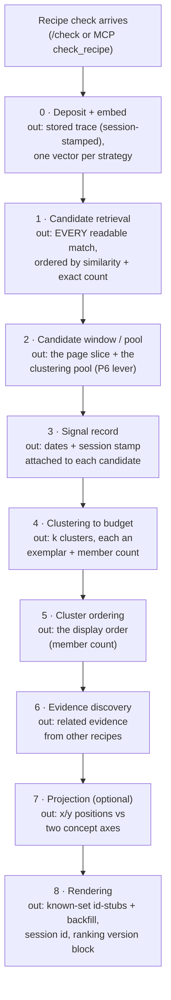

# The recipe-check ranking engine

> **Who this is for.** (1) A person new to this project who wants to understand what the ranking engine is for, how it works today, and how we'll know it's working — assuming no knowledge of decisions we've already made. (2) The AI agents building the companion evaluation workstream (currently private), for whom the [hypothesis register](#5-the-hypothesis-register) is the shared research agenda.
>
> **What this is not.** Not an implementation reference ([search-algorithms.md](search-algorithms.md) has the exact algorithms and code locations), not the math ([research-foundations.md](research-foundations.md)), not a history (the [ranking changelog](ranking-changelog.md) carries the timeline), and not the original build plan ([the implementation brief](../planning/check-recipe-ranking-system.md)). This page is the current truth plus the near future, summarized, with every detail linked. Facts here are quoted verbatim from their sources — if you find an unquoted number, treat it as a bug in this doc.

## 1. What this engine is for

Soup.net's core operation is the **recipe check**: an AI agent working for a human submits the judgment call it's facing — *"As a data engineer mapping client GL codes, I prefer…"* — and gets back the most similar judgments already recorded in the human's corpus, together with their evidence. Checking is also logging (the submitted recipe becomes part of the corpus — the stigmergic trick the [product README](../../README.md) explains), which means the ranking engine sits between everything agents have ever deposited and the small slice one agent sees at its moment of decision.

That framing gives the engine five goals, and everything else in this document serves one of them:

1. **Return the judgment that matters** — from the whole readable corpus, surface what bears on this call: the human's own prior ruling, a collaborator's, or the closest adjacent precedent.
2. **Include the surprise** — the objective is deliberately **utility × surprise**, not relevance-max: the check exists to bring back the adjacent judgment the agent didn't know to ask for, so pure similarity ordering would optimize away part of the value.
3. **Fit the caller's budget** — agent context is scarce, so the response reshapes itself to a requested size: results are clustered into representative exemplars, the caller can steer with an explicit cluster count or a character budget ([stage 4](#stage-4--clustering-to-the-callers-budget)), and recipes the session already knows render as id-stubs whose freed budget backfills with novel content ([stage 8](#stage-8--rendering)).
4. **Stay sharp as the corpus ages and fills** — a heavily-used, multi-agent, months-old corpus must answer as well as a fresh one. Self-pollution resistance (the current headline problem) is one instance of this goal; temporal decay and reinforcement are its future instances.
5. **Be an experimentation platform, not a final algorithm.** Operator direction, verbatim: *"We're not building the final engine here, we're building a system that we can try experiments with, and soupnet-evals can test and regression test."* (Andy, design review, 2026-07-16 — recipe `a7108776`). Every stage occupant is replaceable, every parameter is a named lever, and an idea should become an experiment by touching an [extension point](#4-extension-points--how-an-idea-becomes-an-experiment), not by rewriting the system.

## 2. Design principles

Three principles actually inform decisions in this engine — each stated with what it buys, not what it forbids:

1. **The server does cheap, deterministic math; the reasoning stays with the agent.** *"the server does math (embeddings, search, clustering, ranking); agents do the reasoning."* ([brief §2](../planning/check-recipe-ranking-system.md)) What this buys: operating cost that doesn't scale with how hard people use their corpus, and results that are reproducible and auditable (the same check under the same algorithm version returns the same ranking — which is what makes offline regression testing possible at all). LLM-assisted capabilities live *off* the ranking path as opt-ins — the premium `synthesize` distillation is the shipped precedent — so richer paid features can arrive later without changing what baseline retrieval costs or how it behaves.
2. **Honest scores, budget-shaped display.** No relevance-score floor ever silently hides a result: candidates are ordered by similarity, windowed by rank ([stage 3](#stage-3--the-candidate-window)), and summarized by clustering to the caller's budget — and the similarity number displayed is always the raw score, even when an adjusted score changed the ordering: *"The displayed similarity percentage is the raw cosine similarity and is **never mutated**"* ([echo-suppression.md](../planning/echo-suppression.md)). (This is the 2026-07-16 reframe of an older, absolutist "no cutoffs, ever" rule — display inevitably cuts somewhere, and pretending otherwise obscured a real open question about *where*, which is now hypothesis [P6](#presentation--budget). Recipe `e2a0795f`.)
3. **Protection comes from someone else.** When an agent grades its own retrievals, the grades mostly point back at text that agent itself submitted earlier the same run — the audit of 705 automated feedback rows from the PERMA benchmark campaign found most "useful" verdicts were the agent's own same-day check coming back to it: *"70.5% of the 'useful' hits were backed by the agent's own run-date hypothesis-append echoed back, not durable user history (only 27% from genuine history)."* ([audit recipe `ff54eafd`](https://www.soup.net/traces/ff54eafd-b22f-476e-93a1-cf3fe0da0fc8), 2026-07-09; the graded dataset is [golden set #2 in the brief](../planning/check-recipe-ranking-system.md)). So any signal that protects, boosts, or reinforces a recipe must come from provenance the reporting agent can't self-supply: a human's reaction, a *different* agent's report, a deliberate decision date.

## 3. The pipeline, stage by stage

One pipeline serves every surface ([search-pipeline.ts](../../apps/backend/src/services/search-pipeline.ts)); a single config object ([`RankingConfig`](../../packages/domain/src/ranking-config.ts)) flows through it. Each stage below states what goes in and what comes out, with the detail linked.

### Stage 0 — deposit and embedding

**In:** the submitted recipe text (+ evidence). **Out:** a stored trace, and one embedding vector *per strategy*. Every recipe is embedded several ways concurrently — the claim text alone (`full_document`, synchronous), the claim plus its evidence (`full_recipe_context`, async), and a set of experimental preamble variants (`exp_*`) that a worker backfills across the whole corpus automatically. The multi-strategy pipeline is itself experiment infrastructure, by design: *"It's essential, since it allows different embedding approaches to also be concurrently generated so we can evaluate and iterate that part of the system too."* (Andy, 2026-06-10, recipe `ad08a8e1`). Which strategies *compete in production search* is a separate, deliberate list ([`PRODUCTION_SEARCH_STRATEGY_IDS`](../../packages/domain/src/embedding-strategies.ts)). Detail: [search-algorithms.md §Embedding Strategies](search-algorithms.md#embedding-strategies).

### Stage 1 — candidate retrieval

**In:** the query vector (the just-embedded recipe — reused, so this stage makes no additional embedding calls) plus the key's readable recipe books, and optionally `filter` keywords that narrow candidates by substring match. **Out:** **every** readable recipe that matches, ordered by cosine similarity, with an exact total count — **the list is ordered here, never shortened**. Each recipe's best score across the production strategies is its score (so a recipe can match on its claim text *or* its evidence context, whichever is stronger). The count query is exact by ruling: *"totalResults — an exact COUNT(DISTINCT trace) with no distance work (~5ms). Keeps the recall un-cap's honesty (operator decision 2026-07-01: no silent candidate cap)"* ([vector-search.service.ts](../../apps/backend/src/services/vector-search.service.ts)). An approximate index (HNSW) accelerates the common case with an exact-scan fallback. Detail: [search-algorithms.md §Main Search](search-algorithms.md#main-search--pure-semantic-2026-04-11).

On "how loose is the matching": there is no looseness knob and no score threshold — cosine similarity orders *all* candidates (principle 2). What varies is how much of that ordered list survives into the displayed summary, which is stages 2 and 4 — and the size of that survival window is itself a lever ([P6](#presentation--budget)).

### Between retrieval and the window: deliberately no scoring stage

Nothing reorders candidates after retrieval, by ruling: **ranking is a pure function of the check's explicit inputs and the corpus** — *"The sum of the inputs to the recipe check should be all that influences the results. Holds true even if we add reranking layers later"* (Andy, 2026-07-17, recipe `9067ca1b`). The previous occupant of this slot — echo demotion by API-key authorship — shipped default-OFF and was retired without ever flipping on: it made results a black box (*"Did that old recipe dissappear because it got deleted by the human because it was wrong? Or is it just gone because I submitted it?"*), and the same-key signal conflated a fleet's sibling sub-agents with echoes ([retirement record](ranking-changelog.md); design history: [echo-suppression.md](../planning/echo-suppression.md)). Future scoring levers (temporal decay [S4](#identity--scoring), reinforcement [S5](#identity--scoring)) land here as pure functions of explicit inputs and corpus state, through the register.

### Stage 2 — the candidate window and clustering pool

**In:** the ranked full list. **Out:** the page slice (`per_page`, default 20 — [search-pipeline.ts](../../apps/backend/src/services/search-pipeline.ts), `params.perPage ?? 20`) with exact count and page arithmetic, plus the **clustering pool**: the top candidates down to a relevance boundary, independent of the page. Pool modes ([ranking-config.ts](../../packages/domain/src/ranking-config.ts)): `fixed:100` (**the default since 2026-07-19** — the retrieve-~100-then-refine convention of production practice: sbert's *"a retrieval system that retrieves a large list of e.g. 100 possible hits"*, Elasticsearch's diversified-sampler default of 100, Carrot2's *"a hundred documents on input is probably the minimum"*; sources quoted in the [pool-sizing memo](../planning/ranking-research/candidate-pool-sizing.md)), `page` (the legacy pagination-window pool, now a comparison arm), and `score-gap` (adaptive largest-gap boundary between `minSize` and `size` — the Adaptive-k literature's answer to query-dependent variability; it trailed fixed in both measured embedding spaces and stays a comparison arm — [sweep report](../planning/ranking-research/p6-pool-sweep-report.md)).

Honest assessment (resolved 2026-07-19): the 20 was an inherited web-pagination default with no recorded performance or quality rationale, and on the check path it did a second job it was never designed for — it was also the **clustering pool**; the fixed:100 flip ended that double duty (per_page still sizes the flat page, and only that). The engine's other surfaces already size that pool independently: the Recipe Map passes *"perPage: 10000, // no pagination limit — clustering IS the pagination"* ([traces.ts](../../apps/backend/src/routes/traces.ts)), briefing exemplars use 10,000, and the eval runner uses 100 — the check path is the only consumer clustering a page-sized pool. Performance does not force the small window at current scale: the map k-means over the whole corpus after MRL-truncating vectors to 768 dims, *"4× less transfer/parse/k-means work than the full 3,072 dims"* ([search-pipeline.ts, `MAP_VECTOR_DIMS`](../../apps/backend/src/services/search-pipeline.ts)).

Why this matters: clustering's purpose is diversity, and a fixed similarity-ranked window caps the diversity available to it — the richer the corpus, the more homogeneous its top 20. The operator's framing of the open question, verbatim: *"It feels like the point of clustering is diversity, and that the default 20 limits this. So this might be our actual 'echo chamber' issue."* (Andy, design review 2026-07-16, recipe `bb952d78`). That was hypothesis [P6](#presentation--budget) — measured at real scale 2026-07-19 and confirmed: display diversity rises with the pool and saturates at or before pool 60 in both embedding spaces, with every flat metric invariant and effect size largest where near-duplicates are dense ([sweep report](../planning/ranking-research/p6-pool-sweep-report.md)). The default is now `fixed:100` @ 768-dim pool vectors (version `2026-07-19`, [changelog](ranking-changelog.md)); flat pagination is untouched. A naming honesty note travels with it: when results are clustered, the *cluster count* is what the caller actually receives, so "pagination" describes the flat/`expand` mode better than the default clustered mode.

### Stage 3 — the per-candidate signal record

**In:** the windowed candidates (and pool). **Out:** each candidate carries a concrete record — [`CandidateSignals`](../../packages/domain/src/ranking-config.ts): its raw append time, its deliberate decision date (`decided_at`) if backfilled, and the session token stamped at deposit. All ride the existing row load (zero extra queries). The session field feeds stub *rendering* only — never ranking; future lever signals join this record rather than adding new plumbing.

### Stage 4 — clustering to the caller's budget

**In:** the page of candidates, their vectors, and the caller's size steer — either an explicit cluster count (`clusters`) or a character budget (`max_chars`), from which the engine estimates how many exemplars fit: *"Auto-K estimation: `k = floor(budget / (avgChars × 3.5))`"* ([search-algorithms.md, parameter table](search-algorithms.md#endpoint-inventory)). **Out:** k clusters, each represented by its **exemplar** — the real recipe nearest the cluster's center (always real stored text, never generated — principle 1) — plus a member count so the caller knows what each exemplar stands for. This is how goal 3 (fit the budget) is met: clustering *is* the response-size mechanism. `expand=true` bypasses it and returns the flat page. Algorithm: k-means with deterministic k-means++ seeding, [clustering.service.ts](../../apps/backend/src/services/clustering.service.ts); math and lineage: [research-foundations.md §2](research-foundations.md).

### Stage 5 — cluster ordering

**In:** the k clusters. **Out:** their display order — the first thing the caller reads. Biggest cluster first. (The retired demotion-adjusted-mass alternative left with demotion; a future relevance-weighted ordering would enter through the register as its own measured lever.) The `clusters[i] ↔ results[i]` index-parallel contract the briefing-exemplar and map surfaces rely on is test-enforced.

### Stage 6 — evidence discovery

**In:** the same query vector. **Out:** individual **evidence entries from other recipes** that are topically close to the checked recipe — a second retrieval over evidence-level embeddings (each stored with its parent recipe's text prepended, the Contextual Retrieval pattern — [research-foundations.md §3](research-foundations.md)), de-duplicated so one parent recipe doesn't dominate, sized to match the cluster count. This is a large part of goal 2: evidence arrives from recipes the flat ranking might never have surfaced.

### Stage 7 — projection (optional)

**In:** `axes=termA,termB` — two caller-chosen concept words. **Out:** an x/y position for every result: its cosine similarity to each concept's embedding, so an agent (or the Recipe Map UI) can reason about where results fall between two ideas. Non-destructive by design — every result gets a position, nothing is filtered. The same mechanism powers the Recipe Map's concept-axes mode; the map's other view (UMAP) runs client-side and is a visualization concern, not a ranking one. Detail: [research-foundations.md §1](research-foundations.md), [search-algorithms.md §Concept-Axis Projection](search-algorithms.md#concept-axis-projection-tcav-style).

### Stage 8 — rendering

**In:** everything above, plus the caller's known-set — the session's context-fill state: its prior deposits ∪ **what the server has shown it** (the `session_shown` display history, 7-day window) ∪ client-declared `known_recipes` ids, keyed by the opaque `session_id` token (self-healing, echoed back as `data.sessionId`). **Out:** the response — HTML, JSON (`format=json`), or MCP text/structured. Known recipes render as **id-only stubs at their true ranks** while the display window *walks down the identical ranking until it holds its full budget of unseen recipes* — *"walk down the results until it found one that the calling agent by sessionID didn't already know. That's the whole point. We surface something new each time."* (Andy, 2026-07-17, recipe `31d184df`). The same rule covers evidence discovery (known-parent entries stub; novel parents fill the budget) and cluster exemplars (a known exemplar yields to its next-nearest unseen member). Every full text rendered is recorded as shown, so the session fills like an agent's context — and an agent that compacts its context simply omits the token to start refilling. Purity restated precisely: **ranking is a pure function of the check's inputs and the corpus; rendering is a function of those plus the session's display history — which is exactly what presenting a session token means.** The `ranking` block (`{version, clusterPool}`) stamps every JSON/structured response; the premium `synthesize` distillation also lives here, off the ranking path.

### How a ranking change ships

Any change to any stage: offline sweep on golden datasets (`npm run eval:ranking`) → report → human ruling → the default change, a version bump, and a [changelog](ranking-changelog.md) entry in one commit — so defaults never shift under users silently. Two enforcement layers back this: mechanism-regression tests inside the standard `test:ci` gate (the engine's invariants as literal assertions — result sets identical across arms, displayed scores byte-equal — plus echo exposure measured at every stage boundary: [ranking-regression.test.ts](../../apps/backend/src/services/ranking-regression.test.ts)), and the golden-set evaluation gating CI ([workflow](../workflows/ranking-tuning.md), [dataset contract](../../eval/golden/README.md)).

## 4. Extension points — how an idea becomes an experiment

The stress test this architecture must pass: an arbitrary new ranking idea should map onto one of these points — code change scoped to the point itself, measured by the harness, shipped (or discarded) as a versioned event. If an idea genuinely fits none of them, that's a finding about the architecture and belongs in the backlog.

| You want to experiment with… | Extension point | What you touch | Nothing else moves because… |
|---|---|---|---|
| How recipes are *embedded* (preambles, sections, emphasis, models) | The strategy registry ([embedding-strategies.ts](../../packages/domain/src/embedding-strategies.ts)) | Add a named strategy; the worker sweep backfills the whole corpus automatically | Search only reads strategies listed in `PRODUCTION_SEARCH_STRATEGY_IDS`; the map's strategy dropdown and the harness can score a strategy before it ever competes live |
| What *ranks* a candidate beyond similarity (identity, decay, reinforcement, stance) | The scoring occupant (stage 2) + a [`CandidateSignals`](../../packages/domain/src/ranking-config.ts) field | A pure function in `@soupnet/domain` + one hydration column/query | Stages consume the adjusted order and the signal record, not each other's internals |
| What the caller *sees first* (cluster ordering, exemplar choice) | Stage 5/6 parameters (`memberWeights`, ordering key) | A `RankingConfig` field read at the cluster stage | The `clusters[i] ↔ results[i]` contract is test-enforced, so consumers don't care how order was computed |
| How much the caller gets (budget shaping, drill-down, hierarchy) | The `clusters` / `max_chars` / `expand` / `page` surface | The auto-k estimator or a new response param | Clustering is stateless and recomputed per request — the same check re-submitted with different shape params is idempotent |
| What the response *carries* (stubs, positions, metadata) | Stage 8/9 (rendering-only levers) | A response field or render rule | Rendering levers are documented as unable to touch logging, scoring, or cluster math |
| How any of the above is *judged* | The metric suite ([metrics.ts](../../apps/backend/src/eval/metrics.ts)) + per-dataset thresholds | A metric function + a `thresholds.json` rule with a written rationale | Metrics read pipeline output; they can't affect it |

**The stress test, worked.** The operator's deliberately-weird probe (offered *"to show how I want to 'stress test' the system architecture so that we can try different ideas without rewriting the system"* — Andy, design review 2026-07-16, recipe `a7108776`): embed each recipe several more times, each with a preamble emphasizing one part of the Toulmin/user-story structure (*"Emphasis on the goal: …"*, *"Emphasis on the user: …"*), let the checking agent pass an optional `emphasis` parameter, and search that embedding so results cluster around the chosen facet. Mapping: the per-facet embeddings are **new registry strategies** (the existing `exp_trace_instructed` strategy already tests the preamble mechanism, and the E5 research it rests on is cited in [search-algorithms.md §Experimental Embedding Strategies](search-algorithms.md#experimental-embedding-strategies-clustering-experiments)); the caller's `emphasis` param selects the strategy the retrieval predicate filters on (the same filter the map's strategy dropdown already uses); the harness scores it with a facet-labeled question set before anyone flips anything. No stage rewrite, no schema change beyond registry rows. That's the bar every future idea gets held to.

## 5. The hypothesis register

What we suspect might improve the engine, where each idea came from, which extension point carries it, and what we learn either way. This register — not a task list — is the shared agenda with the evaluation workstream: each row is a question whose answer changes a shipped default or kills an idea with evidence. Status legend: **plumbed** = the lever exists in code awaiting measurement; **infrastructure ready** = the extension point exists, the experiment doesn't; **notes only** = design notes exist.

### Retrieval & embedding

| # | Hypothesis | Source | Extension point | Status |
|---|---|---|---|---|
| R1 | Evidence dilutes clustering — trace-only embeddings cluster judgment better than claim+evidence blends: *"the `full_recipe_context` strategy conflates the core judgment with diverse evidence topics"* | [search-algorithms.md §Experimental Strategies](search-algorithms.md#experimental-embedding-strategies-clustering-experiments) | Strategy registry (six `exp_*` variants already embed the whole corpus, **never yet scored** beyond visual map inspection — recipe `ad08a8e1`) | infrastructure ready |
| R2 | Instruction preambles sharpen embeddings (E5: *"instruction-prefixed embeddings improve downstream task quality"*) | [search-algorithms.md, research basis](search-algorithms.md#experimental-embedding-strategies-clustering-experiments) | Strategy registry | infrastructure ready |
| R3 | Facet-emphasis embeddings + a caller `emphasis` param cluster results around the chosen part of the judgment (the [worked stress test](#4-extension-points--how-an-idea-becomes-an-experiment) — illustrative, not committed) | Andy, design review 2026-07-16 (recipe `a7108776`) | Strategy registry + one request param | notes only |
| R4 | HyDE-style query synthesis helps vague checks (*"Construct a synthetic 'ideal recipe' to improve retrieval for vague queries"*) — in tension with principle 1, so it would have to be client-side or template-based | [search-algorithms.md §Open Improvements](search-algorithms.md#open-improvements-and-investigations) | Query construction before stage 1 | notes only |
| R5 | Lexical+semantic hybrid (RRF) earns its way back: *"RRF may be reintroduced if future experiments demonstrate a quality benefit"* — it ran in production and was removed for lack of validated improvement, so the reintroduction bar is a measured win | [research-foundations.md, Appendix: Paused Techniques](research-foundations.md#appendix-paused-techniques) | Stage 1 (a second ranked list + rank fusion) | notes only |

### Identity & scoring

| # | Hypothesis | Source | Extension point | Status |
|---|---|---|---|---|
| S1 | ~~Explicit session identity beats same-API-key authorship for echo detection~~ **Resolved 2026-07-17, as rendering rather than scoring**: the session token + known-set id-stub rendering with budget backfill shipped (stage 8); suppression itself was retired — ranking stays a pure function of inputs (recipes `9067ca1b`, `4d25aec9`) | Andy, design reviews 2026-07-16/17 | Shipped: `session_id` + stub rendering | built |
| S2 | ~~Echo demotion recovers polluted-corpus retrieval~~ **Retired 2026-07-17 unflipped** — the "pollution" it targeted is benchmark run hygiene, not product behavior (recipe `ebdc6ad7`); [retirement record](ranking-changelog.md) | [echo-suppression.md](../planning/echo-suppression.md) (superseded) | — | retired |
| S3 | ~~Corroboration exemptions protect reinforced recipes from demotion~~ **Retired with demotion 2026-07-17** — the provenance principle survives for future *reinforcement* levers (S5), which re-enter through this register | [Feedback-calibration audit 2026-07-09](https://www.soup.net/traces/ff54eafd-b22f-476e-93a1-cf3fe0da0fc8) | — | retired |
| S4 | Temporal decay from the *judgment* date (`COALESCE(decided_at, created_at)`) retires superseded judgments without burying stable old truths; candidate shapes — exponential, result-set-relative softmax, log-decay with reinforcement — are written up, and the open methodological question is on record: *"Is temporal decay of recipe relevance (stigmergic evaporation) well-modeled by exponential decay, or would a reinforcement-aware function be more appropriate?"* | [search-algorithms.md §Stigmergic Decay](search-algorithms.md#stigmergic-decay--temporal-weighting-of-recipes-research-needed); [research-foundations.md, Open Questions #4](research-foundations.md#open-questions-for-researcher-review) | New scoring term reading `CandidateSignals` dates | notes only |
| S5 | Coverage/diversity weighting — recipes reinforced by *independent* agent sessions outrank one agent reinforcing itself (*"Diversity weighting: multiple independent agent sessions converging > one agent reinforcing itself"*) | [search-algorithms.md §Coverage Signal](search-algorithms.md#coverage-signal-deferred) | New scoring term + a signals count | notes only |
| S6 | Stance-aware presentation — embeddings can't see negation (*"A recipe with 10 contradicting and 0 supporting evidence should rank differently than one with 10 supporting and 0 contradicting — even though their vector similarity to the query is identical"*), so stored stance links could inform presentation without the server judging truth | [search-algorithms.md §Open Improvements #4](search-algorithms.md#open-improvements-and-investigations) | Signals field + rendering annotation (per ADR-0015, interpretation stays with the agent) | notes only |

### Presentation & budget

| # | Hypothesis | Source | Extension point | Status |
|---|---|---|---|---|
| P1 | ~~Cluster ordering by demotion-adjusted mass~~ **Retired with demotion 2026-07-17**; a future relevance-weighted ordering would be its own registered lever | [Retirement record](ranking-changelog.md) | — | retired |
| P2 | Order-independent k-means seeding decouples scoring experiments from clustering outcomes (today an upstream reorder restructures cluster membership) and improves check-to-check stability (*"K-Means is non-deterministic… the same query can return different exemplars"*) | [Backlog](../backlog.md); [search-algorithms.md §Clustering #6](search-algorithms.md#open-improvements-and-investigations) | Stage 5 seeding rule | notes only |
| P3 | Clusters within clusters — hierarchical drill-down on the check surface (the map already re-clusters a cluster's members via `traceIds`; the response-summarization plan sketches a `depth` param and divisive splitting gated on cluster quality) | Andy, design review 2026-07-16; [search-algorithms.md §Response Summarization](search-algorithms.md#response-summarization-via-vector-clustering-planned) | Budget-shaping surface (stateless re-clustering per request) | notes only |
| P4 | Silhouette scores surfaced per response tell agents whether a clustering was meaningful or arbitrary (*"Surface this to agents so they can judge whether the clustering was meaningful or arbitrary"*) | [search-algorithms.md §Clustering #7](search-algorithms.md#open-improvements-and-investigations) | Rendering metadata | notes only |
| P5 | K-medoids extractive summarization — medoid recipes as information-dense compressed responses at very tight budgets (*"the 'summary' is composed of real recipes — no generated text, no hallucination risk, no LLM needed"*) | [search-algorithms.md §Response Summarization](search-algorithms.md#response-summarization-via-vector-clustering-planned) | Stage 5 occupant variant | notes only |
| P6 | The fixed candidate window caps clustering diversity as the corpus grows: *"the point of clustering is diversity, and that the default 20 limits this. So this might be our actual 'echo chamber' issue."* A **relevance-bounded** pool (score-gap boundary) restores it without a brittle global cutoff — fixed caps proved fixture-relative (2026-07-17: `fixed:100` degenerated to whole-corpus on 45 traces), and *"a hundred documents on input is probably the minimum for any statistical significance"* (Carrot2) sizes the ballpark. **Measured at real scale 2026-07-19** ([sweep report](../planning/ranking-research/p6-pool-sweep-report.md)): coverage rises and saturates at or before pool 60 in both embedding spaces with every flat metric invariant; effect size is embedding-dependent (bge +2.8–3.2pts, gemini +0.34–0.55pts — the lever matters most where near-duplicates are dense); score-gap trails fixed in both spaces. Default flipped `page` → `fixed:100` (version `2026-07-19`, [changelog](ranking-changelog.md)) | Andy, design reviews 2026-07-16/17 (recipes `bb952d78`, `81f40bbd`); [pool-sizing memo](../planning/ranking-research/candidate-pool-sizing.md); [sweep report](../planning/ranking-research/p6-pool-sweep-report.md) | `clusterPool` lever at stage 2: `fixed:100` (default since 2026-07-19) / `page` (legacy comparison arm) / `score-gap` (comparison arm) @ 768-dim pool vectors | measured — default flipped |

### Measurement itself

| # | Hypothesis | Source | Extension point | Status |
|---|---|---|---|---|
| M1 | Ser@L (the utility × surprise proxy) tracks real downstream usefulness — validated against feedback-row outcomes, which carry principle 3's measured self-report caveat. **Validated eval-side 2026-07-17** against the 705 graded rows: *"Ser@L earns its place as a report-only regression/tuning metric — not a ranking driver"*; pure rank-discounted relevance is *"a self-pollution trap"* (echo-over-genuine AUC **0.103**, inverted) while *"Ser@L's surprise term corrects direction on all three cuts"* (0.103 → 0.332; full-list 0.573). Caveat: the offline run used a *"conservative **lexical** surprise proxy"* — a same-embedding confirmatory run is queued eval-side, non-blocking | [Ser@L validation pointer](../planning/seral-validation-pointer.md); [Serendipity memo](../planning/ranking-research/serendipity-diversity-metrics.md); recipes `ff54eafd`, `74e925ec` | Metric suite | validated (report-only) |
| M2 | The synthetic thresholds' margins match the true cross-platform noise floor | [Tuning workflow §Threshold philosophy](../workflows/ranking-tuning.md) | Threshold rules | plumbed |

## 6. What standard retrieval systems do that we deliberately don't

For a reader arriving from mainstream RAG practice — each divergence is a choice with a reason and a source, and several have explicit ways back in:

- **Hybrid lexical+semantic retrieval** — we ran it (tsvector + RRF) and removed it: *"Simplified to pure vector similarity baseline because the hybrid layer added complexity without validated improvement over semantic-only search."* ([research-foundations.md, Appendix](research-foundations.md#appendix-paused-techniques)). Way back in: hypothesis R5.
- **Cross-encoder / LLM re-rankers** — kept off the ranking path (principle 1): the cheap-math server is a product property, and LLM capability arrives as off-path opt-ins instead. Way back in: a measured quality ceiling arithmetic provably can't cross, or a paid tier where per-check inference cost is priced in.
- **Relevance-score thresholds** — no score floor ever hides a result (principle 2); the budget problem thresholds usually solve is handled by the rank window plus clustering to the caller's size — and the window's size is an open lever ([P6](#presentation--budget)), not a hidden constant pretending not to exist.
- **MMR-style diversity re-ranking** — diversity is delivered structurally (clustering + per-parent evidence dedup) rather than by a redundancy penalty in the flat order; the [serendipity memo](../planning/ranking-research/serendipity-diversity-metrics.md) covers why naive diversity metrics mislead (duplicate-clump pitfalls) and what we measure instead.
- **Fine-tuned or per-user embedding models** — one provider/model per deployment, switchable but not blendable ([ADR-0023](../adr/0023-local-embedding-providers.md)); personalization comes from the corpus content and the signal record, not from model weights.
- **Click-signal learning** — there are no clicks; consumers are agents. The equivalent signal is structured per-recipe feedback with provenance, and principle 3's audit says why it must be treated skeptically.

What we *do* share with standard practice, with lineage: contextual retrieval for evidence embeddings, k-means++ summarization, TCAV-style concept projection, ANN-with-exact-fallback retrieval — each with its research citations in [research-foundations.md](research-foundations.md), and the five [ranking-research memos](../planning/ranking-research/) document the field practices (offline IR evaluation, ranking regression testing, LTR feature architecture, serendipity metrics, config management) this engine's measurement design was built from.

## 7. What success looks like

In human terms — the engine succeeds when these are ordinarily true (the technical metrics that operationalize them belong to the evaluation workstream and [the tuning workflow](../workflows/ranking-tuning.md)):

- **The agent gets the ruling the human actually made.** An agent facing a judgment call checks it and the human's own prior decision — or their collaborator's — comes back at the top with its evidence, not buried under near-duplicates of the agent's own question.
- **The corpus rewards use instead of degrading with it.** A person who has checked thousands of recipes across many agents gets *better* answers than they did at fifty recipes — never worse. Nobody has to garden their corpus for the ranking to hold up.
- **The surprise arrives.** Checks routinely surface the adjacent judgment the agent didn't know to ask for — the related evidence, the cross-project precedent — and agents' feedback says it changed what they did.
- **A fleet works like a team.** Parallel sub-agents see each other's fresh trails (that's how they coordinate) while each one's own just-written hypotheses don't drown its next search.
- **Answers fit where they land.** A tight-context agent asks for 2,000 characters and gets a faithful miniature of the same answer a 20,000-character caller gets — not a different answer.
- **Every change arrives with receipts.** No ranking behavior ever shifts under users silently: each shift has a version, a changelog entry, the measurement it rests on, and the human ruling that shipped it.

## Near future (committed direction, not yet built)

- The three parked default flips — echo demotion (S2), mass cluster-ordering (P1), corroboration exemptions (S3) — each awaiting golden-set measurement and a ruling, shipped as [changelog](ranking-changelog.md) events.
- Session identity for scoring (S1) — design stage, [backlog](../backlog.md).
- Real golden datasets from the evaluation side (the synthetic starter proves machinery, not product — [dataset contract](../../eval/golden/README.md)).
- Decay + reinforcement (S4/S5) — the "stay sharp as the corpus ages" goal's next instances, entering through the same register.

## Doc map

| Document | What it holds |
|---|---|
| [search-algorithms.md](search-algorithms.md) | Implementation reference — exact algorithms, parameters, code locations, open improvement notes |
| [research-foundations.md](research-foundations.md) | The math, research lineage, verification experiments, paused techniques, open researcher questions |
| [search-strategies.md](search-strategies.md) | Alternatives considered and output-strategy notes |
| [ranking-changelog.md](ranking-changelog.md) | The timeline: every default change, with measurements and rulings |
| [check-recipe-ranking-system.md](../planning/check-recipe-ranking-system.md) | The implementation brief this engine was built from |
| [echo-suppression.md](../planning/echo-suppression.md) | The current scoring occupant's design doc |
| [ranking-research/](../planning/ranking-research/) | Five quote-backed research memos (offline IR eval, regression testing, LTR architecture, serendipity metrics, config management) |
| [ranking-tuning.md](../workflows/ranking-tuning.md) | The tuning workflow: sweep → report → ruling → versioned event |
| [eval/golden/README.md](../../eval/golden/README.md) | Golden dataset file contract + delivery path |
| [ranking-config.ts](../../packages/domain/src/ranking-config.ts) | The config object: every lever, default, range, and rule |
| [recipe.ts (contracts)](../../packages/contracts/src/recipe.ts) | The canonical Recipe wire schema — one object at every fill level, field definitions as source of truth; published at `GET /schemas/recipe.json` + `/schemas/check-response.json` |
