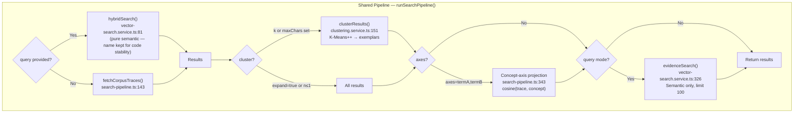

# Search Algorithms — Implementation Reference

> **Purpose:** Documents what is actually implemented — the exact algorithms, parameters, code locations, and endpoint-to-component mappings. This is the ground truth for how search works today.
>
> **Audience:** Engineers working on the codebase. Read this to understand what code does what and where to make changes.
>
> **Related docs (and how they differ):**
> - [ranking-engine.md](ranking-engine.md) — **The ranking engine for newcomers**: goals, the pipeline stage by stage with inputs/outputs, extension points, and the hypothesis register. Start there; come here for code-level detail.
> - [research-foundations.md](research-foundations.md) — **Why** each algorithm works: formal math (LaTeX), research lineage, verification experiments. Same algorithms, deeper theory. Written for researchers.
> - [search-strategies.md](search-strategies.md) — **What we considered:** general research notes, alternatives we evaluated, ideas for future exploration. Not necessarily implemented.
> - [design-thinking.md](../design-thinking.md) — **Who and why:** user archetypes, product vision, design principles. No algorithm details.
>
> **Rule of thumb:** If it's running in production, document it here. If it's the math behind what's running, put it in research-foundations.md. If it's something we considered or might try, put it in search-strategies.md.

For formal mathematical descriptions and research lineage of each algorithm, see [research-foundations.md](research-foundations.md).

---

## Implementation: Endpoints → Search Components

Every search endpoint ultimately calls `runSearchPipeline()` in `apps/backend/src/services/search-pipeline.ts`. The pipeline is the single, shared search+cluster+project engine. What differs per endpoint is: which parameters are passed in, what enrichment happens after, and how results are formatted.

### Pipeline Architecture (shared by all endpoints)



### Endpoint Inventory

#### 1. `GET/POST /check` — Recipe Check

| | |
|---|---|
| **File** | `apps/backend/src/routes/check.ts` |
| **Auth** | API key (`key` param in query/form) |
| **Audience** | AI agents (all three archetypes) and human debugging |
| **Formats** | HTML (default), JSON (`format=json` or `Accept: application/json`) |

**Call chain:**

```
/check → handleCheck() → submitAndSearch() → runSearchPipeline()
                                            → enrichResults()
                                            → clusterEvidenceInResults()
```

**Search stages:**
1. **Format adherence check** — heuristic score gates bad recipes (`format-adherence.ts`)
2. **Idempotent insert** — trace + evidence + references written to DB (the stigmergic deposit)
3. **Embedding enqueue** — `full_document` embedding sync; evidence + `full_recipe_context` async via pg-boss
4. **Semantic search** — pgvector HNSW cosine similarity (lexical/RRF removed 2026-04-11)
5. **Recipe clustering** — K-Means on trace vectors, returns exemplars (default: `clusters=3` for JSON, `max_chars=3000` for HTML)
6. **Evidence discovery** — semantic search against evidence embeddings, diversified by parent trace
7. **Concept-axis projection** — if `axes` param provided, cosine similarity to two concept embeddings
8. **Result enrichment** — batch-loads evidence entries + references per result trace
9. **Evidence sub-clustering** — K-Means within each trace when evidence count > 5

**Parameters affecting search:**

| Parameter | Effect on search | Passed to |
|---|---|---|
| `trace` / recipe text | Semantic search query | `hybridSearch(recipeText)` |
| `f` / filter | **Keyword narrowing** — used as additional context for semantic search. See [Filter Behavior](#filter-behavior-across-endpoints). | `hybridSearch(filterText)` |
| `clusters` | Explicit K for K-Means | `clusterResults(k)` |
| `max_chars` | Auto-K estimation: `k = floor(budget / (avgChars × 3.5))` | `clusterResults(maxChars)` |
| `expand` | Disables clustering entirely | `runSearchPipeline(expand)` |
| `axes` | Two concept terms → cosine projection positions | `runSearchPipeline(axes)` |
| `sort` | `"relevance"` (default) or `"recent"` | Post-pipeline sort |
| `group` | Write target group (resolved within key's write groups) | `submitAndSearch(targetGroup)` |
| `read_groups` | Restricts search scope to specific groups | `runSearchPipeline(groupIds)` |
| `page` | Pagination (applied to hybrid search offset) | `hybridSearch(offset)` |

---

#### 2. `POST /mcp` → `check_recipe` tool — MCP Recipe Check

| | |
|---|---|
| **File** | `apps/backend/src/routes/mcp.ts` |
| **Auth** | Bearer token in `Authorization` header (API key) |
| **Audience** | MCP-connected AI agents (Claude Code, Claude Desktop, Google Antigravity) |
| **Format** | Plain text (formatted from JSON internally) |

**Call chain:**

```
/mcp → check_recipe tool → submitAndSearch() → runSearchPipeline()
                                              → enrichResults()
                                              → clusterEvidenceInResults()
                                              → buildMcpJsonResponse()
                                              → formatCheckResponse()
```

**Identical search stages to `/check`** — calls `submitAndSearch()` directly (same process, no HTTP roundtrip). The only differences are:
- Default `clusters=3` (no `max_chars` default)
- Response formatted as plain text via `formatCheckResponse()` rather than HTML/JSON
- No image upload support

**Parameters:** `recipe`, `supporting_evidence`, `filter`, `clusters`, `max_chars`, `axes`, `group`, `read_groups` — all passed through to `submitAndSearch()`.

---

#### 3. `GET /traces/map` — Recipe Map Visualization

| | |
|---|---|
| **File** | `apps/backend/src/routes/traces.ts` |
| **Auth** | JWT (user session, via `requireAuth` middleware) |
| **Audience** | Human users via the SPA dashboard |
| **Format** | JSON (consumed by D3.js/UMAP visualization) |

**Call chain:**

```
/traces/map → runSearchPipeline(includeVectors=true)
```

**Search stages:**
1. **Query mode (optional)** — if `query` param provided, runs semantic vector search
2. **Corpus mode (default)** — fetches all user's traces, optionally filtered
3. **Clustering** — K-Means with exemplars + member trace IDs for drill-down
4. **Vector return** — raw vectors included for client-side UMAP projection
5. **Concept-axis projection** — if `axes` param provided

**Key differences from `/check`:**
- **No trace insert** — read-only, no stigmergic deposit
- **No evidence discovery** — no `evidenceSearch()` call (only recipe-level results)
- **No result enrichment** — no evidence/reference loading per trace
- **Vectors included** — `includeVectors: true` returns raw float vectors for client-side UMAP
- **Hierarchical drill-down** — `traceIds` param scopes to a subset for re-clustering
- **Group scope** — `groupId` filters to a single group; otherwise uses all user's groups

**Parameters affecting search:**

| Parameter | Effect on search |
|---|---|
| `query` | Optional — switches from corpus mode to semantic search |
| `filter` | Supplementary context for semantic search. See [Filter Behavior](#filter-behavior-across-endpoints). |
| `k` | Explicit K for K-Means (default 5) |
| `max_chars` | Auto-K estimation |
| `expand` | Disables clustering |
| `axes` | Concept-axis projection |
| `traceIds` | Scopes to specific traces (for hierarchical drill-down) |
| `groupId` | Filters to a single group |

---

#### ~~4. `GET/POST /search` — Removed (2026-04-05)~~

Legacy search page, superseded by `/check`. Was dead code (never registered in `index.ts`). Deleted.

---

### Filter Behavior Across Endpoints

The `filter` / `f` parameter provides additional keyword context for semantic search. With lexical search removed (2026-04-11), filter keywords are used as supplementary query context for the vector similarity search.

| Context | filter behavior | Code location |
|---|---|---|
| `/check` (always has query) | Supplementary context for semantic search. Non-matching traces can still appear via semantic similarity. | `vector-search.service.ts` |
| `/mcp check_recipe` (always has query) | Same as `/check` | Same pipeline |
| `/traces/map` with `query` | Same as above | Same pipeline |
| `/traces/map` without `query` | Uses filter as query for semantic search. | `search-pipeline.ts` |

Filter behavior is **unified across all endpoints** (2026-04-05, simplified 2026-04-11). When only a filter is provided without a query, the pipeline uses the filter text as the semantic search query.

### Auth Summary

| Endpoint | Auth | Token location | Validated by |
|---|---|---|---|
| `GET/POST /check` | API key | `key` query/form param | `validateKey()` |
| `POST /mcp` (check_recipe) | API key | `Authorization: Bearer <key>` | MCP auth middleware |
| `GET /traces/map` | JWT | `Authorization: Bearer <jwt>` | `requireAuth()` middleware |
| `GET/POST /search` | API key | `key` query/form param | `validateKey()` |

### Inconsistencies and Open Questions

1. ~~**`/search` vs `/check` — redundant endpoints.**~~ Resolved: `/search` removed (2026-04-05). Was dead code.

2. ~~**Filter behavior inconsistency.**~~ Resolved (2026-04-05): filter unified across all endpoints. Further simplified (2026-04-11) with removal of lexical/RRF layer.

3. **Evidence discovery clustering alignment.** The evidence discovery step (`evidenceSearch`) returns up to 100 candidates, then diversity-samples to match the recipe cluster count. But if the caller doesn't specify `clusters` and auto-k produces a different count than the default, the evidence count may not match the recipe count. Minor — the heuristic works well enough — but worth noting for tuning.

4. **`/search` and `/check` both support `sort=recent`**, but `/traces/map` has no explicit sort param — corpus mode returns traces in `created_at DESC` order, and query mode uses semantic similarity rank. This is probably fine (map users don't paginate linearly) but is undocumented.

---

## Embedding Strategies

Each recipe check generates multiple embeddings with different strategies. The search algorithm searches across **all** trace-level strategies simultaneously — `DISTINCT ON` deduplication keeps only the best-scoring vector per trace.

### Currently Active Strategies

| Strategy ID | Source Type | What it embeds | Sync/Async | Used in search |
|---|---|---|---|---|
| `full_document` | `trace` | **Trace text only** — the recipe claim text as submitted | **Sync** (at check time) | Yes — semantic vector search |
| `full_recipe_context` | `trace` | **Trace + all evidence + references** concatenated with structural markers (see below) | **Async** (pg-boss worker) | Yes — searched alongside `full_document`, best score per trace wins |
| `full_document` | `evidence` | **Individual evidence entry** prepended with parent trace context (Contextual Retrieval pattern) | **Async** (pg-boss worker) | Yes — evidence discovery pipeline only |

### What the `full_recipe_context` embedding contains

```
Claim: [trace text]

Supporting evidence: [evidence 1 interpretation]
> "[quote 1]"
-- [source 1]

Supporting evidence: [evidence 2 interpretation]
> "[quote 2]"
-- [source 2]
```

Built in `trace.service.ts:323-343`. Deferred to worker because it depends on evidence being inserted first.

### What the evidence embedding contains

```
Recipe context: "[parent trace claim text]"
Supporting evidence: [interpretation]
> "[quote]"
-- [source]
```

Follows Anthropic's Contextual Retrieval pattern — parent trace text prepended to each evidence entry. Built in `trace.service.ts:162-188`.

### How search uses these strategies

**Recipe search** (`hybridSearch`): Searches `embedding_vectors` WHERE `source_type='trace'` AND `strategy_id IN PRODUCTION_SEARCH_STRATEGY_IDS` (`full_document`, `full_recipe_context`) — experimental strategies do not compete (operator decision 2026-07-01: with all 8 strategies searched, each trace's variants crowded the old 1000-candidate budget down to ~141 distinct traces; the filter plus dropping the LIMIT un-capped recall entirely). Results are deduplicated by trace ID, keeping the best semantic score per trace. This means a trace can match via its claim text OR via its combined evidence context — whichever produces the better score.

**Evidence search** (`evidenceSearch`): Searches `embedding_vectors` WHERE `source_type='evidence'`. Returns individual evidence entries from other recipes that are topically related to the current recipe.

### Task types

One task type is generated per chunk: `SEMANTIC_SIMILARITY` — the only one search reads. `RETRIEVAL_DOCUMENT` twins were dropped entirely on 2026-07-01 (operator decision): `gemini-embedding-2-preview` ignores `task_type` (produces identical vectors), so the twins doubled `embedding_vectors` and `vector_cache` for byte-identical data; existing rows were deleted by migration 0025. If Google fixes `task_type`, re-add it to the `TASK_TYPES` lists in `enqueue.ts` and `strategy-check.ts` and run a backfill (the sweep discovers strategy-level gaps, not missing task-type rows). See the KNOWN BUG note in `apps/backend/src/lib/embeddings/enqueue.ts`.

### Strategies defined but not yet implemented

| Strategy ID | Description |
|---|---|
| `overlap_256_64` | 256-token windows, 64-token overlap |
| `overlap_512_128` | 512-token windows, 128-token overlap |
| `semantic_markdown` | Split on markdown heading levels |
| `hierarchical_512_256` | 512-token parent chunks, rechunked to 256-token children |

These are defined in the schema (`packages/db/src/schema/vectors.ts:128-134`) but not used. They would become relevant for longer evidence text or document-style content.

### Experimental Embedding Strategies (clustering experiments)

Six experimental strategies designed to test whether different text formatting and content levels produce tighter semantic clusters. Not enqueued on the check path at all — the worker strategy sweep discovers traces missing them and backfills within ~1 minute (operator decision 2026-07-01; previously they were enqueued inline as pending rows). Selectable on the `/traces/map` page via the strategy dropdown.

**Hypothesis:** Evidence dilutes clustering — the `full_recipe_context` strategy conflates the core judgment with diverse evidence topics, pulling the embedding in multiple directions. Trace-only vectors should produce clusters more aligned with the actual taste/judgment. Instruction prefixes may further help by telling the embedding model what to weight.

| Strategy ID | Content | Formatting | What it tests |
|---|---|---|---|
| `exp_trace_minimal` | Trace only | Raw text, no wrapper | Baseline — does the claim alone cluster well? |
| `exp_trace_instructed` | Trace only | Preamble: `Taste and judgment claim (format: "As a [role]..."):\n` | Does an instruction prefix improve embedding focus? |
| `exp_trace_evidence_headed` | Trace + evidence | `Claim:\n...\n\nSupporting evidence:\n...` | Section headers as structural markers |
| `exp_trace_evidence_weighted` | Trace + evidence | `PRIMARY — taste/judgment claim (weight heavily):\n...\n\nSECONDARY — supporting context:\n...` | Explicit weighting instruction |
| `exp_full_headed` | Trace + evidence + references | `Claim:\n...\n\nSupporting evidence with sources:\n...` | Full content with section headers |
| `exp_full_weighted` | Trace + evidence + references | `PRIMARY — ...\n\nSECONDARY — ...` | Full content with weighting instruction |

**Research basis:**
- E5 (Wang et al. 2024, "Improving Text Embeddings with Large Language Models") — instruction-prefixed embeddings improve downstream task quality
- Anthropic Contextual Retrieval (2024) — structural context improves retrieval 35-67%
- ~~The `exp_trace_minimal` strategy is identical to `full_document`~~ — removed 2026-07-01 for exactly that reason; `full_document` IS the trace-only baseline in the selector UI, and existing `exp_trace_minimal` rows were cleaned up by migration 0025.

**Implementation:** `packages/domain/src/embedding-strategies.ts`, function `buildExperimentalStrategies()`. Not enqueued at check time — the worker strategy sweep backfills traces missing them within ~1 minute.

---

## Main Search — Pure Semantic (2026-04-11)

> **History:** Prior to 2026-04-11, search used a hybrid approach combining semantic (pgvector) and lexical (tsvector) results via Reciprocal Rank Fusion (RRF, k=60). This was simplified to pure vector similarity because the hybrid layer added complexity without validated improvement. The function is still named `hybridSearch()` for code stability. See [research-foundations.md Appendix](research-foundations.md#appendix-paused-techniques) for the RRF math and citations.

### Semantic Search (pgvector, ANN-first with exact guarantees)
- Model: gemini-embedding-2-preview (3072-dim halfvec)
- Three cooperating queries per search (2026-07-02, see `hybridSearch`):
  1. **totalResults** — exact `COUNT(DISTINCT trace)`, no distance work (~5ms). No silent candidate cap (operator decision 2026-07-01).
  2. **Results** — HNSW-streamed top-k (`hnsw.iterative_scan = relaxed_order`, `ef_search = max(200, k)`, `k = clamp((offset+perPage)×3, 60, 400)`). The planner picks the HNSW index unforced at these limits through the full join shape; cold it touches ~k vectors' pages instead of the whole table (removes the after-idle latency cliff).
  3. **Fallback** — exhaustive no-LIMIT exact scan when top-k under-fills the page, when k would exceed 400 (deep pagination), or when the ANN transaction errors (e.g. pgvector <0.8).
- Recall (validated 2026-07-02 on the real 1,316-trace corpus, leave-one-out ×30): recall@20 mean 99.0% / min 85%, top-3 exemplar agreement 28/30 vs exact — residuals are near-tie score inversions that clustering absorbs.
- Scoring: 1 - cosine_distance (0=unrelated, 1=identical); app-side best-score-per-trace dedupe + exact sort over the candidate set.
- Strengths: catches meaning, handles paraphrasing, cross-vocabulary matching; honest total count; cache-resilient and roughly scale-flat.
- Weaknesses: query embedding needs an API call only when the vector isn't already cached (the check path reuses the just-cached trace vector); top-k is approximate within measured bounds.

### Fallback behavior
- No GEMINI_API_KEY → search unavailable (no lexical fallback)
- No vectors in DB yet (cold start) → no results returned
- Gemini API error → error logged, no results (previously fell back to lexical)

### ~~Echo suppression — same-agent/same-session downranking~~ (retired 2026-07-17, never enabled)

The demotion mechanism shipped 2026-07-14 default-OFF and was removed 2026-07-17 without ever flipping on (operator ruling: ranking is a pure function of the check's explicit inputs; the same-key signal conflates sibling sub-agents with echoes; the measured "self-pollution" is benchmark hygiene, not product). Design history: [echo-suppression.md](../planning/echo-suppression.md) (superseded banner); successor: session-aware known-set **stub rendering** — recipes the presenting session already deposited render as id-only stubs at their true rank with the freed display budget backfilled by the next results in line (`session_id` on `/check` and MCP `check_recipe`; [session-novelty-and-pool-diversity.md](../planning/session-novelty-and-pool-diversity.md)).

### Ranking pipeline config — versioned, tunable, signal-complete (2026-07-16)

The point-fix era ended with the measured lesson that demotion at one stage gets
absorbed by untouched downstream stages (echo-at-top-rank fell 0.779 → 0.191 while
end-to-end recovery was only ~15–17% — see
[docs/planning/check-recipe-ranking-system.md](../planning/check-recipe-ranking-system.md)).
The pipeline is now an explicit system:

- **One config object** — `RankingConfig` (`packages/domain/src/ranking-config.ts`)
  flows through `runSearchPipeline` (`SearchPipelineParams.ranking`). Layering:
  versioned code defaults (`DEFAULT_RANKING`) ← the `echoSuppression` system
  setting ← the per-request `echo_suppress` override
  (`resolveRankingConfig`, system-settings.service.ts). Absent ⇒ defaults, which
  are byte-identical to legacy behavior; the read-only surfaces (map, briefing
  exemplars) pass nothing and stay untouched.
- **Dated algorithm version** — `RANKING_ALGORITHM_VERSION`, minted only when a
  shipped default changes, with a mandatory same-commit entry in
  [ranking-changelog.md](ranking-changelog.md). Echoed as `data.ranking`
  (`{version, echoSuppression, clusterOrdering, overrides}`) in `/check` JSON and
  MCP structured responses (never the token-lean markdown), and as
  `rankingVersion` in `recipe.checked` audit metadata.
- **Per-candidate signals** — `CandidateSignals` (authorship api_key/user, raw
  `created_at`, `decided_at`) hydrate on hybridSearch's existing trace-row load
  (zero extra queries) and ride every `SearchResultItem` in query mode; the
  expensive corroboration counts (human `still_true` reactions, cross-agent
  fulfilled check-feedback) hydrate lazily inside the demotion query only when
  their `exemption` flag is on. Any future recency/decay lever must decay from
  `COALESCE(decided_at, created_at)` (operator ruling 2026-07-16).
- **Cluster-ordering lever (§3d)** — `clusterOrdering: "demotion-adjusted-mass"`
  sorts displayed clusters by the sum of members' demotion-adjusted ranking
  scores (`similarity × (1 − echo penalty)`, reusing the penalties the demotion
  stage actually applied) instead of raw `memberCount`, so a cluster of demoted
  echoes sinks below a smaller durable cluster. Implemented via
  `ClusterParams.memberWeights`; ordering only — membership, exemplars, displayed
  percentages, and the `clusters[i] ↔ results[i]` index-parallel contract are
  untouched. Ships default `"member-count"` pending the golden-set ruling.
- **Stage names** (timer keys match): `query_embed` → `search` (retrieval +
  scoring/demotion inside hybridSearch) → `vectors` → `cluster` (k-means +
  cluster ordering) → `evidence` → axes. Regression harness and tuning workflow:
  `npm run eval:ranking`, [docs/workflows/ranking-tuning.md](../workflows/ranking-tuning.md).

## format_adherence_score — IMPLEMENTED (heuristic, v1)

Heuristic scoring in `apps/backend/src/services/format-adherence.ts`. Score 0.0–1.0.

**Thresholds (tunable constants):**
- **good** (≥0.6): well-formed recipe, proceed normally
- **warn** (0.3–0.6): accepted with format suggestion shown to agent
- **reject** (<0.3): blocked — questions, commands, empty/short text. Error returned, no trace created.

**Positive signals (additive):**
- "As a " / "As an " role framing (+0.25)
- "I " + action verb (prefer/chose/decided/want/like/insist/use/selected/adopted) (+0.20)
- "so that " / "because " reasoning clause (+0.15)
- Project/goal context: "working on" / "building" / "organizing" etc. (+0.10)
- Length >50 chars (+0.15)
- Sentence punctuation (+0.10)
- Capital letter start (+0.05)
- Role noun after "As a" (+0.10)
- Declarative/comparative verb (+0.10)

**Negative signals (cap overrides):**
- Ends with "?" → cap at 0.20 (likely question)
- Starts with command verb (Find/Search/Get/Show/List/Tell/What/How/Why/Where/Which) → cap at 0.25
- Length <10 → reject (0.1)
- Empty → reject (0.0)

**Future: vector-based scoring.** Cosine similarity between trace embedding and reference "ideal recipe" embeddings (multiple reference vectors for: pure taste, judgment with evidence, cross-project reference). This would replace or supplement the heuristic approach.

## Coverage Signal (deferred)
- Supporting coverage: count of unique api_key_ids in trace_evidence (all rows; per ADR-0015 we no longer accept new `stance='against'` entries — embeddings can't distinguish stance, so coverage is just "how many independent agents asserted this evidence at write time")
- Diversity weighting: multiple independent agent sessions converging > one agent reinforcing itself
- Temporal decay: more recent evidence outweighs older
- NOT INTEGRATED INTO RANKING YET — documented as future feature

## Example Quality Selection (deferred)
- For the search page examples: select traces with highest coverage diversity
- Prefer traces with evidence from multiple agent sessions
- Prefer recent traces
- Avoid traces that are near-duplicates of many others
- NOT IMPLEMENTED YET

## Edge Cases and Tuning Data

### Cold Start
- New system with zero vectors: no search results until first embeddings are generated
- Workers haven't processed yet: only traces with sync `full_document` embeddings are searchable
- Mitigation: show "vector index building..." in UI when search isn't available

### Short Text
- Very short traces (<50 chars) produce low-quality embeddings
- Context-free assertions like "I prefer X" lack the role+goal context needed for meaningful clustering
- Tuning recommendation: format adherence scorer rewards context inclusion (role, goal, reasoning)

### Cross-Vocabulary Matching
- Key strength of semantic search: "I like sans-serif fonts" should match "I prefer clean modern typography"
- Test with diverse phrasing of the same judgment

### Conflicting Traces
- Two recipes on the same topic with different judgments both appear in results — the system makes no stance determination at search time
- Cosine over gemini-embedding-2-preview encodes topic, not stance, so a "X" recipe and a "not X" recipe are near-neighbors and surface together
- The LLM consumer reads both and decides which applies to the current task; per ADR-0015 stance interpretation is the agent's job, not the system's

### Data Categories for Tuning
1. **Design decisions** — "As a [role] working on [goal], I chose [technology] so that [reason]"
2. **Contextual taste** — "As a developer setting up my daily environment, I prefer sans-serif fonts so that code reads cleanly at small sizes"
3. **Technical judgments** — "16px base font for WCAG compliance"
4. **Cross-project references** — same user, different contexts, related judgment
5. **Superseded judgments** — earlier taste later contradicted (temporal decay test)
6. **Thin evidence** — judgment based on single data point
7. **Diverse evidence** — judgment reinforced by multiple independent observations

## Stigmergic Decay — Temporal Weighting of Recipes (research needed)

**Status:** Not implemented. Needs research review before design.

### The Problem

Taste changes over time. A recipe checked 6 months ago ("I prefer Material UI") may have been superseded by a more recent judgment ("I prefer Radix primitives"). In a stigmergic system, old pheromone trails fade while active paths get reinforced. We need an analogous mechanism for recipe relevance.

### Analogy: Ant Pheromone Trails

In ant colony optimization, pheromones evaporate over time (exponential decay). When a scout ant finds a shorter path, that path gets reinforced more frequently (more round-trips per unit time), so the pheromone concentration grows faster than it evaporates. Longer/worse paths evaporate faster than they're reinforced, and eventually disappear.

In our system:
- **Pheromone = recipe relevance weight** — how strongly a recipe influences search results
- **Evaporation = temporal decay** — older recipes contribute less
- **Reinforcement = new evidence / re-checking** — when agents check similar recipes or add supporting evidence, the trail is refreshed
- **Fork competition** — when a contradicting recipe appears on the same topic, both trails exist until one accumulates more support and becomes dominant

### Proposed Approach (simple v1)

Apply a time-decay weight to each recipe's contribution to ranking. The weight modifies the similarity score or the final ranking, not the vector similarity itself (vectors are immutable representations of meaning; relevance is what changes).

**Decay function candidates:**

1. **Exponential decay:** `w(t) = exp(-λ * age_days)` where λ controls half-life. Simple, well-understood. A half-life of ~90 days means a 6-month-old recipe has ~25% weight.

2. **Softmax over date range:** Normalize ages across the result set using softmax, then apply a non-linear activation (e.g., sigmoid or tanh) to compress the distribution. This makes decay relative to the result set rather than absolute — in a corpus where everything is old, nothing is penalized.

3. **Log-decay with reinforcement bump:** `w(t) = 1 / (1 + log(1 + age_days)) * reinforcement_factor` where reinforcement_factor increases when new evidence is added or the recipe is re-checked. This models the "active path" concept — recipes that keep getting used stay relevant.

**Recommendation:** Start with option 2 (softmax + activation) because it's relative to the result set. Absolute decay (option 1) would penalize everything in a new system where all recipes are recent, and would require tuning the half-life constant. Softmax adapts to whatever time range exists.

### Where Decay Applies

Decay could be integrated at multiple points in the pipeline:

| Integration point | Effect | Complexity |
|-------------------|--------|------------|
| **Similarity score modifier** | Multiply similarity score by decay weight before ranking | Low — one multiplication per result |
| **Cluster ranking** | Weight clusters by recency of their members | Low — applied after clustering |
| **Within-cluster exemplar selection** | Prefer recent exemplars when multiple candidates are equally central | Low — tiebreaker in existing logic |
| **Evidence weighting** | Weight individual evidence items by age within a trace's coverage | Medium — changes coverage signal calculation |
| **Vector re-indexing** | Periodically re-weight or prune old vectors | High — changes the index, not just ranking |

**Start with similarity score modifier and cluster ranking.** These are the lowest-risk integration points and give the most visible effect.

### Reinforcement Mechanism

A recipe's "last reinforced" timestamp should update when:
- New evidence is added (trace_evidence insert)
- The recipe is returned as a search result and the searching agent adds its own evidence (the stigmergic feedback loop)
- The recipe is explicitly re-checked with the same claim text (idempotent check refreshes the trail)

This requires tracking a `last_reinforced_at` timestamp on traces, separate from `updated_at` (which tracks data changes, not relevance signals).

### Fork Competition (Superseding Recipes)

When two recipes cover the same topic with different conclusions:
- Both appear in results (the system doesn't judge)
- Each has its own decay curve
- The one that keeps getting reinforced (new evidence, re-checks) stays prominent
- The abandoned one fades naturally
- Coverage signals (supporting/contradicting counts) help agents see the competition

This is the ant trail fork: two paths to the same food source, the shorter one wins through reinforcement rate, not through explicit deletion of the longer one.

### Research Needed

Before implementing, review:
- **Ant Colony Optimization (ACO) literature** — pheromone update rules, evaporation rates, convergence guarantees. Key papers: Dorigo & Stützle 2004, Dorigo et al. 1996.
- **Temporal relevance in information retrieval** — how search engines handle document freshness. Key work: recency boosting in Elasticsearch, time-decay functions in Lucene.
- **Stigmergic coordination in multi-agent systems** — how digital stigmergy differs from biological. Key: Heylighen 2016 "Stigmergy as a Universal Coordination Mechanism."
- **Forgetting curves in spaced repetition** — Ebbinghaus curve, SM-2 algorithm. The parallel is: recipes that are "tested" (checked) at intervals are retained; untested ones fade.
- **Whether decay should affect embedding storage** — should old vectors be pruned, or should decay only affect ranking? Pruning saves storage but loses history; ranking-only preserves the full trail.

---

## Open Improvements and Investigations

### Search Quality

1. **HNSW ef_search tuning** — Currently 100, identified as potentially too low in testing. Needs benchmarking with real corpus to find the quality/speed tradeoff. The 500-result limit on Strategy 1 may also need adjustment.

2. **HyDE (Hypothetical Document Embeddings)** — Referenced in search-strategies.md research foundation but not implemented. Construct a synthetic "ideal recipe" to improve retrieval for vague queries. Would help when an agent checks "I prefer clean typography" — generate what a well-formed version of that recipe would look like, embed that instead.

3. **Cross-group recipe discovery** — Currently search is scoped by API key's group memberships. Users in multiple groups should be able to see how recipes in one group relate to recipes in another (privacy-permitting). This is a query construction change, not an algorithm change.

4. **Negation-aware evidence presentation** — The negation problem means vector search can't distinguish "I prefer X" from "I don't prefer X" at the embedding level. Current mitigation: stance is stored on the trace_evidence link, not inferred from vectors. But the ranking pipeline doesn't yet use stance to adjust relevance. A recipe with 10 contradicting and 0 supporting evidence should rank differently than one with 10 supporting and 0 contradicting — even though their vector similarity to the query is identical.

### Clustering

5. **Hierarchical clustering** — Implemented for the recipe map visualization via `traceIds` scoping: click a cluster to re-cluster its members. Not yet exposed to agents via recipe check — agent-facing hierarchical exploration (requesting deeper splits) still needs UX design.

6. **Cluster stability** — K-Means is non-deterministic (random initialization). K-Means++ helps but doesn't guarantee identical clusters across runs. For idempotent recipe checks, this means the same query can return different exemplars. Consider seeded initialization or caching cluster assignments.

7. **Silhouette score feedback** — Compute silhouette scores for auto-k estimation quality. Surface this to agents so they can judge whether the clustering was meaningful or arbitrary.

### Search Pipeline Architecture

See the [Implementation: Endpoints → Search Components](#implementation-endpoints--search-components) section above for the full endpoint-to-pipeline mapping, Mermaid diagrams, and parameter tables.

### Concept-Axis Projection (TCAV-style)

**Status:** Implemented. Available on `/map` (concept axes mode) and `/check?axes=termA,termB`.

**Research basis:** Semantic Projection (Grand, Blank, Pereira & Fedorenko, 2022, *Nature Human Behaviour*). Our implementation is a unipolar variant using single-term embeddings rather than bipolar antonym-pair axes. See [research-foundations.md](research-foundations.md) §1 for the detailed mathematical relationship and lineage.

**How it works:** The user provides two concept terms (e.g., "accessibility" and "performance"). Each term is embedded via Gemini. For each recipe in the result set, we compute `cosine_similarity(recipe_vector, concept_A_vector)` as the X coordinate and `cosine_similarity(recipe_vector, concept_B_vector)` as the Y coordinate. The axes have explicit, user-chosen meaning — unlike UMAP where axes are arbitrary artifacts of the projection.

**Parameter:** `axes=termA,termB` (comma-separated). Available on both `/check` and `/traces/map`. Two Gemini API calls per request (one per concept term).

**Distinction from `filter`:** `filter` provides supplementary keyword context for semantic search — it focuses the result set, but semantically similar recipes still appear. The `axes` parameter is always *non-destructive* — every trace gets a position, nothing is removed. Both can be used together: filter focuses the result set, then axes positions what remains.

**Why not UMAP for the primary view:** UMAP inter-cluster distances are unreliable (Wang et al. 2025: "Stop Misusing t-SNE and UMAP for Visual Analytics"). UMAP is useful for *discovering* that clusters exist, but concept axes are better for *understanding* what those clusters mean. We offer both as toggle modes.

**Agent API:** When agents pass `axes` to `/check`, the JSON response includes a `conceptAxes` object with positions per result trace. This lets agents reason about where recipes fall relative to two concepts — useful for nuanced analysis.

See [visualization-research.md](visualization-research.md) for the full research survey and [research-foundations.md](research-foundations.md) for formal math and verification experiments.

### Recipe Map Visualization

**Status:** Implemented. Interactive 2D scatter plot at `/map`.

**Architecture:**
- `GET /traces/map?k=5&filter=...&traceIds=...` returns clusters with exemplars and member trace IDs
- Same `runSearchPipeline()` as recipe check, with `includeVectors: true`
- Client computes UMAP 2D projection in a Web Worker (avoids server compute cost)
- D3.js renders interactive SVG with zoom/pan and progressive drill-down

**Hierarchical pagination:** Clustering IS the pagination. For a large corpus:
- Level 0: k clusters with exemplars (small payload)
- Click a cluster → re-fetch with `traceIds` scoped to that cluster's members
- Drill continues until clusters have ≤k individual traces (leaf level)
- Only exemplar vectors are transmitted per level, not all member vectors

**Why client-side UMAP:** The projection is computationally expensive and the sole consumer is the human dashboard viewer. Running it client-side avoids server cost. If agents need pre-computed projections later, UMAP can be added to the client SDK.

**Why UMAP over t-SNE:** UMAP preserves global cluster topology — inter-cluster distances are meaningful. Clusters that are semantically related appear visually close, accurately representing how the search algorithm sees the data.

### Data Pipeline

8. **Embedding task type workaround** — Gemini embedding-2-preview ignores `task_type` parameter (confirmed in testing). All embedding strategies produce identical vectors regardless of task type. When Google fixes this or we switch models, the vector pipeline will need re-indexing. Track the upstream bug.

9. **Incremental vector cache invalidation** — When new evidence is added to a trace, the `full_recipe_context` embedding becomes stale (it was computed from the old evidence set). Currently no mechanism to detect and re-embed. Needs a staleness check: compare evidence count at embedding time vs current count.

10. **Client-side vector computation for air-gapped mode** — Specified in the architecture (ADR-0014) but not implemented. Traces with `storage_mode='air-gapped'` should compute vectors locally and upload only the vector, never the text. Needs a client-side embedding library.

### Frontend / UX

11. **Search result explanation** — Show users WHY a recipe matched (which terms, which vectors). Currently shows a combined relevance score but not the breakdown. Would help agents and humans understand and trust the ranking.

12. **Contradiction visualization** — When two recipes on the same topic disagree, surface them together with their evidence side by side. Currently they appear as independent results.

13. **Temporal view** — Show how taste on a topic has evolved over time. This connects to stigmergic decay — the UI counterpart of the fading algorithm.

### Performance

14. **Gemini API call reduction** — Currently 4 API calls per recipe check (one per embedding strategy). Near-term roadmap identifies this as the main bottleneck. Options: reduce to 1 strategy, parallelize, defer non-critical strategies to async (pg-boss).

15. **Vector index maintenance** — HNSW indexes degrade as data is added. Periodic REINDEX may be needed at scale. Monitor recall quality over time.

---

## Response Summarization via Vector Clustering (planned)

The search returns many results, but agents with limited context need concise responses. Rather than LLM-based summarization (which we don't have on the backend), we use the existing vector embeddings for extractive summarization.

### Approach: K-Medoids Clustering

**Goal:** Reduce N results into k representative exemplars that maximize information density.

**Why K-Medoids over K-Means:** K-Medoids selects actual data points (medoids) as cluster centers, not synthetic means. This means the "summary" is composed of real recipes — no generated text, no hallucination risk, no LLM needed.

**Pipeline:**
1. Take the N result vectors (already in the DB from SEMANTIC_SIMILARITY embeddings)
2. Run K-Medoids to group into k clusters
3. Select the medoid (most central recipe) from each cluster as the exemplar
4. Return k exemplars with their evidence, ordered by cluster size (largest cluster = most common theme)

**Hierarchical exploration:**
- Use a top-down (divisive) approach: start with k=3–5 clusters, let the agent request deeper splits
- Only split clusters that warrant it based on internal density or Silhouette Scores
- The agent resubmits the same (idempotent) recipe with different depth/cluster parameters
- The server remains stateless — clustering is computed on each request from the existing vectors

### Late Chunking

Before clustering, apply Late Chunking to ensure fragments retain global context. Standard chunking splits text before embedding, losing context. Late Chunking:
1. Embeds the full recipe text first (which we already do — `full_document` strategy)
2. Uses the full-document embedding as context when interpreting chunk-level similarities
3. Ensures medoid sentences still make sense in isolation

Since we currently only use `full_document` chunking (one vector per recipe), each recipe IS its own chunk. Late Chunking becomes relevant when we add finer-grained chunking strategies (`overlap_256_64`, `semantic_markdown`) for longer evidence text.

### Extractive Summarization Objective

The output is NOT human-readable prose. It's a compressed set of the most central, unique fragments from across the result set. AI agents consume this directly — they don't need narrative flow, they need information density.

**Quality metric:** A good extractive summary should cover the maximum number of distinct themes with the minimum number of exemplars.

### API Parameters (planned)

| Parameter | Description |
|-----------|-------------|
| `max_chars` | Target response character count. Triggers clustering to reduce results. |
| `clusters` | Number of clusters (default: auto based on result count). |
| `depth` | Clustering hierarchy depth (0 = flat, 1 = one split, etc.). |
| `page` / `per_page` | Pagination within a cluster or across exemplars. |

These parameters work with idempotent recipe checks — the agent can resubmit the same recipe with different clustering parameters to iteratively explore the result space without creating new traces.

---

## Search Form Recommendations for AI Agents

### Implemented
1. ~~**JSON response option**~~ — `Accept: application/json` header or `?format=json` returns structured JSON with enriched evidence/references ✓
2. ~~**Format adherence checking**~~ — warn/reject thresholds for bad recipes (questions, commands) ✓

### Recommended changes (not yet implemented)
1. **Accept JSON POST body** — agents prefer structured JSON over form encoding
2. **Bearer token auth** — accept `Authorization: Bearer <key>` as alternative to `?key=` param
3. **OpenAPI spec** — publish spec for the check endpoint for agent discoverability
4. **Response verbosity controls** — `max_chars` and clustering parameters (see Response Summarization section above)
5. **Compact response mode** — a `?compact=true` flag that returns just recipe text + scores, no evidence (for agents that only need a relevance list)

### Do NOT change
1. Keep the HTML form — it's the human debugging interface and the Web Agent's only interface
2. Keep atomic check-and-log — the stigmergic model requires it (checking IS logging)
3. Don't add streaming — search is fast enough synchronously
4. Don't split into separate submit/query endpoints
5. Keep recipe checks framed as read-only — agents should check autonomously without permission
