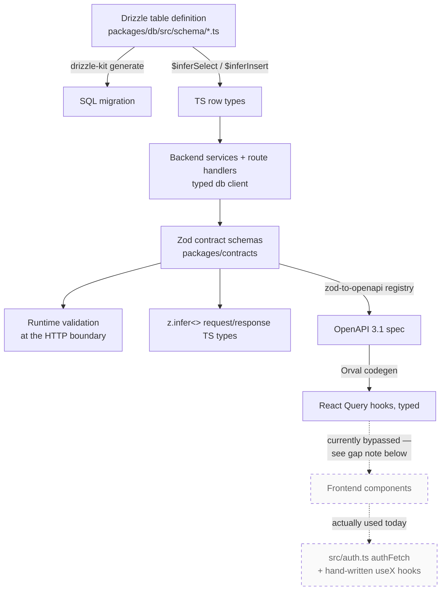

# End-to-End Type Safety

Talking-point reference for the TypeScript story in this repo. Each link in the chain has a single source of truth that compiles forward; type errors at one end of the stack surface at the other before code runs.

The headline: **the SQL schema, the HTTP wire format, and the React Query hooks generated from it are all derived from TypeScript declarations in this repo.** Drift between the *generated* layers is a build error, not a runtime bug. The frontend's *current* consumption of those generated hooks is a separate question — see the gap noted in "Where the chain is intentionally loose" below.

---

## The chain



Two regenerator commands, both committed-output:

- `npm run db:generate` — Drizzle reads `packages/db/src/schema/*.ts` and writes a SQL migration plus a JSON snapshot, then regenerates `docs/architecture/data-model-generated.md`.
- `npm run generate:openapi && npm run generate:api-client` — the Zod registry in `packages/contracts/src/openapi-registry.ts` emits `packages/api-client/openapi.json`, and Orval consumes that to write `packages/api-client/src/generated/claimnet.ts`.

---

## Link 1 — Schema to row types (Drizzle)

`packages/db/src/schema/*.ts` is the only place a table is declared. The TypeScript declaration generates the migration AND the row types — there's no separate `interface User` to keep in sync with the SQL.

```ts
// packages/db/src/schema/traces.ts
export const traces = claimnetSchema.table("traces", {
  id: uuid("id").primaryKey().default(sql`gen_random_uuid()`),
  userId: uuid("user_id").notNull(),
  claimText: text("claim_text").notNull(),
  // ...
});

export type Trace = typeof traces.$inferSelect;     // for reads
export type NewTrace = typeof traces.$inferInsert;  // for writes
```

`$inferSelect` returns the row shape after a `SELECT *`. `$inferInsert` returns the insertable shape — required columns are required, columns with defaults or `.notNull()`+default become optional. **Adding a column to a table changes both types simultaneously**, and every call site that reads or writes that row breaks at compile time until updated.

Every schema file ends with the same two `$inferSelect` / `$inferInsert` exports — see them all with `rg '\$infer' packages/db/src/schema`.

**Talking point:** the canonical Drizzle pattern, but worth knowing the underlying mechanism — `$inferSelect` is a `typeof`-driven mapped type that walks the column definitions and produces a record whose property types are derived from each column's runtime constructor (`uuid()`, `text()`, `timestamp({ withTimezone: true })`). No code generation step; pure type-level inference.

---

## Link 2 — Typed query client in the backend

The Drizzle client `getDb()` returns a `PostgresJsDatabase` typed against the full schema. Every query method (`db.select().from(traces)`, `db.insert(traces).values({...})`) flows the types through:

- `db.select().from(traces)` returns `Trace[]`.
- `.values({...})` requires a `NewTrace`-compatible payload; missing required columns or extra unknown keys are compile errors.
- `.where(eq(traces.userId, foo))` checks `foo` against the inferred type of the `userId` column.

Services in `apps/backend/src/services/` import the table objects directly from `@soupnet/db` and rely on inference — there is no place where you write out the user's columns by hand and risk a typo.

---

## Link 3 — Zod contracts at the HTTP boundary

`packages/contracts/src/*.ts` declares the public API shapes as Zod schemas. Each schema serves three roles from one declaration:

```ts
// packages/contracts/src/claims.ts
export const CreateClaimBodySchema = z.object({
  summary: z.string().min(10).max(2000),
  tags: z.array(z.string()).max(30),
  organizationId: IdSchema,
  privacyLevel: PrivacyLevelSchema.optional(),
  // ...
});
export type CreateClaimBody = z.infer<typeof CreateClaimBodySchema>;
```

1. **Runtime validation** — route handlers call `.parse()` / `.safeParse()` on the request body. The validator IS the type definition; they can't disagree.
2. **TypeScript types** — `z.infer<typeof Schema>` gives the static type. Service signatures take the inferred type, so a route handler that hands an unvalidated `unknown` to a service is a compile error.
3. **OpenAPI** — the registry in `openapi-registry.ts` decorates each schema with `.openapi({...})` and registers paths. `generateOpenApiSpec()` walks the registry and emits a complete OpenAPI 3.1 document.

**One Zod definition, three downstream artifacts. Drift between validator, types, and docs is structurally impossible.**

---

## Link 4 — Orval to React Query hooks

`packages/api-client/orval.config.ts` points at the committed `openapi.json` and emits `src/generated/claimnet.ts` — typed `useQuery` and `useMutation` hooks plus their underlying fetch functions. The generated client wires through a custom `authFetch` mutator so auth handling stays in one place.

```ts
// packages/api-client/src/generated/claimnet.ts (excerpt)
export type PrivacyLevel = (typeof PrivacyLevel)[keyof typeof PrivacyLevel];
export const PrivacyLevel = {
  agent_only: "agent_only",
  user_only: "user_only",
  group: "group",
  org_only: "org_only",
} as const;
```

Note the pattern: Orval emits a `const` object **and** a type alias of the same name — a TS-friendly substitute for enums that's tree-shakable and won't fight `erasableSyntaxOnly`-style settings. The shape of every request body, response, and path parameter is exported and typed; the frontend imports those hooks and gets compile-time errors if a backend response shape changes.

**Talking point:** the OpenAPI spec is committed (not generated at build time). This is deliberate — the spec is reviewable in diffs, and a backend change that alters a contract shows up as a deliberate two-file edit (Zod + spec) rather than silently flowing into the frontend. Worth contrasting with `tRPC`-style live type imports, which trade reviewability for fewer regenerator steps.

**Current state, honest:** the pipeline through Orval is wired end to end and the package builds, but no file under `apps/frontend/src/` actually imports `@soupnet/api-client`. The SPA currently fetches via hand-written hooks in `apps/frontend/src/hooks/` that wrap a thin `authFetch` from `apps/frontend/src/auth.ts`, with response types declared inline per hook (e.g. `interface Trace` in `useTraces.ts`). The generated hooks exist as an unused artifact; consuming them is a backlog item (see the workspace package map in `docs/architecture/overview.md`).

---

## Link 5 — Typed Hono context

Middleware-attached request state is typed via Hono's generic env parameter:

```ts
// apps/backend/src/types.ts
export type AppEnv = {
  Variables: {
    user: AuthUser;
  };
};

// apps/backend/src/routes/traces.ts
const traces = new Hono<AppEnv>();
traces.use("/*", requireAuth, requireVerifiedEmail);
traces.get("/map", async (c) => {
  const user = c.get("user"); // typed as AuthUser, not unknown
  // ...
});
```

`requireAuth` sets `c.set("user", ...)`. Downstream handlers get the typed value without a cast or a runtime "is this defined?" guard, because the middleware-handler contract is enforced at the env-type level.

---

## Compiler and lint settings worth pointing at

`packages/config/tsconfig.base.json` extends across every workspace:

- `"strict": true` — all strict-family checks
- `"exactOptionalPropertyTypes": true` — `{ foo?: string }` is genuinely different from `{ foo?: string | undefined }`. Catches the case where a function passes `{ foo: undefined }` to a parameter typed `{ foo?: string }`.
- `"noUncheckedIndexedAccess": true` — `array[i]` and `record[key]` are typed `T | undefined`. Forces narrowing before use; eliminates a whole class of "I forgot the array might be empty" bugs.
- `"noImplicitOverride": true` — subclass overrides must be explicit.

ESLint enforces:
- `@typescript-eslint/no-explicit-any` — `unknown` is the escape hatch, not `any`. CLAUDE.md restates this so agents don't silently smuggle `any` past review.
- `@typescript-eslint/consistent-type-imports` — type-only imports must use `import type`. Keeps the runtime graph cleaner and surfaces accidental value imports of type-only modules.

**Talking point:** `exactOptionalPropertyTypes` and `noUncheckedIndexedAccess` are the two strictness flags most teams turn off because they're noisy. Leaving them on is a deliberate choice — the noise is the point. They catch real bugs at the cost of a few extra narrowing checks per file.

---

## Where the chain is intentionally loose

A senior interviewer will probe for the gaps. There are four, three deliberate and one a known drift:

**1. Cross-concern UUIDs without FK constraints.** `traces.user_id` and `traces.group_id` are typed `uuid` columns with no `.references()` call. The schema files for traces, users, and groups can't import each other without circular dependencies, so referential integrity is enforced at the service layer instead. The generated ER diagram in `data-model-generated.md` distinguishes these visually (dotted lines). Tradeoff: pure type safety inside a concern, defense-in-depth integrity across concerns.

**2. Migration-SQL-only objects.** Drizzle doesn't model Postgres generated columns (`traces.tsv` is `to_tsvector('english', claim_text)`) or HNSW vector indexes, so those live in hand-written migration SQL and aren't captured in the Drizzle snapshot. The data-model doc explicitly calls this out so future agents know where to look.

**3. Inline validation on newer routes.** `/check`, `/traces`, `/uploads`, `/auth` validate inline rather than going through `packages/contracts`. The contracts package mostly holds legacy shapes from the pre-pivot claims/validations model. Consolidating new routes into contracts (so OpenAPI describes the actual current surface, not just the legacy one) is tracked in `docs/backlog.md`. Honest answer if asked: the team made a tactical call to ship the pivot first and harmonize the contract surface later — the cost is a partial OpenAPI doc.

**4. The frontend doesn't consume the generated hooks yet.** This one is drift, not design. The Orval pipeline produces `packages/api-client/src/generated/claimnet.ts` cleanly, but no SPA file imports the package — every fetch goes through the hand-written `authFetch` + per-hook `interface` pattern. So the "type error at one end surfaces at the other" guarantee currently stops at the package boundary on the frontend side. The fix is mechanical (replace each hand-written hook with the generated one) but blocked on the same contracts-consolidation work in #3 — until the new routes are in `packages/contracts`, the generated client only covers the legacy surface, which isn't what the SPA calls. Tracked in `docs/backlog.md`.

---

## One-line talking points

Pick the ones that fit the conversation:

- "Single source of truth at each layer — Drizzle table objects for schema, Zod for the wire format, OpenAPI as a derived artifact."
- "Zod schemas play three roles from one declaration: runtime validator, TS type via `z.infer`, OpenAPI definition via the registry."
- "`$inferSelect` / `$inferInsert` mean a schema change can't compile until every read and write site is updated."
- "Orval's generated React Query hooks are typed end to end — a backend response shape change shows up as a frontend type error before it ships."
- "`exactOptionalPropertyTypes` and `noUncheckedIndexedAccess` are both on — strict beyond strict-mode defaults — because the noise catches real bugs."
- "Hono's typed env (`Hono<AppEnv>`) carries middleware-set values through to handlers without casts."
- "Honest tradeoffs: cross-concern FKs enforced at the service layer, generated columns in raw SQL, some new routes still validate inline pending a contract consolidation pass."
