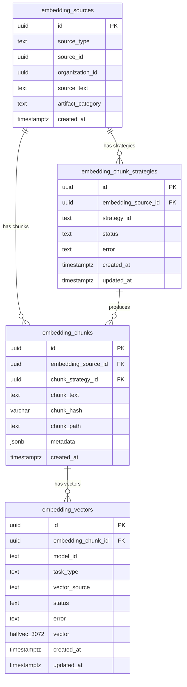

# Vector Store Architecture

How ClaimNet stores, generates, and queries embeddings. Read alongside `docs/data-model.md` (table definitions) and `docs/data-flow.md §7` (embedding generation flow).

---

## ER diagram



---

## Design goals

1. **Never block primary writes** on embedding generation. A claim write must succeed and return to the caller before any embedding work begins.
2. **Multiple chunking strategies per source** — overlapping windows, semantic splits, hierarchical rechunking — without duplicating the source text.
3. **Multiple task types per chunk** — `RETRIEVAL_DOCUMENT` and future task types can be added without re-chunking.
4. **Single vector table** — all vectors in one place regardless of model or task type. Easier to route to a different vector backend (e.g. AWS S3 Vectors) when the time comes.
5. **Future-proof dimensions** — standardize on 3072 dims. MRL truncation available if needed without schema migration.

---

## Embedding model

**Model:** `gemini-embedding-2-preview`

**Source:** https://ai.google.dev/gemini-api/docs/embeddings — check periodically; this changed materially in early 2026.

| Property | Value |
|---|---|
| Max input tokens | 8,192 |
| Output dimensions | 3,072 (default); MRL-adjustable: 128 / 768 / 1,536 / 3,072 |
| Modalities | Text, images (PNG/JPEG), video (MP4/MOV ≤120s), audio, PDF (≤6 pages) |
| Sync batch max | 200 inputs per API call |
| Async batch discount | 50% off standard per-token price |

Multimodal inputs (images, video) are available in the model but deferred as a future feature. For MVP, only text content is embedded.

All modalities (text, images, video, PDF, audio) are supported by `gemini-embedding-2-preview`. The `model_id` column in `embedding_vectors` makes switching or adding a second model a worker-only change with no schema migration required.

---

## Task types

The `task_type` column records which Gemini task type was used when generating each vector. This is significant: vectors with different task types are semantically different even from the same model on the same text.

| Task type | MVP use |
|---|---|
| `RETRIEVAL_DOCUMENT` | ✅ Indexing all content (claims, validations, requests) |
| `RETRIEVAL_QUERY` | ✅ Text/general search queries |
| `CODE_RETRIEVAL_QUERY` | ✅ Code-specific search queries |
| `FACT_VERIFICATION` | Future — validations |
| `SEMANTIC_SIMILARITY` | Future — deduplication |
| `CLUSTERING` | Not needed — HNSW is an index structure, not a task type |

Key insight: `RETRIEVAL_DOCUMENT` is used for all indexed content regardless of artifact category (text, code, data). Document embeddings only need to be generated once. Query-side task types can be added as new `embedding_vectors` rows without re-chunking or re-indexing.

---

## Four-table pipeline

### Worker 1 — chunking

Polls `embedding_chunk_strategies WHERE status='pending'`, applies the named strategy to `embedding_sources.source_text`, inserts `embedding_chunks` rows, then inserts `embedding_vectors` stubs (status='pending', vector=NULL), then marks the strategy row complete.

```
embedding_sources (source_text)
    ↓  [Worker 1: chunking]
embedding_chunk_strategies  ←  status: pending → processing → complete
    ↓  [produces]
embedding_chunks  (chunk_text, chunk_hash, chunk_path, metadata)
    ↓  [creates stubs]
embedding_vectors  (status=pending, vector=NULL)
```

### Worker 2 — vectoring

Polls `embedding_vectors WHERE status='pending'`, batches up to 200 per Gemini API call, writes the float array, marks complete.

```
embedding_vectors (status=pending)
    ↓  [batch Gemini API, up to 200/call]
embedding_vectors (status=complete, vector=[...3072 floats...])
```

### Status values (both workers)

`pending` → `processing` → `complete` | `failed`

pg-boss delivers the job. The status column is the authoritative persistent state — if pg-boss loses a job (worker crash, restart), a sweep job can recover pending rows that have been stuck in `processing` too long.

---

## Chunking strategies

Strategy IDs are string identifiers. The worker code implements each strategy. New strategies are new IDs + new worker implementations — no schema change needed.

| Strategy ID | Description |
|---|---|
| `full_document` | Whole source as a single chunk. Always created. Used for document-level dedup and similarity. |
| `overlap_256_64` | 256-token windows with 64-token overlap. Good precision. |
| `overlap_512_128` | 512-token windows with 128-token overlap. Better recall. |
| `semantic_markdown` | Split on markdown heading levels. Respects document structure. |
| `hierarchical_512_256` | 512-token parent chunks, each rechunked to 256-token children. Small chunks index; parent chunk retrieved for LLM context. |

**Why chunk_path instead of chunk_index:**

A flat integer index can't express overlapping chunks (you can't reconstruct source order), hierarchy (parent/child relationships), or semantic structure (which heading this chunk belongs to). `chunk_path` is a hierarchical string like `doc/section[0]/para[2]` — meaningful regardless of strategy.

**Why chunk_hash:**

SHA-256 of `chunk_text`. The same text appearing across multiple sources or strategies produces the same hash. Future optimization: skip vector generation if a vector with this hash and the desired (model_id, task_type) already exists.

**metadata jsonb fields by strategy:**

```
overlap_*:          { tokenStart, tokenEnd, overlapTokens }
semantic_markdown:  { headingLevel, headingText, parentHeadingPath }
hierarchical_*:     { parentChunkId, level, tokenStart, tokenEnd }
full_document:      {}
```

---

## Search query — hybrid retrieval

```sql
-- 1. Semantic ANN search
SELECT
    ev.id,
    ec.chunk_text,
    ec.chunk_path,
    es.source_type,
    es.source_id,
    es.organization_id,
    1 - (ev.vector <=> $query_vector::vector) AS semantic_score
FROM claimnet.embedding_vectors ev
JOIN claimnet.embedding_chunks ec      ON ec.id = ev.embedding_chunk_id
JOIN claimnet.embedding_sources es     ON es.id = ec.embedding_source_id
WHERE ev.model_id  = 'gemini-embedding-2-preview'
  AND ev.task_type = 'RETRIEVAL_DOCUMENT'
  AND ev.status    = 'complete'
  AND ev.vector IS NOT NULL
  -- org filter: public orgs OR the caller's org
  AND (es.organization_id = $caller_org_id OR $is_public_org)
ORDER BY semantic_score DESC
LIMIT 100;

-- 2. Lexical FTS (parallel)
SELECT id, summary FROM claimnet.claims
WHERE to_tsvector('english', summary) @@ plainto_tsquery('english', $query_text)
  AND moderation_state = 'approved';

-- 3. Merge results, join ranking_signals, apply composite score in application layer
-- (packages/domain/src/ranking.ts)
```

Query vector is generated with `task_type = 'RETRIEVAL_QUERY'` (or `CODE_RETRIEVAL_QUERY` for code searches) — a different task type from indexed documents, which is the intended asymmetric retrieval pattern.

---

## Column type: `halfvec(3072)` not `vector(3072)`

pgvector's HNSW index has a **hard 2,000-dimension limit** for the `vector` (float32) type. Attempting to create an HNSW index on a `vector(3072)` column fails at DDL time:

```
ERROR: column cannot have more than 2000 dimensions for hnsw index
```

The solution is `halfvec` (16-bit / half-precision floats), introduced in **pgvector 0.7.0**. Its HNSW limit is 4,000 dimensions.

| Type | Precision | HNSW limit | Storage per vector |
|---|---|---|---|
| `vector(3072)` | float32 | **2,000 dims** — fails for us | ~12 KB |
| `halfvec(3072)` | float16 | **4,000 dims** ✅ | ~6 KB (50% saving) |
| `bit` (binary) | 1-bit | Unlimited | ~384 B (coarse only) |

`halfvec` gives 50% storage reduction with similar search quality for retrieval tasks. This is the correct type for 3072-dim embeddings in pgvector today.

**Our docker image** (`pgvector/pgvector:pg17`) ships pgvector 0.8.x, which satisfies the ≥ 0.7.0 requirement.

**Query casting:** when querying, the query vector must be cast to match:
```sql
WHERE ev.vector <=> $query_vector::halfvec(3072)
```

Without the cast, the planner may fall back to a sequential scan or error on type mismatch.

**Reference:** [pgvector: A guide for DBA — Part 2: Indexes (March 2026)](https://www.dbi-services.com/blog/pgvector-a-guide-for-dba-part-2-indexes-update-march-2026/)

---

## HNSW index

```sql
-- halfvec_cosine_ops, not vector_cosine_ops
CREATE INDEX ON claimnet.embedding_vectors
  USING hnsw (vector halfvec_cosine_ops)
  WITH (m = 16, ef_construction = 64);
```

**Why HNSW over IVFFlat:**

| | HNSW | IVFFlat |
|---|---|---|
| Build time | Slower | Faster |
| Memory | Higher | Lower |
| Recall | Better | Degrades without ANALYZE |
| Maintenance | None | Requires VACUUM + ANALYZE as data grows; `lists` param needs retuning |
| Consistency | Always good | Drops after bulk inserts until ANALYZE runs |

For a RAG use case where recall is paramount and we don't yet have millions of vectors, HNSW is the right default. IVFFlat can be reconsidered if memory cost becomes significant at scale.

**Scale note:** HNSW on `halfvec(3072)` runs ~193 MB for 25K rows, ~77 GB at 10M rows. Plan buffer pool sizing accordingly before scaling past ~1M vectors.

**Tuning parameters:**
- `m = 16` — connections per node. Increase to 32–64 if recall is poor at scale.
- `ef_construction = 64` — index build quality. Increase to 128 for better recall; costs indexing throughput.
- `ef_search` — set per query: `SET hnsw.ef_search = 100`. Tune based on recall/latency measurements. Past ~200, consider increasing `m` at build time instead.

---

## Comparison with reference schema

The system was informed by a prior design (`cla_embedding_chunks`). Key differences:

| Prior design | This design | Reason |
|---|---|---|
| Single flat table | Four tables | Multiple strategies + task types without duplicating text |
| `input_type` | `task_type` | Matches Gemini API terminology |
| `tenant_id` on vector row | `organization_id` on source row | Normalized — joins back for org-scoped ANN search |
| IVFFlat index | HNSW index | Better recall, no maintenance as data grows |
| `chunk_index` (integer) | `chunk_path` (string) | Expresses hierarchy, overlap, semantic structure |
| `chunk_hash` on flat table | `chunk_hash` on chunks table | Dedup at the chunk level (not vector level) |
| Model field on same row as vector | `model_id` + `task_type` on vectors table | Decoupled — chunk text stored once, many vector variants |

The prior design's unique constraint `(tenant_id, document_id, source_table, model_name, chunk_hash)` is expressed here as a unique constraint on `(embedding_chunk_id, model_id, task_type)` in `embedding_vectors`.

---

## Implementation checklist

Not yet built. Tracked in `docs/backlog.md` → Embeddings.

| File | Responsibility |
|---|---|
| `packages/db/src/schema/vectors.ts` | ✅ Table definitions (includes vector_source column) |
| `apps/backend/src/embedding-worker/jobs/chunking.ts` | Poll chunk strategies, run strategy, insert chunks + vector stubs |
| `apps/backend/src/embedding-worker/jobs/vectoring.ts` | Poll pending vectors, batch Gemini call, write halfvec(3072) vectors |
| `apps/backend/src/embedding-worker/lib/chunking/` | Strategy implementations (overlap, semantic, hierarchical) |
| `apps/backend/src/lib/gemini-client.ts` | Gemini embedding-2-preview client (single + batch), shared by sync + async paths |
| `apps/backend/src/lib/embeddings/enqueue.ts` | Create embedding_sources row + default strategy stubs in same transaction as source write |
| `packages/sdk/src/embeddings.ts` | Client-side embedding via user's own Gemini API key (air-gapped mode) |
