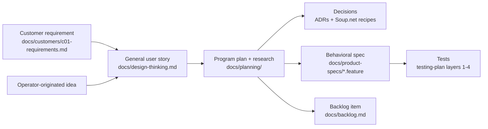

# Customer requirements

Status: proposed convention (2026-09-19), awaiting operator ratification. One directory, one file per customer, so a specific customer's needs can be pointed to later without being tangled into general product plans.

## Why this is separate from the plans

A customer's requirements are evidence about what one organization needs. A program plan is a design for what the product will do for every organization. Keeping them in separate files stops one customer's framing from quietly becoming the product's framing, and lets general organization features keep growing after this customer is served. The operator's correction that prompted this (2026-09-19): a plan sentence had promoted "one of their top use cases" to "the top use case".

## Conventions

- **Anonymous.** This repo is public. Customers are `C01`, `C02`, and so on. No names, no identifying details (industry niche, size, location, named people, named internal systems beyond widely used products). If a detail would let a reader identify the customer, it belongs in the private repo.
- **Requirement ids.** `C01-R01`, `C01-R02`, stable once assigned. Retired requirements keep their id and are marked withdrawn.
- **Provenance on every requirement.** `customer-stated` (the operator attributed it to the customer), `operator-derived` (the operator's design response or extension), or `unclear` (needs the operator to confirm which). Requirements quote the operator's relay of the customer's words verbatim where one exists.
- **Priority as stated, never inferred.** Record what the customer said about importance. Leave it blank otherwise. Ranking is the operator's call, made in the plan, not here.
- **Consumer tag.** Every requirement names its consumer: `human`, `agent`, or `dual` (soupnet-oss recipe `74b88762`).
- **Describe the need, not the solution.** Solutions live in the program plan. A requirement may link to the plan section that answers it.
- **A "considered, not included" ledger** at the end of each file, with what would make each item worth reconsidering.
- Prose is unwrapped: one line per paragraph or bullet.

## How requirements flow into work

1. **Requirement** lands here, in the customer's terms.
2. **User story** is written in `design-thinking.md` in general terms (an archetype any organization would recognize), before implementation, per the standing process (personal-book recipe `030d4414`). Several customers' requirements, and operator-originated ideas with no customer at all, attach to the same story. This is what keeps the product general.
3. **Program plan** in `docs/planning/` designs and sequences the work, grounded by research with verbatim quotes and links.
4. **Decisions** are recorded as ADRs when architectural, and as Soup.net recipes with the operator's words as evidence.
5. **Behavioral specs** are Gherkin `.feature` files under `docs/product-specs/`, organized by behavioral concern (not by customer, not by phase), following the `docs/briefing-specs/` conventions: `# Guards:` comments tracing each scenario to a design-thinking section, observable Then-clauses, and `@unreleased` until the shipping PR drops the tag. Scenarios that answer a customer requirement carry a `# Requirement: C01-R05` comment. Unlike the briefing specs, which an LLM-eval harness runs, these pin deterministic behavior and are realized as Layer 3 integration tests. Specs are written per phase, just before implementation, so they describe a design that has already been through research.
6. **Backlog items** cite the story, the spec file, and any requirement ids.
7. **Security analysis** (threat models, audit findings) stays in the private deployment repo per `docs/workflows/security.md`.

Traceability runs both ways: from `C01-R05` you can find the scenarios and tests that satisfy it, and from a failing scenario you can find who it matters to.

## Files

| File | Customer |
|---|---|
| [c01-requirements.md](c01-requirements.md) | First prospective organization customer (software team, Google Workspace) |
