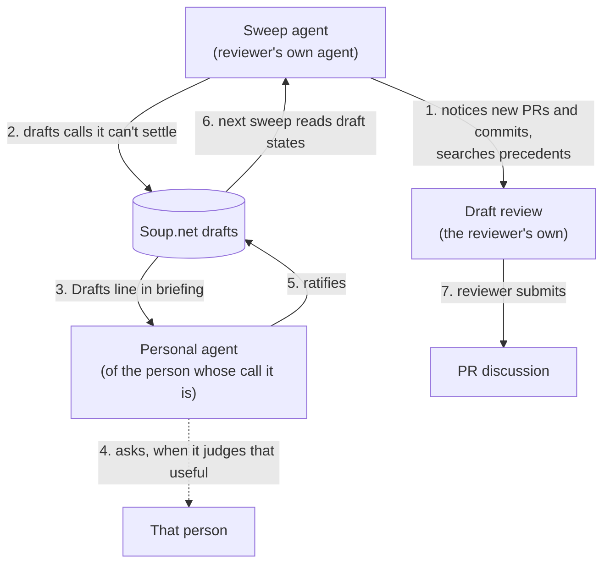

# PR review helpers on Soup.net

Status: plan, revised after the operator's review of draft PR #109. Not built. Written by planning agent `a-pr-review-plan-2026-09-27` from the operator's request (recipe [103e6242](https://www.soup.net/traces/103e6242-ab88-4892-aa68-3aba39a2f442)) and the research in [pr-review-research/](pr-review-research/README.md). Builds on [drafts-and-triage.md](drafts-and-triage.md) and its build log.

## 1. The problem and the principles

Teams already run review processes: CODEOWNERS, a human reviewer, often one or two AI bots, sometimes Playwright or Devin. None of them keeps the team's taste and judgment: why a deliberate-looking choice was made, and who decides the next one like it. Soup.net drafts can carry those questions to the right person and bring the answers back.

- **Helpers, not another workflow.** In the operator's words: "people love their own AI agentic workflow, but they hate being forced to use other people's agentic workflow ... So ours should be helpers not another workflow." The helpers are terse and forkable, and they add only what the Soup.net briefing doesn't already say. How to ask, how often, and what to do about a new commit are left to each person and their agent (recipe [5f1b7e03](https://www.soup.net/traces/5f1b7e03-ed8b-42e6-bfe9-87aa6ae3ad65)).
- **The agent is the main interface.** Every step can be done in the person's own agent. The web app covers what agents do poorly, starting with the draft queue: "I find Claude to be a poor task list."
- **Recipe checks are for AI, not people.** People discuss in PR comments and chat. A draft is how one agent hands a taste-and-judgment question to another person's agent.
- **Autonomous, but directly supervised.** A sweep runs under its person's supervision, with whatever access they chose to give it. It is autonomous only to conserve their attention (recipe [e0d2c1c9](https://www.soup.net/traces/e0d2c1c9-ff79-4c52-9d6d-ee3751928aa9)). Soup.net never reads PR content; the person's agent does, and the agent calls Soup.net.

## 2. Research findings that shape the design

Reports: [01 hosted reviewers](pr-review-research/01-hosted-ai-reviewers.md), [02 agent-native review and skill sharing](pr-review-research/02-agent-native-review.md), [03 the human side](pr-review-research/03-human-side-of-review.md), [04 preference memory](pr-review-research/04-preference-memory.md), [05 mechanics](pr-review-research/05-mechanics.md), and for §6.1, [06](pr-review-research/06-landscape-gaps.md), [07](pr-review-research/07-walkthroughs-and-e2e.md) and [08](pr-review-research/08-repo-review-hairballs.md). The quotes below come from those reports, which carry the source links.

- **Don't rebuild what bots already do.** Line-level bug finding, PR summaries, suggested fixes and in-PR chat are standard in every hosted reviewer surveyed (report 01). The helpers read those bots' comments as input.
- **Team preferences live in two layers, and neither keeps reasons.** Every tool pairs a repo file (`CLAUDE.md`, `AGENTS.md`, `REVIEW.md`, `.cursor/BUGBOT.md`) with a learned layer in the vendor's database. Conflicts go to a precedence order, or, in Claude Code's words, the model "may pick one arbitrarily". No store keeps the person's reason, the date of the decision, or who confirmed it (report 04).
- **No reviewer asks.** No hosted reviewer asks a person about the team's taste and judgment; chat is always started by the human (report 01). AI reviewers fail most on exactly those calls: unresolved agent comments were most often "*incorrect suggestions* and *intentional design decisions*" ([Cynthia et al. 2026](https://arxiv.org/abs/2607.21997v1)).
- **The draft review has to be the person's own.** A GitHub pending review is "only visible to you" until submitted (report 05), so the sweep runs under the GitHub login of the person on sweep duty, in their own agent, as the operator sketched.
- **Share the record, not the skill.** People rewrite shared skills ("a reuse paradox"), and code review is the most-duplicated engineering skill, "with 2,877 skills" (report 02). So the shared asset is the recipe book: every fork, in any agent, reads and writes the same decisions.
- **Retrieval.** Extracting each decision from a PR and searching for it beats searching by filename (recipe [94e8f123](https://www.soup.net/traces/94e8f123-e559-48ee-afe1-93c2dba060a0)).

## 3. The loop

| Step | Uses | Depends on |
|---|---|---|
| 1 Notice and search | `search_recipes`, `get_recipes`, `log_feedback`; the team's own review tools | Exists |
| 2 Draft | `check_recipe` with `draft`, `impact`, `uncertainty` | Drafts slices 1 and 2. A draft about someone else needs slice 4 (`on_behalf_of`); drafts-only keys need slice 5; select-one questions need slice 6 |
| 3 Notice drafts | The briefing's Drafts line, `is:draft` search | Slices 2 and 3 |
| 4, 5 Ratify | `verify_draft`, or one click in `/app/drafts` | Slices 2 and 3 |
| 6 Read back | `get_recipes` on the draft ids; each row carries its state | Slice 2 |

A draft is about the person whose call it is: the PR author for a choice in the code, the reviewer for their own review standard, or the person who decides that area, whom search results name as the author of related recipes. A question that only matters for this PR belongs in the review, not in a draft.

## 4. Skills

Three skills in the house style of [`soupnet-guide`](../../.claude/skills/soupnet-guide/SKILL.md): a few lines each, pointing at `get_briefing` for everything else. They use only the portable Agent Skills frontmatter, so the same folder works in Codex, Gemini CLI, Cursor and Copilot (report 02). An agent without skills can take the same few lines as a prompt; an agent without MCP can use the REST twins.

- **`pr-sweep`.** Notices new or updated PRs and new commits in the areas the person looks after. It brings each one to the right attention: the person's agent, the person, or whatever workflow their team uses. It searches for the decisions each PR implies, cites precedents it finds, and drafts the lasting calls it can't settle, about whoever's call they are. Headless or interactive is the person's choice.
- **`pr-review-assist`.** For a person reviewing one PR with their agent: the same search. The person is present, so their agent asks them and checks the answer as an ordinary recipe.
- **`my-drafts`.** Resolves the drafts about its person. It ratifies a draft itself when it is as confident as it would need to be to check the recipe autonomously, which is the briefing's existing guidance (recipes [df2d6e76](https://www.soup.net/traces/df2d6e76-f3cf-46e0-aa94-98706b892fcd) and [200ed4fe](https://www.soup.net/traces/200ed4fe-efb9-48b5-b776-ed984f35d534)). It asks its person when it judges that necessary or useful. This works for the person's own agent and not for the agent that deposited the draft because it holds the person's context and can reach them.

## 5. Soup.net web versus the agent

| Job | In the agent | In the web app |
|---|---|---|
| Triage many drafts | `is:draft impact:high` search | `/app/drafts`, sorted by impact × uncertainty |
| Confirm a draft | `verify_draft` | One click |
| Reject, or mark not chosen | **Gap**: agents can only verify | One click |
| Hand someone exactly the drafts to review | The `?ids=` link | `/app/drafts?ids=…` |
| See drafts I sent that are still open | `search_recipes author:me`, then `get_recipes` | **Gap**: the queue shows only drafts about me (slice 4 S4-Q4) |
| Read a recipe's evidence | `get_recipes` | Trace detail page |

**Gap: recipes aren't written for easy human reading.** They are shaped for retrieval by agents. A person skimming the queue or a detail page reads a long first-person story and its evidence. That fits a future premium, server-side LLM feature, alongside retrieval synthesis in [premium-llm-features.md](premium-llm-features.md): a short plain-language summary of a recipe or a queue, on demand.

## 6. What Soup.net needs

| Need | Existing thing that does most of it | Smallest addition |
|---|---|---|
| Draft about the PR author or the area's decider | `on_behalf_of` | Slice 4 as specified |
| Headless sweep deposits drafts only | Headless key setting | Slice 5 as specified |
| Select-one questions | Option sets under one intent | Slice 6 as specified |
| Link a recipe to its PR | The evidence citation (`-- https://github.com/o/r/pull/123`) plus quoted search | None. References on intents would make it structural |
| Sweep finds resolved drafts | `get_recipes` returns each draft's state | None |
| Reject or mark not chosen from the agent | `verify_draft` and its REST twin | One outcome value on the same operation (`rejected`, and `not_chosen` from slice 6). Closes the parity gap in §5 |
| Areas of expertise for sweep duty | CODEOWNERS, `review-requested:@me`, recipe authors in search results | None in Soup.net |
| When-to-draft guidance in the briefing | Slice 7 | As planned; the skills shrink when it lands |

### 6.1 Gaps in the PR-review landscape Soup.net might fill

Stretch goals, in dependency order. Each item needs only the ones above it.

1. **Review without a review system.** Standing up hosted review takes an admin: the Claude Action needs "admin access to the repository", and CodeRabbit needs "organization owner permissions" (report 06). Every major vendor already ships a personal review that needs nothing installed on the repo. Claude's `/code-review`, for example, runs "without installing the GitHub App". Each of these is private to one person. The helpers plus a shared recipe book are the missing shared part: setup happens once per person, in their own agent, with nothing installed per repo. The case against: a PR nobody's sweep notices goes unreviewed, and every teammate has to connect their agent to Soup.net. So pitch it as a small team's default, with hosted bots as an optional always-on layer that reads the same book. Depends only on §4.
2. **Soup.net's own process as the first user** (report 08).
   - This repo's "Before committing" sweep is the same retrieval `pr-review-assist` does, so running it on one's own branch replaces a step every agent has to remember.
   - Orchestrator escalations and Layer 4 alignment questions ("aligned on what success looks like", recipe `03a11c5e`) are taste and judgment. They could reach the operator as drafts about him, instead of prose buried in a build log about 975 lines long. That changes how he receives rulings, so it is his call.
   - Report 08 finds three fixes that need plain tooling, not Soup.net: a PR template with the verification headings, a guard for the briefing-spec declaration, and the CLAUDE.md line on when to commit.
   - Depends on 1 and on drafts slices 1 to 3.
3. **The decision log for other agents.** None of the systems surveyed keeps a decision log (who decided, when, why, with evidence). Devin's Knowledge docs "do not specify metadata like author, creation date, source attribution, or access to version history". Devin sessions, Copilot's cloud agent and code review, CodeRabbit, Cursor's cloud agents, Codex CLI and Kiro can all call a remote MCP server with a static header (report 06).
   - Order: first a long-lived key that Soup.net enforces as drafts-only or read-only (slice 5, or the org read-only principal). Then copy-paste configs for header-auth clients. Then a Devin plugin, since Devin plugins "bundle skills, rules, hooks, and MCP servers".
   - Out of reach: Devin Review and Claude's managed Code Review read repo files only; Jules takes a curated MCP list; Codex cloud has no MCP. Those stay out of reach rather than getting a copied repo file (§8).
4. **Walkthrough evidence, with no dev server.** Soup.net hosts files and never runs code (recipe [d818864d](https://www.soup.net/traces/d818864d-b130-4ef0-b084-847f17c29fe9)). The person's own run makes the artifacts. Hypotheses, from report 07:
   - `browser-verify` deposits one recipe per expectation: the expected outcome and its verdict, with the named screenshots as evidence. This needs no server change: PNG is already on the upload allowlist.
   - Embedding the screenshots enables "has this UI state been seen before?", a PR's screenshot surfacing the design recipe logged with a similar mockup, and screenshots as evidence on UI recipes. Per-step screenshots are the unit that works, because Gemini "processes a maximum of 32 frames per video" of at most 120 seconds, and Playwright records WebM, which the allowlist doesn't take.
   - Measure screenshot retrieval before building on it. ADR-0019's planned A/B wants at least 50 image-bearing recipes.
   - Then a read-only image and MP4 viewer on the trace detail page, served with headers for inactive content. Today `GET /uploads/*` always returns 404, so nobody but the uploader can see a file.
   - Traces and HTML reports are active content. Link out to the person's CI, Argos, Currents or `trace.playwright.dev/?trace=` rather than host them.
   - Caveats: traces carry request bodies and headers, so scrubbing happens before upload; self-hosters on the `local` provider get no image embeddings; and for his own review the operator chose the local HTML report "over a hosted walkthrough page" (recipe `cd313ba0`), so hosting pays only when the reviewer isn't the one who ran the tests.
5. **Coverage from walkthroughs: the e2e verification idea.** It is documented in recipe `0760205a`, in which an agent role-plays a user from a declared intent and "walks through the steps to get there with playwrite, taking screenshots and video, depositing feedback on how it's going". It is also in the backlog item "Test-coverage recipe books — judging coverage gaps and overlaps by intent", and its ancestor is recipe `89e712e5` (persona sub-agents plus judges). The expectation recipes from item 4 have the same shape, so the coverage map grows as a side effect of PR verification. This also answers the backlog item's open question of what a walkthrough recipe claims. Depends on 4.

## 7. Accountability and security

The principle in §1 covers the rest: the person decides what their agent can reach. Two rules are specific to Soup.net:

- **The author is the key's owner** (recipe [9e663b62](https://www.soup.net/traces/9e663b62-3277-412e-a82a-97fb6566adfa)). Every sweep draft is authored by the person on sweep duty and names its subject.
- **Drafts stay hidden until resolved.** Only the subject, the depositor and their agents see one (recipe `94e0e682`).

## 8. Open questions

- **Write verified decisions back into repo files?** No. In the operator's words: "No. Keep it DRY. if people don't have soupnet themselves, too bad." (recipe [3dce0615](https://www.soup.net/traces/3dce0615-f8c1-491b-96d2-8761925b86fd)).
- **Distribution.** Recommendation: publish the three skills as plain folders in this repo's `.claude/skills/`, plus the same lines as a copy-paste prompt on the public connect page. Not escalated.

## 9. Backlog

A `[DESIGN]` item, "PR review helpers on Soup.net", points here from [../backlog.md](../backlog.md).
