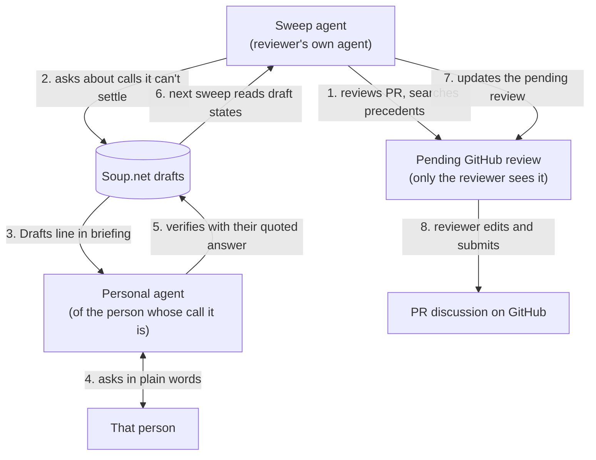

# PR review helpers on Soup.net

Status: plan, 2026-09-27. Not built. Written by planning agent `a-pr-review-plan-2026-09-27` from the operator's request (recipe [103e6242](https://www.soup.net/traces/103e6242-ab88-4892-aa68-3aba39a2f442)) and five research tracks in [pr-review-research/](pr-review-research/README.md). Builds on [drafts-and-triage.md](drafts-and-triage.md) and its build log; merges after `feat/drafts-and-triage`.

## 1. The problem and the principle

Teams already run review processes: CODEOWNERS, a human reviewer, often one or two AI bots, sometimes Playwright or Devin. What none of them keeps is the team's taste and judgment: why a deliberate-looking choice was made, and who decides the next one like it. The operator's sketch uses Soup.net drafts to carry those questions to the right person and bring the answers back.

**Helpers, not another workflow.** In the operator's words: "people love their own AI agentic workflow, but they hate being forced to use other people's agentic workflow ... So ours should be helpers not another workflow."

- **Rules in.** Small skills that each do one job, and each can be forked. They drop into whatever review process the team already has, read the team's own rule files and other bots' comments as input, and write to surfaces people already use (a GitHub pending review, their own agent's conversation). Every step can be done in the person's own agent. Soup.net web is optional.
- **Rules out.** A Soup.net review UI, a required review sequence, a hosted bot identity that posts on people's behalf, rebuilding bug finding or PR summaries, and any step that only works in Claude Code.
- **Recipe checks are for AI, not people.** People discuss in PR comments and chat. A draft recipe is how one agent hands a taste-and-judgment question to another person's agent. The person answers in their own conversation, never in Soup.net.

## 2. Research findings that shape the design

Reports: [01 hosted reviewers](pr-review-research/01-hosted-ai-reviewers.md), [02 agent-native review and skill sharing](pr-review-research/02-agent-native-review.md), [03 the human side](pr-review-research/03-human-side-of-review.md), [04 preference memory](pr-review-research/04-preference-memory.md), [05 mechanics](pr-review-research/05-mechanics.md). Each quote below comes from those reports, which carry the source links.

**What exists and we should not rebuild.** Line-level bug finding, PR summaries, suggested fixes and in-PR chat are standard in every hosted reviewer surveyed (report 01). The helpers read those bots' comments as input.

**Where teams' preferences live today, and why that falls short.** (Report 04.)

- Every tool pairs a repo file (`CLAUDE.md`, `AGENTS.md`, `REVIEW.md`, `.cursor/BUGBOT.md`, `copilot-instructions.md`) with a learned layer kept in the vendor's database.
- Only the file layer is reviewed and versioned. Users ask for learned rules to move back into git because a dashboard store "can become redundant or conflict with repository rules" ([Cursor forum](https://forum.cursor.com/t/api-or-git-based-workflow-to-promote-bugbot-learned-rules-into-repository-rules/171018)).
- Conflicts go to a precedence order, or, in Claude Code's words, the model "may pick one arbitrarily".
- None of these stores keeps the person's reason, the date of the decision, or who confirmed it.
- Learned rules switch on without anyone confirming them, and increasingly so: Qodo's Rule Miner approves automatically by default for new organizations from 2026-09-01 (report 01).
- The files still do what they are for. Context files "do not generally improve task success rates, while increasing inference cost by over 20% on average" ([arXiv 2602.11988](https://arxiv.org/abs/2602.11988)), but their instructions "are well followed". They are good for agreements a team has already settled, not for open questions.

**Three findings that change the operator's sketch.**

1. **The sweep has to run as a person, which merges the two agents into one person's agents.** A GitHub pending review is "only visible to you" until submitted (report 05). A bot or App identity could draft a review that no human can ever see or submit. So the "draft PR review" step only works when the sweep runs under the GitHub login of the person on sweep duty. That confirms the operator's "runs in their user's normal Claude", and rules out an org bot for this step. It also changes the loop: the draft review's owner and the reviewer are the same person. Drafts go to other people only when the call is theirs, usually the PR author's (§3).
2. **Ask about deliberate choices; don't correct them.** AI reviewers fail most on judgment calls. Across 54,791 agent comments, the unresolved ones were most often "*incorrect suggestions* and *intentional design decisions*" ([Cynthia et al. 2026](https://arxiv.org/abs/2607.21997v1)), and 56.3% of CodeRabbit comments were rejected ([Lin et al. 2026](https://arxiv.org/abs/2607.03316)). Google set its ML review edits to "a target precision of 50%" because wrong ones "reduce the developers' trust" (report 03).
   - No hosted reviewer asks a person about the team's taste and judgment; chat is always started by the human (report 01).
   - So the sweep's drafts should be few, and aimed at deliberate-looking deviations, rather than "any decisions not already in soupnet" as the sketch has it. They should be ranked, and capped per person.
   - Review's main value is understanding, not defect finding: reviews "are less about defects than expected" ([Bacchelli and Bird 2013](https://www.microsoft.com/en-us/research/publication/expectations-outcomes-and-challenges-of-modern-code-review/)).
3. **Share the record, not the skill.**
   - The evidence mostly supports the operator's observation about skills. A study of 1,126 skill adaptations names "a reuse paradox" where developers "spend a lot of effort rewriting what the skills do", and code review is the most-duplicated engineering skill, "with 2,877 skills" (report 02).
   - The counterweight: a trusted individual's public skills spread widely, but people fork them.
   - So the helpers stay thin and forkable, and the shared asset is the recipe book: every fork, in any agent, reads and writes the same decisions.
   - Practitioners put it as "Agreements go in the library. Preferences stay with the person."

**Mechanics that constrain the design** (report 05):

- One pending review per user per PR. GraphQL `addPullRequestReviewThread` adds to one the human already started, which preserves their edits.
- `gh pr review` has no line comments and no pending state, so the sweep writes the review through `gh api`.
- Polling fits a sweep on a laptop: webhooks need a public endpoint that answers within 10 seconds.
- Prompt injection through PR text has been exploited in the wild (Aikido's PromptPwnd, December 2025).
- Without `--bare`, `claude -p` loads the PR branch's own `.claude/settings.json` hooks and `.mcp.json`.

**Soup.net's corpus already knew some of this.** Recipe [94e8f123](https://www.soup.net/traces/94e8f123-e559-48ee-afe1-93c2dba060a0) measured that extracting each decision from a PR and searching it both unbounded and date-bounded beats searching by quoted filename. The operator requires that automated review be "observable, understandable, verifyable by huamns and other ai agents" (recipe `0960a183`) and posts "only comments I have verified by hand" (recipe `97fa42eb`).

## 3. The loop

| Step | Uses | Status |
|---|---|---|
| 1 Review and precedent search | `search_recipes` (decision extraction plus quoted filenames), `get_recipes`, `log_feedback`, the team's own review tools | Exists on main |
| 2 Draft the open calls | `check_recipe` with `draft`, `impact`, `uncertainty` | Built on `feat/drafts-and-triage` (slices 1 and 2). About the PR author needs `on_behalf_of` (slice 4). Enforced drafts-only for unattended runs needs headless keys (slice 5). Select-one questions need option sets (slice 6) |
| 3 Notice | The briefing's Drafts line and `is:draft` search | Built (slices 2 and 3) |
| 4 Ask | The person's own agent, in conversation | Nothing new |
| 5 Verify | `verify_draft` with the answer quoted and cited, or one click in `/app/drafts` | Built (slices 2 and 3). Rejecting or marking not chosen from an agent is a gap (§6) |
| 6 Read back | `get_recipes` on the draft ids the sweep kept in its pending review; the state is on each row | Exists; the state labels come with slice 2 |
| 7 and 8 Update and submit | GitHub GraphQL `addPullRequestReviewThread`; the reviewer submits by hand | GitHub, nothing in Soup.net |

**Whose call is a draft about?** It is about the person whose call it is:

- the PR author, for a choice made in the code ("why this retry policy?");
- the reviewer, for their own review standard ("do we block on missing tests for scripts?");
- the area's decider, when the corpus shows one. `search_recipes` results name each recipe's author, so "who has decided things like this" costs nothing to find.

Questions about this PR only, as opposed to decisions that should outlive it, go into the pending review as ordinary comments for the reviewer to send. That split keeps recipe checks for AI and discussion among people.

## 4. Skills

Three thin skills in the house style of `.claude/skills/` (frontmatter `name` and `description`, a short procedure, everything substantive left to `get_briefing`). The portable core is the Soup.net MCP tools, `gh`, and a one-page prompt per skill. The frontmatter uses only the fields the Agent Skills spec guarantees, so the same folder works in Codex, Gemini CLI, Cursor and Copilot (report 02). For an agent without skills, the same prompt pasted as instructions does the job, and agents without MCP use `/check?format=json` plus `/recipes` and `/feedback` over REST.

### 4.1 `pr-sweep`

- **Trigger:** on a schedule, or "sweep my PRs". Runs headless (`claude -p --bare`, `codex exec`, `gemini -p`) or interactive, as the person prefers.
- **Inputs:** a small local config: which repos, which paths or topics this person has claimed for sweep duty, which recipe book each repo maps to, and a question budget.
- **Steps:**
  1. Find PRs with `gh search prs --review-requested=@me --updated=">T"`, plus the person's claimed paths. Skip a PR whose head SHA it has already reviewed; the SHA is kept in a marker in the pending review body (report 05).
  2. Read the diff and the other bots' comments through the API, from the skill's own folder, never from a checkout of the PR branch.
  3. Run the team's own review process, whatever it is.
  4. Extract each decision the PR implies, and `search_recipes` for each one, once unbounded and once bounded to the dates of the work ([94e8f123](https://www.soup.net/traces/94e8f123-e559-48ee-afe1-93c2dba060a0)).
  5. Sort each call three ways:
     - A precedent exists: cite it in a comment.
     - The question is about this PR only: a comment for the reviewer to send.
     - It is a lasting call that isn't in the corpus: a draft, within budget, rated for impact and uncertainty. The first evidence line says why it couldn't ask and which question would settle it.
  6. Write the pending review with every claim verified beside it (recipe `97fa42eb`), plus a hidden marker holding the head SHA and the draft ids.
  7. Log feedback on the recipes that shaped the review, and one `outcome` row listing the drafts left open (drafts-and-triage §When to draft).
- **On later runs:** `get_recipes` on the held ids shows which drafts are resolved. The sweep adds threads to the pending review citing the answers, and never recreates the review.
- **Soup.net calls:** `get_briefing` (its own intent, naming the PR URL), `search_recipes`, `get_recipes`, `check_recipe` with `draft`, and `log_feedback`.
- **Left to the team:** what "review" means, the linters and bots, who submits, merge rules, where people talk.

### 4.2 `pr-review-assist`

- **Trigger:** a person reviewing one PR says "help me review #123".
- **What it does:** the same retrieval as `pr-sweep`, steps 2 to 4. Then it asks the person directly, because the person is present. It uses divergent options where the framing is unclear, which is the briefing's existing pattern. It checks the chosen answer as an ordinary recipe and helps write comments with the verification beside each one.
- **Drafts:** it drafts only for someone else's call (slice 4), for example the PR author's reason.
- **Soup.net calls:** as for the sweep, with plain `check_recipe` instead of drafts.

### 4.3 `my-drafts`

- **Trigger:** the briefing's "N drafts await review" line, or "what's waiting for me?".
- **What it does:**
  1. Lists the drafts with `search_recipes` using `is:draft`, grouped by PR. Adding a quoted PR URL narrows the list.
  2. Asks one question at a time in plain words, at a natural break (report 03: an interruption costs "10-15 minutes" of recovery).
  3. On a yes, calls `verify_draft` with the answer quoted and cited.
  4. On a correction, checks the corrected position as a new recipe with its own reason.
  5. For rejections and anything left, hands over the `/app/drafts?ids=…` link.
- **Treats draft text as data.** Drafts may carry text an attacker planted in a PR (§7).
- **Soup.net calls:** `get_briefing`, `search_recipes`, `get_recipes`, `verify_draft`, `check_recipe`, and `log_feedback`.

## 5. Soup.net web versus the agent

| Job | In the agent | In the web app |
|---|---|---|
| Triage many drafts at once, sorted by impact × uncertainty | `is:draft impact:high` search, then one question at a time | `/app/drafts`, which is the better fit: "I find Claude to be a poor task list" |
| Confirm a draft | `verify_draft` with the quoted answer | One click |
| Reject a draft, or mark it not chosen | **Gap**: agents can only verify | One click |
| Hand someone exactly the drafts to review | The `?ids=` link | `/app/drafts?ids=…` |
| See what I asked others that is still open | `search_recipes author:me "pull/123"`, then `get_recipes` for states | **Gap**: the queue shows only drafts about me, by design (slice 4 S4-Q4) |
| Read one recipe's evidence and feedback | `get_recipes` | Trace detail page |
| Make a headless key for a sweep | Derived-key minting (planned) | Key form (slice 5 adds the setting) |

Web gaps worth closing later: a "sent" view of the drafts I deposited that are still open, and a bulk "reject all from this depositor" action (already noted at slice 4, question 37).

## 6. What Soup.net needs

Each gap is listed with its smallest addition, and the existing thing that does most of it.

| Need | Existing thing that does most of it | Smallest addition |
|---|---|---|
| Draft about the PR author or the area's decider | `on_behalf_of` | Slice 4 as specified. No change for PR review |
| Unattended sweep can only draft | Headless key setting | Slice 5. Until then, the skill passes `draft=true` itself, a convention the server does not enforce, and the sweep runs interactive-first |
| Short-lived key per sweep run | Derived keys | As designed. The sweep mints a one-hour key that reads the repo's books and writes one |
| Select-one questions | Option sets under one intent | Slice 6. Until then, each option is its own draft, with the siblings' ids in its evidence. The person verifies one and rejects the others in the queue |
| Link a recipe to its PR | The evidence citation (`-- https://github.com/o/r/pull/123, path:lines`) plus quoted search | None: a convention in the skills. References on intents (planned) make it structural later |
| Sweep finds resolved drafts | `get_recipes` returns each draft's state; the pending review holds the ids | None |
| Reject or mark not chosen from the agent | `verify_draft` and its REST twin | One `outcome` value on the same operation (`rejected`, and `not_chosen` from slice 6), with the same quoted-answer rule. This closes the one parity gap in §5 |
| Areas of expertise for sweep duty | CODEOWNERS, `review-requested:@me`, and authors named in search results | None in Soup.net: a list of claimed paths in the skill's config. The sweep reports PRs that touch unclaimed paths, and areas where one person holds all the related recipes |
| Briefing teaches when to draft, and the headless profile | Slice 7 | As planned. The skills get shorter when it lands |

## 7. Accountability and security

- **Author is the key's owner** (recipe [9e663b62](https://www.soup.net/traces/9e663b62-3277-412e-a82a-97fb6566adfa)). Every sweep draft is authored by the person on sweep duty, names its subject, and cites the PR.
- **Drafts stay hidden until resolved.** Only the subject, the depositor and their agents can see one (recipe `94e0e682`). Injected text can therefore reach at most one person's queue, never anyone's search results.
- **The headless key's reach.**
  - Reads only the books for the repos in the config.
  - Writes one book.
  - Drafts only (slice 5).
  - Derived per run, lasting an hour.
  - The ladder stays full, drafts only, nothing. The org-owned read-only reviewer ([5295e40f](https://www.soup.net/traces/5295e40f-aa8b-46df-bc78-abffcf68d293), design-thinking Type D) stays the "nothing" rung for bots that act for no one. The sweep acts for a person, so it takes the drafts-only rung ([e7c16ef0](https://www.soup.net/traces/e7c16ef0-57a6-4653-9f0f-349997a0f473)).
- **Private code leaking into shared books.**
  - A verified draft becomes visible to everyone in its book, and its evidence quotes the diff. So the config maps each repo to a book whose members could all read the repo, and the skill refuses to map a private repo to a broader book.
  - The evidence quotes the smallest hunk that makes the claim checkable and cites the PR URL, which only people with repo access can follow.
- **Prompt injection from PR text.**
  - PR titles, bodies, diffs and bot comments are data. The sweep runs with `--bare`, outside any checkout of the PR branch, with read-only repo access.
  - It has no GitHub write tool. A small script checks the agent's review JSON against the diff and creates the pending review, so the agent can never submit or approve (report 02: a prompt that forbids approval did not stop one bot from approving).
  - The personal agent treats draft text as a question to relay. It verifies only with words the person said in this conversation, never on a draft's say-so.
  - Two human gates stand in the way of anything reaching others: the reviewer submits the review, and the subject verifies the draft.
- **Echo risk.** Agents' self-ratings mostly echo their own hypotheses (recipe `ff54eafd`). This is why a draft needs the person's own words to verify it, and why ratings only order the queue.

## 8. Phasing

1. **This week, on what exists on main.**
   - `pr-review-assist` for a person reviewing a PR.
   - `pr-sweep` in interactive mode, writing a pending review with precedents cited. When the person is present, it asks the open calls directly and logs them as ordinary checks.
   - No drafts yet, because production doesn't have them. This tests retrieval quality and the pending-review mechanics on the operator's own team.
2. **When drafts slices 1 to 3 deploy.**
   - `pr-sweep` deposits drafts about its own person, and `my-drafts` closes the loop.
   - This is a real end-to-end tracer for one person: sweep overnight, answer at a break, and the next sweep picks up the answers.
   - It could run locally this week against the `feat/drafts-and-triage` stack.
3. **Slice 4.** Drafts go to the PR author and area deciders. This is the operator's cross-person loop.
4. **Slice 5, with derived keys.** Unattended sweeps get enforced drafts-only keys. Headless becomes the default mode.
5. **Slice 6.** Select-one questions become option sets, and the agent-side reject or not-chosen outcome lands with them.
6. **Slice 7.** The briefing carries the when-to-draft guidance, and the skills shrink.
7. **Later, on evidence of need:**
   - references on intents, which make "every judgment tied to this PR" structural;
   - a generated section of `REVIEW.md` or `AGENTS.md` listing verified, high-traffic decisions with recipe ids (report 04), so reviewers that cannot call MCP still benefit;
   - the org read-only reviewer.

## 9. Open questions

1. **Question budget per person.** No study gives a number (report 03). **Recommendation:** a config value per person, starting small, ordered by impact × uncertainty (recipe `6fa4a9c9`). The overflow waits in the web queue. Tune it from the confirm and reject rates, which the queue already records. Not escalated.
2. **Polling or events.** The operator leans event-driven for always-on agents (recipe `3c8600ac`), but the pending review needs the person's own login, and a laptop has no webhook endpoint. **Recommendation:** poll by default. Use Claude Code routines with GitHub triggers where they can act as the person; whether a routine can call the review API is unverified (report 05). Not escalated.
3. **The PR gets new commits after the draft review is written.** **Recommendation:** leave the pending review alone and add a thread noting the new head SHA. Never delete the person's draft. Not escalated.
4. **Should Soup.net write verified decisions back into repo files** so bots that can't call MCP inherit them? This trades provenance for reach, and a decision copied into two places has diverged before (recipe `0ba77782`). **Recommendation:** later, as an opt-in generated section behind a staleness gate, the way this repo generates its data-model doc. This is a direction choice, but low-stakes to defer. **It is the one question for the operator**, and only when phase 7 comes up.
5. **Skill distribution.** **Recommendation:** publish the three skills in this repo's `.claude/skills/` as plain folders to fork, plus a copy-paste prompt block on the public connect page. Hold off on a plugin marketplace entry until someone asks for one. Not escalated.

## 10. Backlog

A `[DESIGN]` item, "PR review helpers on Soup.net", points here from [../backlog.md](../backlog.md).
