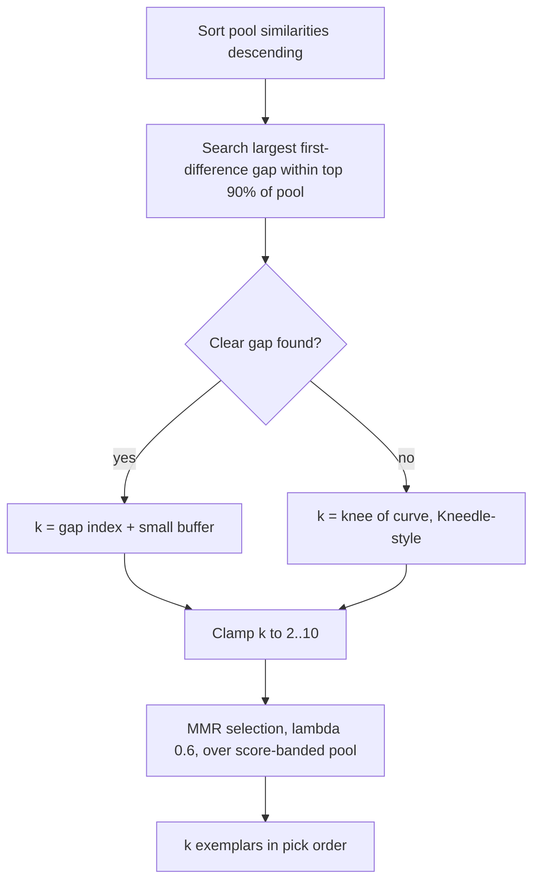

# One adaptive verbosity lever for check results

**Status**: operator-ratified 2026-07-26 (third iteration; decisions in §6). Supersedes the options analysis in [finding-max-chars-mcp-contract.md](finding-max-chars-mcp-contract.md) §3 after the operator's ruling that hard character caps are an anti-pattern and the lever should match how LLM APIs expose effort today.

**Goal** (operator, 2026-07-26): "adjustable result lengths making the most out of every token we put in the LLM context" — not enforcement of a literal character count. "I don't care about enforcing an exact number of characters, and I think a hard limit would be an anti-pattern."

## 1. Problem recap

- `max_chars` is a silent no-op on the MCP surface (`routes/mcp.ts` substitutes `clusters ?? 3` on every call, making `resolveK`'s char-budget branch unreachable) — see the finding doc for the measurement table.
- The documented precedence ("max_chars overrides clusters", `recipe-guide-content.ts` `RESPONSE_SIZE_CONTROL`) is false on every surface: `resolveK` gives explicit `k` precedence unconditionally.
- Even where wired (web JSON), `max_chars` is a pre-render guess: `estimateK` divides the budget by average claim length × a fixed 3.5 multiplier, floors at k=2, and nothing ever measures the rendered response.
- Field data: agents don't reach for numeric knobs. MCP pagination hints were removed because "field data showed zero agents paging anyway" (`routes/mcp.ts`), and the operator observes the same for `clusters`/`max_chars`.
- The "drill deep" half of the original 2026-04-01 verbosity design (recipe `3332134a`) is now served by `session_id`/`known_recipes` stubbing — re-checking walks the ranking to unseen recipes. The only remaining job for a size lever is bounding how much context one response consumes.

## 2. Precedent — how LLM APIs expose this control today

We are not inventing here. Every major provider converged on the same shape: a small ordered enum, a documented default that means "omit it and trust the model," and active deprecation of numeric token knobs. All quotes verbatim from official docs.

| Provider | Parameter | Values | Default / automatic |
|---|---|---|---|
| OpenAI | `reasoning.effort` | `none, minimal, low, medium, high, xhigh, max` (per-model subset) | "gpt-5.5 defaults to `medium` reasoning effort." |
| OpenAI | `text.verbosity` (output length) | `low, medium, high` | `medium` |
| Anthropic | `output_config.effort` | `low, medium, high, xhigh, max` | `high`; "Setting `effort` to `\"high\"` produces exactly the same behavior as omitting the `effort` parameter entirely." |
| Google Gemini | `thinking_level` (supersedes numeric `thinkingBudget`) | `minimal, low, medium, high` | dynamic per-model |
| xAI Grok | `reasoning_effort` | `low, medium, high` | "If not specified, `reasoning_effort` defaults to `\"high\"`." |

Key facts grounding the design:

- Output length and reasoning depth are separate axes at OpenAI, and the output-length one — the exact semantics of our lever — is a 3-value enum: `text.verbosity` "Lets you hint the model to be more or less expansive in its replies." with "low" → terse UX, "medium" (default) → balanced detail, "high" → verbose. ([OpenAI cookbook, GPT-5 new params](https://developers.openai.com/cookbook/examples/gpt-5/gpt-5_new_params_and_tools))
- Anthropic deprecated its numeric knob in favor of enum + adaptive: "The mapping is small: remove `budget_tokens`, set `thinking: {type: \"adaptive\"}`, and control reasoning depth with `output_config: {effort: ...}` instead of a token budget." ([extended-thinking docs](https://platform.claude.com/docs/en/build-with-claude/extended-thinking.md)) And the enum is a steer, not a cap: "Effort is a behavioral signal, not a strict token budget." ([effort docs](https://platform.claude.com/docs/en/build-with-claude/effort.md)) — direct support for the "hard limit is an anti-pattern" ruling.
- Google made automatic the default posture: "Gemini models engage in dynamic thinking by default, automatically adjusting the amount of reasoning effort based on the complexity of the request." ([Gemini thinking docs](https://ai.google.dev/gemini-api/docs/thinking)) Its legacy numeric knob used a sentinel for the same idea: "Setting the `thinkingBudget` to -1 turns on **dynamic thinking**, meaning the model will adjust the budget based on the complexity of the request." ([legacy thinking page](https://ai.google.dev/gemini-api/docs/generate-content/thinking))
- MCP itself has no response-size negotiation — only an open proposal ([modelcontextprotocol discussion #2211](https://github.com/modelcontextprotocol/modelcontextprotocol/discussions/2211)), so a per-tool enum is each server's own design decision and consistent with the field.

## 3. Literature — adaptive result-count and adaptive MMR

The "automatic" mode's job — given result count and the similarity-score distribution, decide how many results to show — is a well-studied problem called **ranked-list truncation**. The trodden path, from simplest to heaviest:

**Largest-gap cutoff (the established simple mechanism).** Weaviate ships it in production as `autocut`: "The autocut function limits results based on discontinuities in the result set. Specifically, autocut looks for discontinuities, or jumps, in result metrics such as vector distance or search score." ([Weaviate docs](https://docs.weaviate.io/weaviate/api/graphql/additional-operators)) The identical rule was independently validated for RAG context selection by Adaptive-k (EMNLP 2025): "We present Adaptive-k retrieval, a simple and effective single-pass method that adaptively selects the number of passages based on the distribution of the similarity scores between the query and the candidate passages. … Adaptive-k matches or outperforms fixed-k baselines while using up to 10x fewer tokens than full-context input, yet still retrieves 70% of relevant passages." ([arXiv 2506.08479](https://arxiv.org/abs/2506.08479)) Mechanism: "Sort the scores in descending order. Compute their first discrete differences and choose the index k where the similarity drop is the largest." Two guardrails worth copying verbatim from the paper: "we restrict the search for the largest gap to the top 90% of documents sorted by their similarity scores" and "we incorporate a small fixed buffer, retrieving an additional B documents after the k-th document." ([arXiv HTML §3.3](https://arxiv.org/html/2506.08479v3))

**Knee detection (fallback when the curve is smooth rather than gapped).** Dense-retrieval score curves have a documented shape: "Ranked similarity curves typically exhibit a characteristic _steep–flat–steep_ pattern, corresponding to a relevance-dominated head, a transition region, and a noise-dominated tail." ([TAA-k, arXiv 2606.11907](https://arxiv.org/html/2606.11907v1)) Kneedle (Satopää et al. 2011) is the generic curvature-based knee detector. ([DOI 10.1109/ICDCSW.2011.20](https://dl.acm.org/doi/abs/10.1109/icdcsw.2011.20))

**Statistical score-distribution models (cite, don't build).** The foundational line — Manmatha, Rath & Feng SIGIR 2001 (normal-for-relevant / exponential-for-non-relevant mixture, [DOI 10.1145/383952.384005](https://dl.acm.org/doi/10.1145/383952.384005)); Arampatzis, Kamps & Robertson SIGIR 2009, "Where to stop reading a ranked list?" ("the task is essentially a score-distributional threshold optimization problem", [DOI 10.1145/1571941.1572031](https://dl.acm.org/doi/10.1145/1571941.1572031)); learned truncation (Choppy, [arXiv 2004.13012](https://arxiv.org/abs/2004.13012)); EVT-based calibration (Surprise, SIGIR 2023, which names exactly the pgvector problem: "what distance constitutes relevance varies from query to query and changes dynamically as more documents are added to the index", [DOI 10.1145/3539618.3592066](https://dl.acm.org/doi/10.1145/3539618.3592066)). These need enough scores per query to fit distributions — overkill at Soup.net corpus scale, but they are the intellectual ancestry of the gap rule and the right citations for the algorithms doc.

**Floor thresholds exist everywhere but need calibration.** Qdrant `score_threshold`, Elasticsearch kNN `similarity`, LlamaIndex `similarity_cutoff` all keep an absolute minimum — but Cohere's docs warn scores aren't linear ("You can't assume that a document with a relevance score of 0.9109375 is twice as relevant as one with a relevance score of 0.04421997", [Cohere reranking best practices](https://docs.cohere.com/docs/reranking-best-practices)) and recommend calibrating empirically from 30–50 borderline queries per embedding model rather than hardcoding folklore values.

**Adaptive MMR λ.** Carbonell & Goldstein's own guidance is stage-based: "start with a small λ (e.g. λ = .3) in order to understand the information space in the region of the query, and then to focus on the most important parts using a reformulated query … and a larger value of λ (e.g. λ = .7)." ([original MMR paper](http://www.cs.cmu.edu/~jgc/publication/The_Use_MMR_Diversity_Based_LTMIR_1998.pdf)) Per-query adaptation is established: Santos, Macdonald & Ounis (CIKM 2010) "propose to learn such a trade-off on a per-query basis … our selective approach can significantly outperform a uniform diversification" ([PDF](http://terrierteam.dcs.gla.ac.uk/publications/santos2010cikm.pdf)); Wang & Zhu (SIGIR 2009) derive the diversification level from score variance via portfolio theory ("an optimal rank order is the one that balancing the overall relevance (mean) of the ranked list against its risk level (variance)", [DOI 10.1145/1571941.1571963](https://dl.acm.org/doi/10.1145/1571941.1571963)). The ecosystem default is LangChain's `lambda_mult: float = 0.5` with ~5× overfetch (`k=4, fetch_k=20`) ([LangChain vectorstores base](https://raw.githubusercontent.com/langchain-ai/langchain/master/libs/core/langchain_core/vectorstores/base.py)); our shipped λ=0.6 over a score-banded pool is already inside the trodden range.

## 4. Proposed design

### The lever

One agent-facing parameter on `check_recipe` (both MCP surfaces) and the web check endpoint:

```
verbosity: "low" | "medium" | "high"    (optional; omitted = automatic)
```

- **Omitted = automatic** — matching the industry default posture (Gemini "dynamic thinking by default"; Anthropic "omitting the effort parameter entirely"). The schema description says so explicitly, so the automatic mode is discoverable without spending an enum member on it.
- **The enum is a behavioral steer, not a budget** — Anthropic's framing ("a behavioral signal, not a strict token budget") is the contract. The server is free to change how each level is realized (exemplar count, evidence compactness, related-evidence sections) without a schema change, which is the property that makes this the last schema change this lever needs.
- `clusters` and `max_chars` are **retired from all agent-facing schemas and guide copy** but remain silently accepted (the evals adapter and any deployed configs keep working): `clusters` maps to explicit `k` as today; `max_chars` maps through `estimateK` as the web route already does (the one-line MCP precedence fix ships as part of this, so the legacy param at least behaves as documented while deprecated).

### Initial level mappings (server-side, tunable — not part of the contract)

| Level | Exemplars (k) | Evidence rendering |
|---|---|---|
| `low` | 2–3 | compact (top evidence entry per exemplar) |
| `medium` | ~5 | current default rendering |
| `high` | ~10 | full evidence |
| automatic | adaptive-k, clamped to [2, 10] | scales with resolved k |

### Automatic mode — the adaptive core

All signals are already available at the display-selection seam: `mmrClusters` receives the query vector and every pool vector, so the sorted similarity curve is computable in-place with no new plumbing.



- Gap rule first (Weaviate autocut / Adaptive-k EMNLP 2025), knee detection as the smooth-curve fallback (TAA-k's steep–flat–steep characterization), hard clamp as the safety rail.
- λ stays fixed at the shipped 0.6 in phase 1. **Adaptive λ is a phase-2 experiment through the existing ranking-lever seam** (plumb → sweep → report → ruling, same cadence as P6–P8): the literature-backed hypothesis is variance-keyed (Wang & Zhu — high score spread → diversify harder), but it gets measured on the golden corpus before any flip, not assumed.
- The score-banded pool (band 0.15, min 100) already gives the adaptive overfetch the literature wants (LangChain's fetch_k ≈ 5×k); no pool change needed.

### Surface and copy changes

- MCP schemas (`routes/mcp.ts`, `apps/mcp-server/src/index.ts`): drop `clusters` + `max_chars` descriptions, add `verbosity` (~150 chars) — net headroom gain under the 4,000-char schema budget cap.
- Guide copy: rewrite `RESPONSE_SIZE_CONTROL` (`recipe-guide-content.ts`) around the enum; its "max_chars overrides clusters" sentence is false today and dies with this change.
- Drill-down affordances: "re-check with a higher clusters value" hints (`routes/mcp.ts`, `check-response-renderer.ts`) become "re-check with verbosity=high" — or lean on `session_id` walking, which is the mechanism agents demonstrably use.
- Web HTML form: replace the two numeric inputs with one select (low/medium/high/automatic); `HTML_DEFAULT_MAX_CHARS` retires in favor of automatic.

## 5. Regression tests (per the evals-side ask, generalized)

The defect class here is "documented parameter silently ignored," which no stage-level test catches. Golden-corpus cases, per surface (MCP and web JSON):

- Monotonicity: delivered exemplar count non-decreasing across `low → medium → high` on a fixed query; byte-size spread between `low` and `high` above a floor.
- Automatic bounds: resolved k within the clamp on every golden query; a query with an engineered score cliff truncates at the cliff, a flat-curve query falls back to the knee/clamp path.
- Legacy params: `clusters=N` still yields N exemplars; `max_chars` alone still moves the response (deprecation ≠ regression).

Cheap (embedding-cache-warm, no LLM), fits the existing ranking regression harness.

## 6. Decisions (operator, 2026-07-26)

1. **Parameter name: `verbosity`** — exact match to OpenAI's output-length param; honest semantics (steers expansiveness, not compute).
2. **Omission-only automatic** — no explicit `"auto"` enum member, matching every provider's default posture.
3. **`verbosity` extends to `get_briefing` too**, with the briefing's default behavior unchanged when omitted — see §7 for the adaptive-briefing look-ahead this decision carries.
4. **Adaptive-λ ships in this work**, not queued: plumb the lever and run the sweep now ("let's do as much as possible now"), still gated by measurement (plumb → sweep → report → ruling) before any default flip.

## 7. Briefing scope and the adaptive-briefing look-ahead

Operator direction (2026-07-26): the future experiment is an **adaptive briefing** — the LLM sends a summary of its understanding of its goals, and the briefing adapts to those goals. "So that will need a much lower floor to the similarity metric in the MMR algorithm, which is why I mention it now so that we think ahead while we're making changes." Method constraint: "In general, I avoid changing too many things at once because it would confuse efforts to understand what helped, but look for opportunities to add simple options while doing related work that would allow for discovery of what helps."

What this means concretely, given what's already built:

- **The goal-summary param already exists**: `get_briefing`'s `purpose` (WT-3) embeds free text describing the task and re-picks each cluster's exemplar as the member most similar to the purpose embedding — "tailored exemplars, stable map of the corpus" (`briefing-exemplars.ts`). No new `prompt_summary` param is needed; adding one would duplicate `purpose`.
- **What's new is a selection mode, not a param**: today `purpose` only biases within-cluster exemplar choice; the cluster structure stays corpus-wide k-means. The adaptive-briefing experiment arm lets the purpose embedding drive **selection itself** — MMR over the corpus against the goal embedding, the same display-selection mechanism the check path ships — instead of merely re-picking exemplars inside fixed clusters.
- **The similarity floor concern maps to pool reach**: goal-text-to-recipe similarities run lower than recipe-to-recipe similarities, so any absolute floor tuned for checks would starve a goal-conditioned briefing. The shipped pool mode is already **relative** (score band 0.15 below the top hit, min 100), which degrades gracefully — but the experiment arm likely needs a wider band or uncapped reach as its own lever value, which is why the pool-band lever stays per-surface-configurable rather than a global constant.
- **This work ships**: (a) `verbosity` on `get_briefing`, mapping to the exemplar cluster count (default unchanged — current preference-driven k when omitted); (b) the briefing selection-mode lever plumbed behind the ranking-config seam (`corpus-kmeans` today, `goal-mmr` as the experiment arm), defaulting to today's behavior — exposed for A/B, flipped only by measurement.

## 8. Implementation order

1. **Lever + surfaces**: `verbosity` enum on `check_recipe` (both MCP surfaces), web check endpoint, and `get_briefing`; `clusters`/`max_chars` leave the guide copy and shrink to one-line "Deprecated — use verbosity" schema descriptions (they must stay in the MCP zod schema to remain honored: the SDK strips unknown keys silently, which would recreate the exact parameter-silently-ignored defect this work fixes — for the evals adapter of all callers); legacy mapping incl. the one-line MCP precedence fix; drill-down hints and HTML form updated.
2. **Automatic mode**: adaptive-k (gap → knee → clamp) at the `resolveK`/`mmrClusters` seam; regression tests per §5. **The automatic realization ships behind a ranking-config lever** (`autoK: "fixed" | "adaptive"`, default `fixed` = today's k=3): the schema contract (omitted = automatic, a behavioral steer) is unaffected by which realization is live, and the default flips to adaptive only after a golden-corpus sweep — the measure-before-flipping-defaults discipline (recipe c2dbcac1) applies to the realization, not the contract.
3. **Adaptive-λ**: plumb variance-keyed λ as a ranking-config lever, golden-corpus sweep, report, operator ruling before any default change.
4. **Briefing selection-mode lever**: `goal-mmr` arm plumbed and off by default; A/B via the eval harness when the adaptive-briefing experiment starts.
5. **Public algorithm docs** (operator, 2026-07-26: "make sure the plan includes updating all our public facing documentation on how our algorithms work, backed up by the research references"): `docs/architecture/search-algorithms.md`, `ranking-engine.md`, and `research-foundations.md` gain the verbosity lever semantics, the adaptive-k mechanism with its lineage (Weaviate autocut, Adaptive-k EMNLP 2025, Kneedle, the Manmatha/Arampatzis score-distribution foundations), and the adaptive-λ hypothesis (Wang & Zhu 2009, Santos 2010) — every fact a verbatim quote + link, per the standing docs rule.

**Schema-description budget**: the 4,000-char cap in `mcp-tool-descriptions.test.ts` stays — it guards tool-list bytes shipped to every conversation, not response size, and the 2026-07-17 ruling (recipe 8dd573b4) keeps it as a loud, reviewable tripwire. This change fits under it with net headroom gained.
