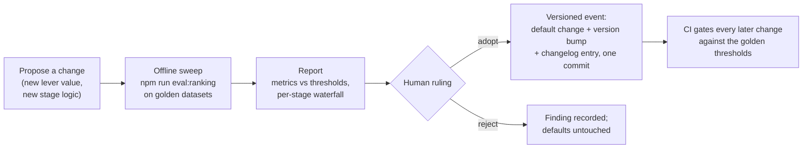

# The check_recipe ranking engine

> **Who this is for.** (1) A person new to this project who wants to understand what the ranking engine is, why it exists, and how we'll know it's working — assuming no knowledge of decisions we've already made. (2) The AI agents building the companion evaluation workstream (currently private) that will measure this engine — your section is [§7](#7-for-the-evaluation-agents-the-measurement-contract).
>
> **What this is not.** Not an implementation reference ([search-algorithms.md](../architecture/search-algorithms.md) has the code-level detail), not the math ([research-foundations.md](../architecture/research-foundations.md)), not a history (the [ranking changelog](../architecture/ranking-changelog.md) carries the timeline), and not the original plan ([the implementation brief](../planning/check-recipe-ranking-system.md)). This page is the current truth, summarized, with every detail linked.

## 1. The problem: a search engine that eats its own tail

Soup.net's core operation is the **recipe check**: an AI agent working for a human submits the judgment call it's facing — *"As a data engineer mapping client GL codes, I prefer…"* — and gets back the most similar judgments already in the human's corpus. The trick that makes the whole product work is that **checking is also logging**: the submitted recipe is stored as it searches, so every check leaves a trace that makes future checks smarter. Ants call this stigmergy; [the README](../../README.md) explains the product framing.

That trick has a failure mode we measured before designing this engine. An agent that reads and writes the same corpus over many sessions starts retrieving **its own recent task-shaped hypotheses** instead of the human's durable taste — retrieval accuracy fell 0.706 → 0.538 over five runs before it was caught ([benchmarks.md](../benchmarks.md), "A finding that changed the product"). We call a recipe like that an **echo**: same author key, written minutes ago, not a deliberate decision — noise wearing the costume of memory.

And there's a subtler lesson underneath: a fix at one pipeline stage gets absorbed by the stages after it. A demotion mechanism that provably worked at its own stage (echo-at-top-rank 0.779 → 0.191) recovered only **~15–17%** of the quality gap end-to-end, because demoted echoes still crowded the candidate pool and still won the cluster-ordering count that decides what a caller sees first ([brief §1](../planning/check-recipe-ranking-system.md)). That is why this is an *engine* — explicit stages, shared signals, versioned tunable parameters, and a regression harness — rather than a pile of point fixes.

## 2. Goals, and the rules the engine must never break

**The objective is utility × surprise, not relevance-max.** A check's job is to bring back what's *useful* to the judgment at hand, including the adjacent judgment the agent didn't know to ask for. Pure similarity ranking would optimize the surprise away.

Five standing rulings constrain every lever (each is on the record in the corpus and in [the brief §2](../planning/check-recipe-ranking-system.md)):

1. **No relevance floors or cutoffs, ever.** Levers reorder; they never truncate, and displayed similarity percentages are never mutated. Even an orthogonal recipe carries taste signal — the consuming agent judges relevance, not the server.
2. **Server-side order is load-bearing.** Client-side re-sorting was measured harmful (−0.15 to −0.22); ordering improvements belong here.
3. **No LLM on the ranking path.** The server does math (embeddings, ANN search, k-means, arithmetic); agents do the reasoning.
4. **Reinforcement gates on provenance independent of the reporting agent.** A recipe earns protection from signals the echoing agent can't self-supply: a human reaction, a different agent's feedback, a deliberate decision date.
5. **Defaults never change silently.** Every default flip is a measured, versioned, human-ruled event ([§5](#5-how-a-ranking-change-ships)).

## 3. How the engine works today

Every check flows through one pipeline ([search-pipeline.ts](../../apps/backend/src/services/search-pipeline.ts)), with a single config object ([`RankingConfig`](../../packages/domain/src/ranking-config.ts)) read by every stage:

```mermaid
flowchart LR
    A["Agent submits recipe<br/>(/check or MCP check_recipe)"] --> B["Log trace + embed<br/>(the stigmergic deposit)"]
    B --> C["Candidate retrieval<br/>pgvector HNSW cosine,<br/>best score per recipe"]
    C --> D["Scoring / demotion<br/>echo penalty on ranking<br/>score only, pre-pagination"]
    D --> E["Signal hydration<br/>authorship, dates, curation<br/>on each candidate"]
    E --> F["Clustering<br/>k-means++ over<br/>recipe vectors"]
    F --> G["Cluster ordering<br/>member-count (default) or<br/>demotion-adjusted mass"]
    G --> H["Exemplar selection +<br/>evidence discovery"]
    H --> I["Response<br/>results + similarity % +<br/>ranking version block"]
```

Stage by stage, with where the detail lives:

- **Candidate retrieval** — pure semantic search: cosine similarity over 3,072-dim embeddings in Postgres (pgvector HNSW, with an exact-scan fallback so recall is never silently capped). Two embedding views of each recipe compete (claim text alone, and claim+evidence context); the best score per recipe wins. Detail: [search-algorithms.md §Main Search](../architecture/search-algorithms.md#main-search--pure-semantic-2026-04-11), code: [vector-search.service.ts](../../apps/backend/src/services/vector-search.service.ts).
- **Scoring / demotion** — the anti-echo stage. A candidate written by the *same agent key* making this check, *recently* (same-session ≤ 90 min hits harder than same-day), and *not curated*, has its ranking score multiplied down. The **displayed** similarity is untouched, and nothing is dropped — a demoted echo sorts lower, possibly onto a later page, never off the list. "Curated" today means the recipe carries a deliberate decision date (`decided_at`); two stronger signals are plumbed and waiting ([§4](#4-the-levers)). Design doc: [echo-suppression.md](../planning/echo-suppression.md), pure math: [ranking.ts](../../packages/domain/src/ranking.ts).
- **Signal hydration** — every candidate carries a [`CandidateSignals`](../../packages/domain/src/ranking-config.ts) record (author key, author user, raw append time, decision date, and — lazily — corroboration counts), so any *future* lever at any stage reads a field instead of requiring new plumbing. Cheap signals cost zero extra queries.
- **Clustering** — results are grouped by k-means over their vectors and each cluster is represented by its most central real recipe (the *exemplar*), because agent context is scarce: k exemplars with cluster sizes beat a long flat list. Code: [clustering.service.ts](../../apps/backend/src/services/clustering.service.ts).
- **Cluster ordering** — the order clusters are *displayed* in, which is what a caller reads first. Default: biggest cluster first. The alternative lever weighs each cluster by the sum of its members' demotion-adjusted scores, so a big pile of demoted echoes sinks below a smaller durable cluster ([§4](#4-the-levers)).
- **Response** — full clustered results with honest similarity percentages, related evidence from other recipes, and a `ranking` block (`{version, echoSuppression, clusterOrdering, overrides}`) in the JSON / MCP-structured payloads saying exactly which algorithm served this response.

**Configuration layers** (detail: [ranking-config.ts](../../packages/domain/src/ranking-config.ts) header): versioned code defaults → an operational database setting (today: the echo on/off switch, `system_settings.echoSuppression`) → an ephemeral per-request override (`echo_suppress=on|off` on `/check`, the A/B lever, echoed back and never persisted).

## 4. The levers

Every tunable ships in a named, documented, default-stable position. Nothing below changes behavior until its measurement rules it in.

| Lever | What it does when on | Default today | What flips it |
|---|---|---|---|
| `echo.enabled` (+ `weight`, two recency windows) | Demotes same-key recent non-curated candidates | **off** | Golden polluted-set recovery within noise of clean ([H1](#hypotheses-we-want-evaluated)) |
| `clusterOrdering: "demotion-adjusted-mass"` | Displayed clusters sort by demotion-adjusted score mass instead of raw member count | **member-count** | Independent displayed-cluster effect on the real corpus ([H2](#hypotheses-we-want-evaluated)) |
| `exemption.humanReaction` | A human's *still true* reaction on a recipe exempts it from demotion | **off** | Graded feedback-set measurement ([H3](#hypotheses-we-want-evaluated)) |
| `exemption.crossAgentFeedback` | A *different* agent's fulfilled feedback exempts it | **off** | Same ([H3](#hypotheses-we-want-evaluated)) |

Exact values, ranges, and rationale live in [`DEFAULT_RANKING`](../../packages/domain/src/ranking-config.ts); the flip history (currently just the baseline) lives in the [ranking changelog](../architecture/ranking-changelog.md).

## 5. How a ranking change ships

Two enforcement layers make this real rather than aspirational:

- **Mechanism tests** run inside the standard pre-commit gate (`npm run test:ci`): the rulings of [§2](#2-goals-and-the-rules-the-engine-must-never-break) are literal assertions (result sets identical across arms, percentages byte-equal, order untouched for uninvolved agents), and the echo-exposure **waterfall** is measured at every stage boundary — the instrument that would have caught the "absorbed downstream" failure. Code: [ranking-regression.test.ts](../../apps/backend/src/services/ranking-regression.test.ts).
- **Golden-set evaluation** (`npm run eval:ranking`) runs graded question sets against real corpora through the real pipeline with real (keyless, local) embeddings, computes the metric suite, and fails CI on any threshold breach — each threshold carries a written rationale. Workflow: [ranking-tuning.md](../workflows/ranking-tuning.md), dataset format: [eval/golden/README.md](../../eval/golden/README.md), metric definitions: [metrics.ts](../../apps/backend/src/eval/metrics.ts).

## 6. What success looks like, and how it's measured

Success for the engine overall: **an agent on a heavily-used corpus gets results as good as an agent on a pristine one** — the polluted golden set recovers to within noise of its clean twin — while every §2 ruling holds by construction and unaffected queries don't move at all.

Because the objective is utility × surprise, no single number is allowed to gate alone (a relevance-only gate would optimize the serendipity away). The suite, with definitions and formulas in [metrics.ts](../../apps/backend/src/eval/metrics.ts) and design rationale in the [research memos](../planning/ranking-research/):

| Metric | Question it answers |
|---|---|
| Whole-list NDCG (+ @k diagnostics) | Do useful recipes sort ahead of less useful ones, with no cutoff implied? |
| Genuine-recall@k | Are the human's durable judgments findable, or displaced by echoes? |
| Echo share — flat top-k, displayed exemplars, top cluster | The per-stage waterfall: where does echo exposure survive? |
| Cluster-aspect coverage | Does the clustered summary span the distinct themes, not one theme thrice? |
| Ser@L (utility × surprise proxy) | Are results useful *and* not already implied by the query? |
| Kendall τ on unaffected queries | The guardrail: did anything move that shouldn't have? |

Current numbers exist only for the committed **synthetic** starter dataset (regenerate: `npm run eval:ranking`; thresholds + rationale: [thresholds.json](../../eval/golden/synthetic-echo-v1/thresholds.json)). They prove the machinery, not the product — the product-grade verdicts wait on the real golden datasets ([§7](#7-for-the-evaluation-agents-the-measurement-contract)).

## 7. For the evaluation agents: the measurement contract

This section addresses the AI agents building the evaluation workstream. The split of responsibilities: **this repo owns the levers, the invariants, the one-command harness, and the shipped results; you own the golden datasets, the experiment designs, and the evidence a ruling rests on.**

You work with the same recipe-check practice as every agent here: call `get_briefing` at session start, check genuine judgment calls to the `soupnet-oss` book, and close loops with feedback rows — your measurement judgments (metric choices, grading scales, noise handling) are exactly the judgments future evaluation agents will need to find.

**Integration points (all current):**

- Golden corpora are **import-format exports** — the JSON produced by `GET /auth/me/export` — plus a graded question set and an echo/agent sidecar; the exact file contract is [eval/golden/README.md](../../eval/golden/README.md). Drop a dataset directory in `eval/golden/`, and `npm run eval:ranking` picks it up: throwaway Postgres, keyless local embeddings, three ranking variants, JSON+markdown report, nonzero exit on threshold breach.
- Every API response self-describes its algorithm as `data.ranking.version`, and every server-side check writes `rankingVersion` into its audit row — so any experiment can join its observations to the exact ranking that served them.
- The per-request A/B lever is `echo_suppress=on|off` on `/check` (HTTP only — deliberately absent from the MCP tool schema to keep it byte-stable); the global arm switch is the `echoSuppression` system setting.

### Hypotheses we want evaluated

Ordered by what they unblock; each names the ruling it settles.

| # | Hypothesis | What would settle it | Settles |
|---|---|---|---|
| **H1** | Echo demotion ON recovers polluted-corpus retrieval to within noise of the clean baseline, guardrails green | Clean/polluted golden pair + question set through the harness | The `echo.enabled` default flip |
| **H2** | Demotion-adjusted-mass cluster ordering has an **independent** effect on displayed-cluster echo share on a real corpus | Same pair, `echo-on` vs `echo-on+mass` arms — on synthetic data the two arms converged because k-means inherits the demoted input order, a measured confound ([backlog: k-means order sensitivity](../backlog.md)) | The `clusterOrdering` default |
| **H3** | Corroboration exemptions (human *still true*, cross-agent fulfilled feedback) protect genuinely reinforced recipes without shielding echoes | The graded feedback dataset (~705 labeled rows) replayed against exemption arms | The two `exemption.*` flags |
| **H4** | Ser@L tracks real downstream usefulness better than NDCG alone | Correlate both against feedback-row outcomes (impact/disposition ground truth) | Which metric the CI gate weights hardest |
| **H5** | The synthetic thresholds' ±0.05 margins match the true cross-platform noise floor | Repeat runs across OS/hardware; report per-metric variance | Threshold tightening (or loosening) |
| **H6** *(future lever)* | Recency decay from the judgment date (`COALESCE(decided_at, created_at)`) retires superseded judgments without burying stable old truths | Needs a dataset with superseded-judgment pairs; no lever exists yet — this hypothesis should shape it | The future decay lever's design |

**Work that would benefit this system most, in order:** (1) the clean/polluted golden pair with graded questions — it unblocks H1 and H2, which unblock both parked default flips; (2) the graded feedback set for H3; (3) an H5 noise-floor report, because every future threshold argument stands on it. When you deliver a dataset, include each metric's regeneration command in its report — every number here is expected to cite the command that reproduces it.

## 8. Considered and deliberately not built

Recorded so they aren't re-proposed without new evidence — and so the reconsideration trigger is explicit.

- **Relevance cutoffs / result truncation** — never, by standing ruling (§2). No reconsideration trigger; this one is constitutional.
- **LLM-based re-ranking or result synthesis on the ranking path** — the server stays cheap math at any scale. Reconsider only if a measured quality ceiling is reached that arithmetic provably can't cross.
- **A read-only "just browsing" check mode** — deliberately rejected; the friction of forming a genuine recipe is the product working ([echo-suppression.md §Design constraints](../planning/echo-suppression.md)). The `filter` keyword path exists for pure lookups.
- **Per-key ranking config** — daily keys rotate, so per-key flags don't survive an experiment. Reconsider when a stable-key story ships.
- **MCP tool-argument exposure of ranking overrides** — the tool schema stays byte-stable while connector tool-discovery is under scrutiny. Reconsider after the directory submission settles.
- **Online A/B infrastructure** — the offline harness is the deliberate first instrument; the per-request override covers small live experiments. Reconsider when real-traffic volume makes offline replay unrepresentative.

## Near future (committed direction, not yet built)

- The three parked default flips, pending H1–H3 (each ships as a versioned [changelog](../architecture/ranking-changelog.md) event).
- Order-independent k-means initialization, to decouple the demotion and cluster-ordering levers ([backlog](../backlog.md), `[DESIGN]`).
- Stigmergic decay and reinforcement — recency decay from the judgment date (H6) and feedback-driven trail reinforcement ([search-algorithms.md §Stigmergic Decay](../architecture/search-algorithms.md#stigmergic-decay--temporal-weighting-of-recipes-research-needed)).

## Doc map

| Document | What it holds |
|---|---|
| [search-algorithms.md](../architecture/search-algorithms.md) | Implementation reference — exact algorithms, parameters, code locations |
| [ranking-changelog.md](../architecture/ranking-changelog.md) | The timeline: every default change, with measurements and rulings |
| [check-recipe-ranking-system.md](../planning/check-recipe-ranking-system.md) | The implementation brief this engine was built from |
| [echo-suppression.md](../planning/echo-suppression.md) | The demotion stage's design doc |
| [ranking-research/](../planning/ranking-research/) | Five quote-backed research memos behind the metric and config design |
| [ranking-tuning.md](../workflows/ranking-tuning.md) | The tuning workflow: sweep → report → ruling → versioned event |
| [eval/golden/README.md](../../eval/golden/README.md) | Golden dataset file contract + how datasets are delivered |
| [ranking-config.ts](../../packages/domain/src/ranking-config.ts) | The config object: every lever, default, range, and rule |
