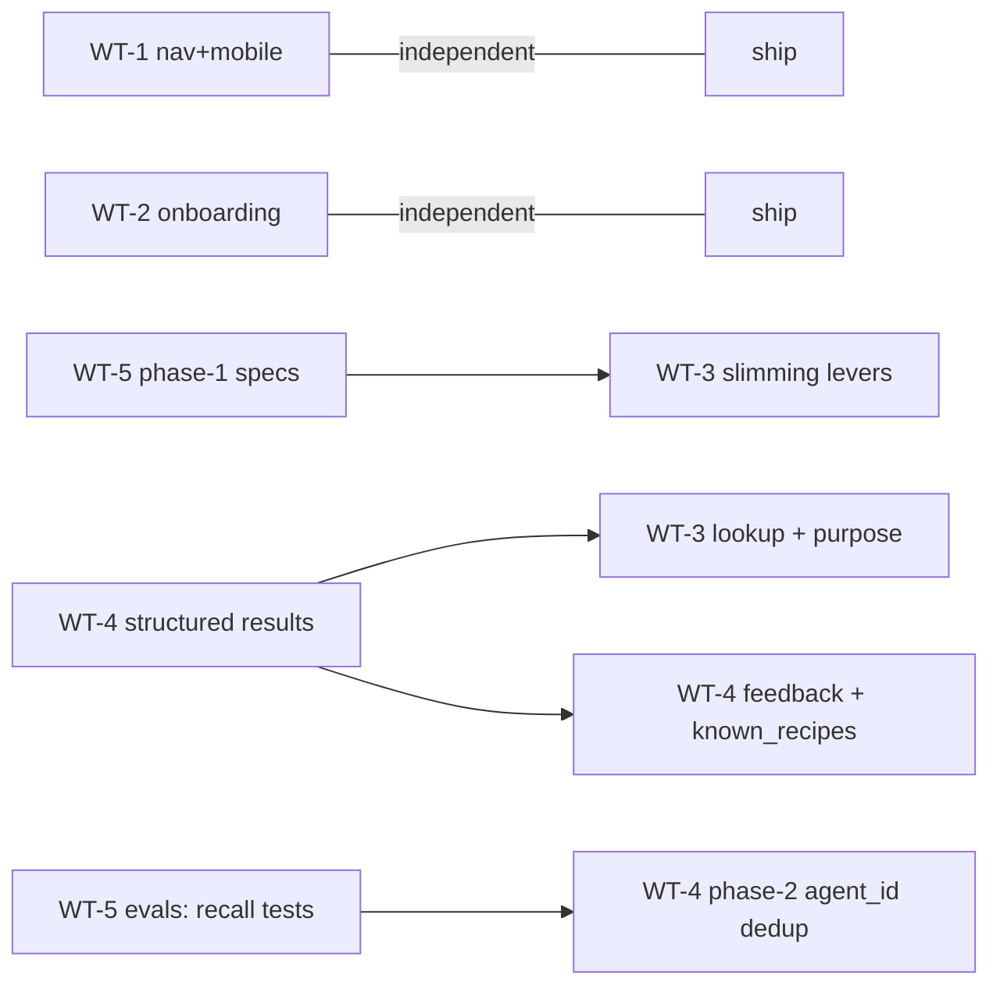

# Next improvements — parallel work-tree plan

Scoped from the 2026-07-05 planning request (onboarding, GUI/nav, mobile, briefing tailoring, recipe lookup, feedback ingestion, dedup), a heavy-multi-agent-day field report, three code surveys, and the existing backlog. Organized as five work trees that can run concurrently, with named merge-coordination points where they can't be fully independent.

## What you need to know first

These change the plan more than any individual feature does:

1. **Two of the briefing asks are already built.** Every live "Copy briefing" button (Dashboard, API Keys, Recipe Books, Recipe Map) calls the same `GET /keys/briefing` → `composeBriefing()` and always includes the clustered exemplar sample (`apps/backend/src/routes/keys.ts:190`, `services/briefing.ts:78`). Per-book "include in briefing by default" toggles also already exist (`daily_read`/`daily_write`, `GroupsPage.tsx` `DailyPrefsToggles`, migration 0016). The dashboard-briefing work is therefore *truth-in-labeling and surfacing*, not building — see the real bug below.

2. **Verified scope bug:** the Dashboard says the daily key "reads all recipe books" (`DashboardPage.tsx:359`) but the key actually reads only `daily_read`-flagged books, falling back to "all" only when zero are configured (`keys.ts:101`). New memberships default to *excluded*, so the claim drifts more wrong as books are added. This is exactly the "check what it gives access to" concern — confirmed.

3. **Recipe lookup by id is the keystone of the batch.** It unblocks four things at once: the frontmatter `soupnet_recipes` convention (currently inert by design — ids-only was chosen as the forcing function), the briefing-slimming lever (drop evidence from exemplars only once agents can look it up), server-joinable feedback, and (later) citation links. If only one backend tree runs, run this one.

4. **Briefing *content* changes have a prerequisite the backlog already committed to.** The regression harness (behavioral specs, phase 1 = pure writing) exists precisely to stop over-correction in briefing copy; the backlog already sequences the emphasis pass behind it. Slimming is the same class of edit. So: **capability first (purpose param, recipe_ids — purely additive), content slimming after phase-1 specs exist.** Recommendation ⚑: pull regression phase 1 into this batch as a small parallel tree — it's writing, not engineering, and it gates the slimming you want.

5. **Two MCP response bugs surfaced in survey, and fixing them is the foundation of the feedback loop:**
   - `check_recipe` returns prose only. The structured JSON (recipeId, per-result scores, cluster sizes) is built internally (`mcp.ts:752`) and then flattened to text; no `structuredContent` is emitted anywhere. Agents copy "80% similar" by eye into feedback records today.
   - The tool's own response hints "Request page=N for more" (`mcp.ts:830`), but the tool schema accepts no `page` param — an MCP agent can never page. Meanwhile field data shows zero agents paged in ~15 checks anyway: pagination text is dead weight in agent flows.

6. **Dedup: the agent must stay authoritative about its own context.** An explicit `known_recipes` param (agent declares what it holds) already exists as a design-thinking user story whose backlog pointer went dangling — restore it. Server-side "we returned this to you before" inference (via self-minted agent IDs) is attractive but unsafe until recall-tested: context compaction means the server's "already sent" memory can diverge from what the agent still holds, and field notes show agents demonstrably lose briefing context mid-session. Also a semantics guard: dedup must affect **response rendering only, never trace logging** — the idempotency rule ("same recipe from a different agent session IS a new observation") stays intact.

7. **Security surface grows in this batch** (by-id lookup = IDOR class; feedback ingestion = new write path; both new tools bypass the F29 rate limiter, which counts only `action='recipe.checked'` on `audit_log`). The backlog already has a pending fresh audit; these trees should land behind key-scope ACL tests + their own rate-limit decisions, and the audit should cover them. Per the security workflow, audit and implementation stay separate roles.

---

## Work-tree map

| Tree | Area | Primary file surface | Model tier (per the recorded heuristic) |
|---|---|---|---|
| WT-1 | Nav + mobile shell | `AppShell.tsx` + `AppShell.module.css` | mid — UI wiring against existing components |
| WT-2 | Dashboard onboarding + briefing UX | `DashboardPage.tsx`, new components | mixed — top-tier for archetype copy (taste compounds), mid for wiring |
| WT-3 | Retrieval API: lookup by id + purpose | `mcp.ts`†, `routes/traces|briefing`, `briefing-exemplars.ts`, new service | top — API design, ACL invariants |
| WT-4 | Check loop: structured results + feedback + dedup | `mcp.ts`†, `check.ts`, `trace.service.ts`, new schema/service | top — cross-cutting invariants, security-adjacent |
| WT-5 | Specs + docs housekeeping | `docs/briefing-specs/*.feature` (new), `docs/*` | mid, with top-tier review of spec wording |

† = shared merge-coordination point, see below.

**Merge coordination.** WT-3 and WT-4 both touch three files: `apps/backend/src/routes/mcp.ts` (tool registration), `packages/domain/src/recipe-guide-content.ts` (`MCP_TOOL_DESCRIPTIONS`), and `apps/mcp-server/src/index.ts` (stdio mirror). All changes there are additive blocks, so conflicts are mechanical, but declare a landing order: **WT-4's structured-results change lands first** (it reshapes `formatCheckResponse`, the highest-churn function), then WT-3 rebases its new tool blocks on top. Everything else across the five trees is disjoint.

---

## WT-1 — Navigation and mobile shell (frontend)

One tree because the sidebar and the mobile bottom bar render from the same flat `baseNavItems` array in the same component — the two asks are one change.

### Features

- **Rule-of-7 nav regrouping** (existing backlog `[DESIGN]` item, decided direction 2026-06-10, never implemented): group the explainer pages — How it works, Connect to AI, the landing page itself, Privacy/Terms — into one "Learn"/"About" group. Admin stays top-level for the few who see it. This also fixes the known gap that signed-in users can't reach the landing page except via the logo.
- **Mobile bottom bar overflow fix.** Root cause verified: all 8–9 items flex-compress with `justify-content: space-around`, no overflow handling of any kind. With the regrouping done, mobile shows ~5 primary items (Dashboard, Check, Map, Books, More); the "More" sheet carries the Learn group, Settings, Admin. Falling out of the same change, not a separate mobile design.
- **Icon dedup:** Admin currently reuses the Settings icon — pick a distinct one while in the file.

### Rejected within this tree

- **A separate mobile-specific nav model** — rejected. One grouped nav model that degrades to primary-items + More on small screens keeps the two surfaces from drifting; the crowding bug exists precisely because there is no overflow concept, not because mobile needs different information architecture.
- **Horizontal scroll on the bottom bar** — rejected; hides items off-screen (the current de-facto behavior for Admin) rather than organizing them.

---

## WT-2 — New-user onboarding + dashboard briefing UX (frontend)

### Features

- **Dashboard empty state (currently: literally nothing).** When zero recipe checks exist, the check-log section renders an empty `.map()` — no message, no CTA. Detection is trivial client-side (`tracesQuery` empty). This is the cheapest high-leverage gap in the product: the moment after signup is the moment we lose people, and today it's blank.
- **Agent-type picker in that empty state.** Four cards matching the operator's archetypes, mapped onto existing instruction content:
  1. **Coding tools** (Claude Code, VS Code Copilot, Codex, Antigravity, Cursor…) → API-key + config snippet path (`/info/connect` §"Connect via API key").
  2. **Desktop AI apps** (Claude Desktop, Cowork…) → `.mcpb` / `mcp-remote` path (today folded into the dev-tools section; give it its own card but shared underlying instructions).
  3. **Web chatbots with MCP** (claude.ai, ChatGPT Developer Mode, Le Chat, Perplexity) → OAuth connector path (`/info/connect` §OAuth).
  4. **Web chatbots without MCP** (free ChatGPT, Stitch, Grok, DeepSeek) → copy-briefing / check-page-URL path.

  Pick a card → short steps + the normal **Copy agent briefing** button (same endpoint as everywhere; no new briefing variant). The picker's job in the *empty state* ends at the user's first logged check — after that the empty state disappears forever. First-check success can celebrate ("your corpus has begun") and point at the check log.
- **Permanent home for the picker (operator revision 2026-07-05):** the archetype picker is a reusable component, rendered in two places — the dashboard empty state, and a standing "Connect your agents" page reachable from the nav's new Learn/About group, so users can return to it when adding a second or third agent after their dashboard has recipes in it. Natural shape: the picker becomes the interactive top of the existing `/info/connect` page (whose markdown already carries the per-client instructions), rather than a new parallel page that would drift from it. Coordination point with WT-1: the nav group is defined there; the page content lands here.
  Content source: `/info/connect`'s markdown already segments 3 of the 4 archetypes with per-client steps — the picker curates, it doesn't author. Reusable primitives: `StoryCarousel`, `.step-content-row`, `AdminEmptyState` (lift out of `components/admin/`), `useClipboard`.
- **Briefing-scope truth-in-labeling (the verified bug):** replace the static "reads all recipe books" with the actual resolved list (the `daily_read` set), and surface the per-book include toggles — or at minimum a link to them — next to the Copy-briefing button, so scope is visible and adjustable where the promise is made. The briefing text itself already states its true scope internally (it renders the key's books); the dashboard label is the only lying surface.

### Rejected within this tree

- **A new per-book selection mechanism for the briefing button** — rejected: `daily_read`/`daily_write` toggles already ship with exactly this meaning. The work is surfacing them at the point of use, not rebuilding them.
- **"Bring the dashboard briefing in line with the others"** as originally framed — premise verified stale: all copy-briefing buttons already produce the identical unified artifact including clustering. Closed as a verification result, not a work item.
- **Concierge chatbot onboarding (Chrome Prompt API)** — deferred, stays as its own backlog `[DESIGN]` item. The archetype picker is the smaller step the concierge idea would sit on top of; nothing in the picker forecloses it.
- **Auto-detecting the user's agent type** (via referrer/UA) — rejected: the four paths are self-identifying in one click, and guessing wrong on the first screen is worse than asking.

---

## WT-3 — Retrieval API: recipe lookup by id + briefing purpose (backend)

The fleet-workflow tree. Field-verified gap: **no surface today lets an agent retrieve a known recipe by id** — `check_recipe` is semantic-only, `GET /traces/:id` is JWT-only, and the web trace page is login-walled.

### Features

- **`get_recipes` MCP tool + REST equivalent (`GET /recipes?ids=...`, API-key Bearer), list-accepting.** Returns recipe text + evidence + references per id. ACL: filter by the key's `read_group_ids` (the API-key model, *not* the JWT group-membership check the REST trace route uses); an unreadable or unknown id returns a marker entry, not content and not a request-killing error. Batch matters — real frontmatter lists already carry 6 ids.
- **`recipe_ids` param on `get_briefing`.** One onboarding call returns identity + books + format + exactly the named recipes — matches how document-scoped sub-agents actually start. Shares the service with `get_recipes`.
- **`purpose` param on `get_briefing` (and REST `/briefing`, `/keys/briefing`).** A free-text task description used as a semantic query to bias exemplar selection — threaded through the exemplar pipeline's *existing* `filter` → `query` slot (`briefing-exemplars.ts` already passes it into `runSearchPipeline`, which ranks semantically before clustering). No new retrieval plumbing; the work is the param, its agent-facing description, and deciding how strongly query-biased selection replaces pure corpus-shape clustering (suggest: purpose biases exemplar choice *within* clusters first — tailored exemplars, stable cluster structure — before any stronger reordering).
- **Fix the trace-link mismatch:** the briefing instructs agents to emit `https://www.soup.net/traces/<recipeId>`, but the SPA route is `/app/traces/$traceId` and no bare `/traces/*` frontend route exists. Verify prod behavior and either add the redirect or fix the briefing template — today's link-formatting guidance may be minting broken links.

### Sequenced *behind* WT-5's phase-1 specs (slimming — do not start until specs exist)

- **Top-N evidence per briefing exemplar** with a "full evidence via `get_recipes`" pointer — the lookup tool is what makes this safe.
- **`max_chars` on the briefing** (parity with `/check`) — today briefing size is unbounded (k configurable to 20, no cap), which a purpose-tailored fleet will start stressing.
- The `/briefing` `exemplarCount: 0` fresh-book bug (existing backlog item) belongs to whoever is in this pipeline first.

### Rejected within this tree

- **`recipe_ids` on `get_briefing` only, no standalone tool** — rejected: mid-session lookups would re-fetch ~10 kB of briefing boilerplate per call, the opposite of the slimming goal. Both surfaces, one service.
- **Standalone tool only, no briefing param** — rejected: the frontmatter-briefed sub-agent flow is one onboarding call by design; two calls doubles the friction the convention exists to remove.
- **Public (unauthenticated) trace fetch for agents** — rejected for this batch: by-id lookup stays key-scoped. Citation links (design-thinking §Citation Links) remain the sanctioned future shape for non-technical copy-back; this tree's REST endpoint is deliberately shaped so a citation-link layer could sit on it later.
- **Exposing `purpose` in the web dashboard UI** — rejected for now, per the 1-click promise. The Recipe Map is already the human's exemplar-shaping surface ("the only place that lets the human shape the exemplars"); adding a text field to the dashboard reintroduces the two-button-era confusion. Revisit only on human demand.

---

## WT-4 — Check loop: structured results, feedback ingestion, dedup (backend)

The stigmergy tree: reinforcing helpful trails, not just leaving them.

### Features

- **Check response format flag (revised per operator review — one format per response, never both).** `check_recipe` gains `response_format: "markdown" | "structured"`, defaulting to **markdown**: a readable report-style rendering (the flattened output stays primary — it's also what a human relaying results to a web agent reads). `"structured"` returns the JSON that already exists internally (`buildMcpJsonResponse`) as `structuredContent` with minimal prose. Crucially, the markdown rendering *always* carries recipe IDs and per-exemplar similarity inline (single lines, negligible cost) — so the check → feedback join works in the default format and structured mode is an optimization, not a prerequisite.
- **Markdown copy-back for the web `/check` page.** The existing backlog `[DESIGN]` item ("Markdown response option, encapsulated in backticks" — from the 2026-05-27 demo where JSON alienated even technical users) folds into this tree: the same markdown renderer that serves MCP's default format renders the web result as a fenced block the human can read like a report and paste into their chat as a clean attachment-like card. One renderer, three surfaces (MCP prose, web copy-back, `format=json` unchanged for API integrators).
- **Pagination cleanup.** Drop "Page X of Y" from agent-facing prose (MCP + `/check` JSON hints), replace with a narrowing affordance agents actually use ("narrow with `read_recipe_books` or `axes`"); delete the contradictory `actions.nextPage` hint (advertises a param the tool doesn't accept). HTML view can keep pagination for humans.
- **Server-side feedback ingestion.** New table (`check_feedback`) whose wire format starts from the field-proven local JSONL schema v1 — it survived real load and its enum validation caught bad values in the wild; keep that strictness — extended with the server-stamped and server-computed columns in §Validating the UVP below (schema v2). Two thin surfaces over one service:
  - **optional `feedback` field on `check_recipe`** — mid-flow agents attach feedback on prior checks to the check they're already making: fewer calls, and a natural check→feedback→check trail in a stateless system;
  - **standalone `log_feedback` tool** — for end-of-session rows and `outcome`/`operational` kinds that have no next check to ride on.
  Routing-by-book disappears (the server knows the trace's book) — this was the single most error-prone part of sub-agent briefs in the field session. The local JSONL logger becomes the offline fallback; its helper is already built as the swap seam.
  The briefing gains a short *descriptive* feedback-convention blurb (issue → approach → benefit framing, consistent with the corpus's descriptive-not-prescriptive briefing taste), replacing ~150 words of per-brief boilerplate in fleet prompts.
  Rate limiting: F29's limiter counts only `recipe.checked` — feedback writes need their own budget (cheap: per-key hourly cap mirroring F29's shape).
- **Human-observable feedback (operator decision 2026-07-05: everything observable by the human).** Feedback rows render on the **trace detail page** — each recipe shows the checks-against-it lineage: impact/disposition chips, the agent's story (why it checked) and note (what it did with the result). Tracer-bullet slice: table + ingestion + trace-detail rendering ship together in this tree so the first server-side feedback row is visible to Andy the day it lands. Dashboard-level aggregation deliberately waits for data (see §Validating the UVP).
- **Dedup, phase 1: `known_recipes` param** on `check_recipe` (and `/check`). Agent passes ids it already holds; response renders those results as compact stubs (id + one-line gist + similarity) instead of full bodies. Restores the dangling design-thinking user story. Invariants: rendering-only (trace logging and idempotency semantics untouched); stubs still count in cluster math so the shape of results doesn't shift.
- **Dedup, phase 2 (gated on evals — see WT-5): self-minted `agent_id`.** Optional param logged with checks (the `recipe.checked` audit rows already store `resultTraceIds` in jsonb metadata, so the raw material exists); server auto-stubs recipes *that same agent id already checked or received*. Do not build until the recall tests say compaction-loss doesn't make it net-harmful.

### Rejected within this tree

- **Emitting prose and `structuredContent` together in every response** — rejected by operator review: doubles payload for data most calls don't use. A format flag with one default replaces it; inline IDs/similarities in the markdown keep the join alive without the duplication.
- **Feedback chained-only (no standalone tool)** — rejected: the schema's own `outcome` and `operational` kinds have no next check to ride on; end-of-session rows would be lost.
- **Feedback standalone-only (no chaining)** — rejected: gives up the minimized-API-calls trail that was the stated point, and mid-flow agents demonstrably skip separate bookkeeping calls.
- **Feedback as `audit_log` rows instead of a table** — rejected: audit_log is the F29 rate-limit hot path with a purpose-built index; feedback wants typed enums, a trace FK, and analytical queries. Write an audit row *about* the feedback if the coverage item lands, but the data lives in its own table.
- **Server-side "returned to anyone before" dedup (beyond own-agent-id)** — rejected outright, not just deferred: another agent having seen a recipe says nothing about this agent's context. Only self-scope inference is even a candidate, and that's phase 2.
- **LLM-side summarization of results server-side** — never a candidate (zero-LLM-on-server principle), noted only because briefing-slimming discussions drift there.

---

## WT-5 — Behavioral specs + docs housekeeping (this repo + private evals repo)

### Features

- **Regression harness phase 1** (existing backlog item): encode the `.feature` behavioral specs into `docs/briefing-specs/`. Pure writing, immediately useful, and the gate for WT-3's slimming work. Add scenarios for the *new* behaviors this batch creates: does a frontmatter-briefed agent call the id lookup? does an agent use `known_recipes`? does feedback arrive chained vs standalone?
- **Private evals repo backlog entries** (that repo has no backlog file yet — create one): (a) recall tests for phase-2 dedup inference — the existing ANN-recall-validation script is the methodological template (leave-one-out, recall@k, top-3 agreement = the exemplar zone), extended to "was a suppressed recipe actually still in the agent's context?"; (b) behavioral spec + eval for id-lookup usage once shipped (a live 6-id frontmatter test bed exists); (c) migrate feedback analysis to the server-side table when it lands.
- **Doc corrections riding along:** restore the `known_recipes` backlog item design-thinking.md still points at (dangling reference); flag `docs/architecture/api.md` as historical (it still documents a ✅ `get_claim`-by-id tool from the pre-pivot vocabulary — the fossil of exactly the lookup WT-3 rebuilds); verify/fix the `www.soup.net/traces/<id>` briefing link template (shared with WT-3 — whoever gets there first).

---

## Validating the UVP — feedback v2 and the measurement architecture

Added on operator direction 2026-07-05. Input: the private field-effectiveness analysis (2026-07-02) that ground-truthed ~180 feedback rows against the corpus. Its limitations list is the requirements doc: self-graded feedback never says "no" (zero unfulfilled stories, zero asked-human across 178 checks — upper bounds, not measurements); the schema can't distinguish confirmed-by-prior-taste from confirmed-by-own-echo; timestamps are append-time, not check-time; skipped checks are invisible (survivorship); cross-vendor value has zero field evidence despite being the lead structural UVP.

The design answer is a **three-layer measurement architecture**, ordered by how much each layer can flatter itself:

### Layer 1 — server-observed facts (cannot flatter themselves; the narrative foundation)

All computable from data the server already holds or receives — no self-report, no LLM:

- **Server stamps on every feedback row:** true check time, recipe book, api_key, and the check's returned trace ids + similarities (already in the `recipe.checked` audit metadata). This single change erases the three worst completeness gaps in the field data (missing `topSimilarity` on 77% of one project's rows, missing book on 141/155, append-time-vs-check-time ambiguity) — they were all denormalization the server had and the agent was retyping.
- **Echo detection, computed not confessed:** for each check, classify returned exemplars by authorship and recency — *self-same-session*, *self-earlier*, *other-agent*, *collaborator*. A check whose top hits are its own session's traces is an echo; the server knows this from `api_key_id`/`agent_id` + `created_at` without asking. Yields the **echo-adjusted confirm rate** — the honest version of the headline 68% number.
- **Cross-agent assist rate:** checks where the deciding exemplar was authored by a *different* agent or session. This is the stigmergy claim itself, measured — the morning-agent-helps-afternoon-agent case as a standing counter instead of an anecdote.
- **Connection-surface capture:** MCP-HTTP vs stdio vs web `/check` vs OAuth client identity are all server-known per request. OAuth client id in particular turns the cross-vendor UVP from "no field evidence" into a segmentable column the day a claude.ai / Le Chat / ChatGPT connector check arrives. Self-reported `model`/`harness` stay as refinement on top.
- **The survivorship denominator, finally:** `get_briefing` calls with zero subsequent checks from that key/agent are the null cohort no local log could see — briefing-to-first-check conversion per surface and per harness. Same mechanics give **check cadence over session position** (per agent-id lineage), making the "agents stop checking after compaction" field observation measurable for the first time. This is also the onboarding funnel WT-2 wants (signup → briefing copied → first check).

### Layer 2 — agent self-report (keep, but treat as upper bounds)

Schema v1's enums survive unchanged (impact/disposition/storyFulfilled, the story/note before-after pair). Two additions:

- **Lineage links:** optional `related_trace_ids` on a feedback row — when a check triggers a correction or reversal, the row links the recipe that changed the action and the trace that logged the new decision. The strongest artifact in the whole corpus analysis was a four-trace reversal arc reconstructed *manually*; lineage links make correction arcs a query, and correction arcs are the case-study narratives.
- **Calibration by audit, not by incentive:** don't add fields begging agents to say "no" — productize the trace-join audit instead (an eval that re-grades a sample of rows against the corpus each period; already the method that validated the 12 case studies). Briefing copy frames null results as seeding value (descriptive framing), and the periodic audit tells us how much to shrink the self-graded numbers.

### Layer 3 — human ground truth (the missing signal, and decision ⚑4's surface)

The field analysis had no human layer at all — every verdict was agent-graded or analyst-inferred. The trace detail page (where feedback rows now render, per operator decision) gains lightweight human reactions:

- **On recipes:** *still true* / *stale* / *wrong* — one click, timestamped, attributed. This is the calibration signal for self-graded confirms, the input the planned stigmergic decay needs anyway (decay from judgment date is already backlogged; human "stale" marks are the explicit version), and the first data that can say a *recipe* — not a check — earned its keep.
- **On feedback rows / checks:** a *this one mattered* star. Starred checks are the human-endorsed narrative seeds — "show me the arcs the human starred" is the case-study generator.

### What the narratives look like (so the data model serves them)

- **The corrections ledger:** auto-assembled arcs from lineage links — check → surfaced recipe → changed decision → new trace, with dates. The honest headline is already known from field data: behavior change is rare (~4.5% of checks) and high-value; the ledger tells that story truthfully instead of inflating confirm counts.
- **Value tiles that link to their evidence:** echo-adjusted confirm rate, cross-agent assists, corrections this month, briefing→check conversion, seeding rate (thin-corpus nulls presented *as* seeding, not failure). Every tile clicks through to the underlying traces — observability is the product's own UVP; the metrics page should be made of it.
- **The weekly digest** (dashboard-as-feed principle, later phase): "this week your corpus changed N decisions across M agents; here are the arcs." Deliberately after ingestion data exists.

### Rejected / gated within this section

- **Wiring feedback impact into live retrieval ranking now** — gated behind offline evals on ingested data, not rejected. It's the reinforcement half of stigmergy (the operator's stated direction) and the natural counterpart of the planned decay — but a signal trained on self-graded confirms that never say "no" would launder the skew into search. Land ingestion → run the calibration audit → then evaluate reinforcement offline (evals-repo item).
- **A required "counterfactual" field** ("what would you have done without this check?") — rejected: the story/note pair already carries before/after, and every added required field raises the friction that produces skipped or rote rows.
- **Incentivizing negative self-reports** (quota of "no" rows, prompts to self-criticize) — rejected: produces performative negativity instead of honesty; the audit layer measures skew instead.
- **Client-side telemetry beyond first-party API events** — rejected: the privacy posture (agents do the heavy lifting; the server sees only what's sent to it) is a UVP; validation must not undermine the thing it validates.

## Cross-tree sequencing at a glance

WT-1, WT-2, WT-5 have no backend coupling and can start immediately. WT-3 and WT-4 can also start immediately — the arrow from WT-4a to WT-3a is a *merge order* (land structured-results first), not a start-blocking dependency.

## Decisions — resolved by operator review, 2026-07-05

1. **Param name: `purpose`.** ✓
2. **Regression phase 1 pulled into this batch (WT-5).** ✓
3. **Archetype cards: 4**, with cards 1–2 sharing most instruction content. ✓
4. **Feedback IS surfaced to humans in this batch** — operator: "I want everything observable by the human." Surface: the **trace detail page** (feedback lineage per recipe), not the dashboard; dashboard-level aggregation waits for data (§Validating the UVP). Ships as part of WT-4's tracer-bullet slice.
5. **(From the same review)** check responses carry **one format per response** — `response_format` flag, markdown default, IDs/similarities always inline; the flattened markdown rendering is kept and extended to the web `/check` copy-back block.
6. **(From the same review)** the onboarding archetype picker gets a **permanent home** reachable from the nav, not just the empty state.
