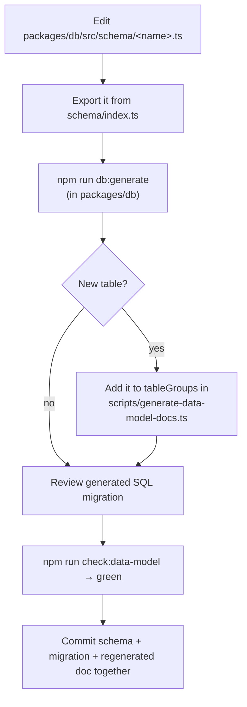

# Working with the data model

How to add or change a table, and which doc to trust for what. If you are an
agent planning a feature, **read the three docs below first** — the schema has
denormalized columns and multi-column constraints that are easy to miss from
the TypeScript alone (e.g. `group_id` is denormalized into `embedding_sources`,
and `traces` has a unique constraint on `(api_key_id, group_id, claim_text_hash)`).

The schema is a single `claimnet` Postgres schema managed entirely by Drizzle.
**Source of truth: `packages/db/src/schema/`.** Everything else is derived from
it or describes it.

---

## The three data-model docs — what each is FOR

| Doc | Kind | Read it for | Edit it? |
|---|---|---|---|
| [`architecture/data-model-generated.md`](../architecture/data-model-generated.md) | **Auto-generated** from the Drizzle snapshot | The exact current columns, types, indexes, constraints, and ER diagram for every table | **Never.** Regenerate it. |
| [`architecture/data-model.md`](../architecture/data-model.md) | LLM-written annotation of the generated reference | *Why* the schema looks the way it does — Toulmin model, FK-vs-UUID-ref conventions, idempotency, embedding-pipeline rationale. It summarizes and annotates the generated doc; it is not a second source of structural truth | Yes, when the design rationale changes — and re-read the generated doc first, so the annotation still matches |
| [`architecture/data-flow.md`](../architecture/data-flow.md) | Hand-written | How data *moves at runtime* — auth, recipe-check flow, embedding pipeline, access model | Yes, when a flow changes |

The generated doc is authoritative for *structure*; the hand-written docs are
authoritative for *rationale* and *flow*. Cross-link between them; don't
duplicate. For the broader code-generation pipeline (OpenAPI, API client), see
[api-schema-pipeline.md](api-schema-pipeline.md).

---

## Add or change a table



1. **Edit the schema.** Write or change `packages/db/src/schema/<name>.ts`
   (use `api-keys.ts` as a template for a new table), and add
   `export * from "./<name>";` to `packages/db/src/schema/index.ts`.

2. **Generate the migration + docs in one step.** From `packages/db`:

   ```bash
   npm run db:generate
   ```

   This runs `drizzle-kit generate` (writes the SQL migration and the snapshot
   JSON) **and** chains `generate:data-model`, which regenerates
   `data-model-generated.md`. To pass a descriptive migration name, run the tool
   directly, then regenerate docs from the root:

   ```bash
   cd packages/db && npx drizzle-kit generate --name <descriptive_name> && cd -
   npm run generate:data-model
   ```

3. **If you added a table, categorize it.** The generator assigns every table
   to a category in the `tableGroups` map in
   `scripts/generate-data-model-docs.ts`. A table that isn't in the map makes the
   generator **fail loudly** (non-zero exit, nothing written) — it will not
   silently drop from the index. Add your table to the fitting category and
   regenerate.

4. **Review the generated SQL** in `packages/db/migrations/` before committing.
   Migrations apply automatically at backend startup (`apps/backend/src/db.ts`).

5. **Verify no drift:**

   ```bash
   npm run check:data-model   # regenerates to a temp file, diffs the committed doc
   ```

   Green means the committed doc matches the schema. This same check runs in CI
   and in `npm run test:ci`, so a schema change that skips the regenerate step
   fails the build.

6. **Commit the schema, migration, and regenerated doc together** — they are one
   logical change.

Update `data-model.md` (rationale) and/or `data-flow.md` (runtime flow) in the
same commit if the change affects design intent or how data moves.

---

## Why it works this way

- **Deterministic generation.** The generator reads only the latest Drizzle
  migration snapshot (`packages/db/migrations/meta/NNNN_snapshot.json`) — not a
  live DB, not wall-clock time — so its output is a pure function of the schema.
  That is what lets `check:data-model` diff for drift reliably. The "schema as
  of migration" date in the header comes from the migration's own journal
  timestamp, so it only changes when a migration is added.
- **Fail-loud over silent-drop.** Categorization is the one hand-maintained
  input; guarding it makes a missing category impossible to ship rather than
  merely discouraged (recipe `9d43fe77`).
- **Migration-SQL-only objects** (the `traces.tsv` tsvector column, the
  `embedding_vectors` HNSW index) aren't in the Drizzle snapshot, so they're
  documented via a hardcoded note in the generator. If you add another raw-SQL
  object, add it to that note too.
